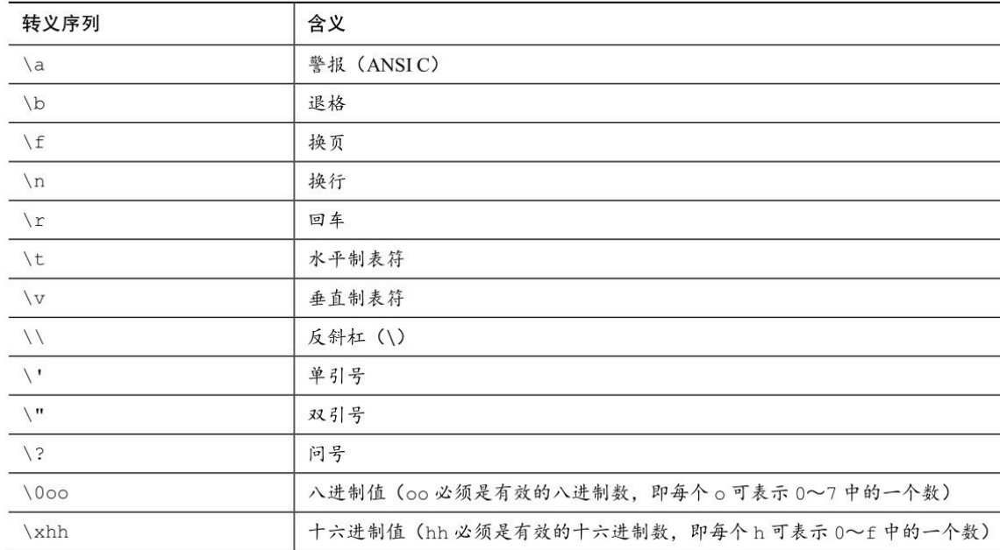

# Note

## 使用C语言的7个步骤

1. 定义程序的目标
2. 设计程序
3. 编写代码
4. 编译
5. 运行程序
6. 测试和调试程序
7. 维护和修改程序

## 变量命名规则

- 可以用小写字母、大写字母、数字和下划线（_）来命名。而且，名称的第1个字符必须是字符或下划线，不能是数字。
- 谨慎使用单下划线和双下划线开头的变量名，因为操作系统和C语言库中经常使用这种方式命名变量，防止出现名称冲突
- 区分大小写
- 为了更好的兼容性，变量命名常放在其他代码块的上方

## c程序基本格式

``` c
#include <stdio.h>
int main(void)
{
    语句
    return 0;
}
```

## 提高程序可读性

- 变量名见名知意
- 适当使用注释
- 适当使用空行分隔
- 一行一条语句

## 数据类型

- `int` 有符号整型，32位系统整型是32位，16位系统整型是16位（整型最小范围-32768~32767），默认是十进制数%d，0X和0x前缀的数字是十六进制数%x $#x %#X，0前缀的数是八进制数%o %#o，有#的表示法表示打印前缀 `long` `short` `unsigned` 
    - `short int` `short` 有符号短整型，可能比int更节省内存，但表示的整数范围比int小，十进制%hd，八进制%ho
    - `long int` `long` 有符号长整型，可能比int占用的内存更多，表示的整数范围更大，长整型数字可以加上后缀l或L，十进制%ld，十六进制%lx，八进制%lo
    - `long long int` `long long` 更长的有符号长整型，可以使用后缀ll或LL
    - `unsigned int` `unsigned` 无符号整型，表示非负数，%u
- `char` 字符，实际上是较小的整数，例如ASCII码0~127，字符'A'实际上存储的是65，所有操作系统char类型占内存1字节byte，用单引号包裹，%c，C语言没有字符串类型，
    - 常见转义字符：

    

    - 字符串，字符数组，使用双引号包裹，字符串一定以空字符 `\0` 结束，这也说明字符串实际能存储的字符数比数组容量小1

- `float` 单精度浮点数字，可以使用后最f或F，%f十进制计数法，%e指数计数法
- `double` 双精度浮点数，所有的小数默认是双精度浮点数，%f十进制计数法，%e指数计数法
- `long double` 浮点数 
- `_Bool` 布尔值 `true` `false`，实际上也是整数1和0
- `_Complex` 复数
- `_Imaginary` 虚数

## 位bit、字节byte、字word

- 位bit是最小的存错单元，表示一个二进制数0或1
- 1byte = 8bit
- 64位系统的字长是64，字长越大，数据转移越快，允许访问的内存更多

