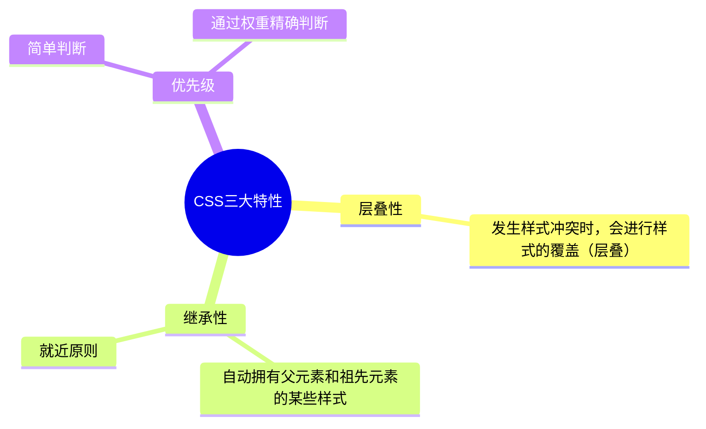
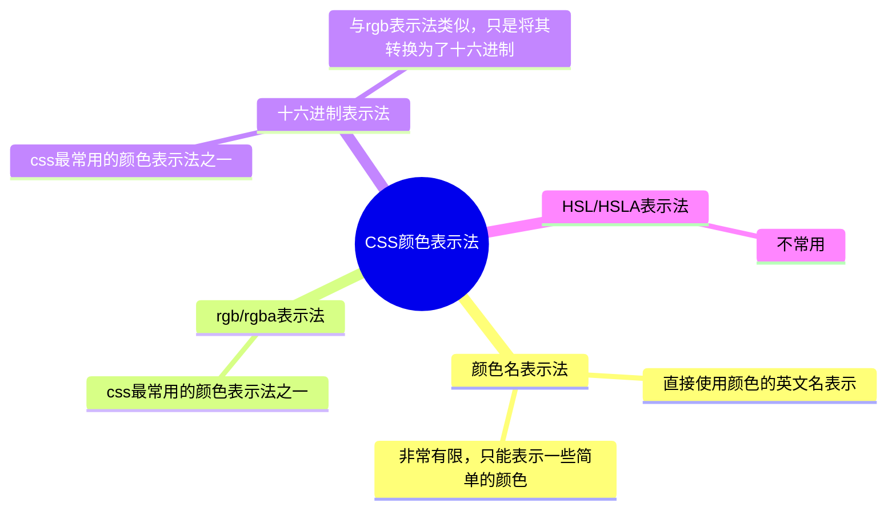

:material-pen-plus: `本文创建于2025-3-24`

!!! abstract
    HTML用于设计网页的**结构**，CSS用于控制网页的**表现**，JavaScript用于控制网页的**行为**。

    本文的目的并不是学习HTML4和CSS2语法，而是学习HTML5和CSS3中的HTML4和CSS2语法。

## 一、HTML4

[W3C官方文档](https://www.w3.org/){ .md-button }
[:simple-mdnwebdocs: MDN权威文档](https://developer.mozilla.org/zh-CN/docs/Web/HTML){ .md-button .md-button--primary }
[w3school文档](https://www.w3school.com.cn/h.asp){ .md-button }


### 1.1 HTML简介

:simple-html5: HTML全称是HyperText Markup Language（超文本标记语言）。

标签 又称 元素elements，是HTML的基本组成单位。标签分为：双标签 与 单标签 （绝大多数都是双标签）。标签名不区分大小写，但推荐小写，因为小写更规范。使用尖括号包裹。标签支持嵌套。

- 双标签（左侧的标签称为起始标签，右侧标签称为结束标签）

    `<标签名>标签体</标签名>`

    ??? example
        `<h1>这是一级标题</h1>`

- 单标签

    `<标签名>` 或 `<标签名/>`

标签属性：用于给标签提供 附加信息。可以写在：起始标签 或 单标签中，形式如下：

`<标签名 属性名="属性值">`

一个标签中可以有多个属性。有些特殊的属性，没有属性名，只有属性值，例如：

`<input disabled>`

???+ note 
    1. 不同的标签，有不同的属性；也有一些通用属性。
    2. 属性名、属性值，都不区分大小写，但推荐小写。
    3. 双引号，也可以写成单引号，甚至不写都行，但还是推荐写双引号。
    4. 标签中不要出现同名属性，否则后写的会失效

HTML标准结构

```html
<!DOCTYPE html> <!-- html文档声明，必须放在第一行，用来告诉浏览器当前网页的版本 -->
<html lang="zh-CN"> <!-- 网页所用的语言，方便浏览器提供翻译提示以及搜索引擎优化 -->

<head>
    <!-- head 标签中的内容不会出现在网页中 -->
    <meta charset="UTF-8"> <!-- 使用的字符编码 -->
    <title>Document</title> <!-- 将网页标题写在title标签中 -->
</head>

<body>
    <!-- 想要呈现在网页中的内容写在 body 标签中 -->
</body>

</html>
```

语义化标签：用特定的标签来表达特定的含义，即标签的默认样式并不重要，重要的是标签的语义。例如，用 `h1` 标签表示文章标题，用 `p` 标签表示段落内容。这样做使代码结构清晰，有利于SEO（搜索引擎优化），方便设备解析。

块级元素和行内元素：

- 块级元素：独占一行的标签
- 行内元素：不独占一行的标签

???+ note
    - 块级元素中可以嵌套块级元素和行内元素
    - 行内元素中只能嵌套行内元素，不能嵌套块级元素
    - 标题标签不能相互嵌套
    - 段落标签 `p` 中不能嵌套块级元素

### 1.2 排版标签（都是块级元素）

以下排版标签都是双标签：

- 标题 `h1` `h2` `h3` `h4` `h5` `h6`
    - 一级标题 `h1` 一般只使用一个
    - 标题标签不能相互嵌套使用
- 段落 `p`，英文paragraph
    - 段落标签 `p` 中不允许嵌套标题标签、段落标签 `p` 以及分区标签 `div`
- 分区分节 `div` 无意义，用于排版，英文division

### 1.3 文本标签

文本标签用于包裹词汇、短语等，通常写在排版标签里面

以下文本标签都是双标签，行内元素：

- 强调 `em`
- 语气更重的强调 `strong`
- `span` 与 `div` 类似，没有意义，用于包裹短语

??? 不常用的文本标签

    以下文本标签都是双标签：

    | 标签名 | 标签语义 |
    |---|---|
    | i | 类似于语文中的心理描写、语言描写用的引号，现在常用于呈现字体图标（斜体） |
    | cite | 作品标题（斜体） |
    | dfn | 特殊用语/专属名词（斜体） |
    | del | 删除的文本（删除线） |
    | ins | 插入的文本（下划线） |
    | sub | 下标文本 |
    | sup | 上标文本 |
    | code | 一段代码（字号略小） |
    | samp | 从正常的上下文中，将某些内容提取出来，例如：标识设备输出（字号略小） |
    | kbd | 键盘文本，表示文本是通过键盘输入的，经常用在与计算机相关的手册中（字号略小） |
    | abbr | 缩写，最好配上title属性（虚线下划线，如果配置了title属性，鼠标悬停时会显示title内容） |
    | bdo | 更改文本方向，要配合dir属性，可选值：ltr(默认值，从左到右)/rtl（从右到左） |
    | var | 标记变量，可与code标签一起使用（斜体） |
    | small | 附属细则，很少使用。例如：版权/法律文本（字号略小于p） |
    | b | 摘要中的关键字、评论中的产品名称，很少使用（加粗） |
    | u | 与正常内容有反差的文本，很少使用，例如：错的单词、不合理的描述（下划线） |
    | q | 短引用，很少使用（双引号） |
    | blockquote | 长引用，很少使用（换行+首行缩进） |
    | address | 地址（换行+斜体） |

    除了 `blockquote` 和 `address` 是块级元素，其他都是行内元素

### 1.4 图片标签

图片标签 `img` ，单标签

常用的标签属性有：

- `src` 图片地址
- `alt` 图片文本描述（图片加载成功不显示alt，加载失败时显示alt），主要用于搜索引擎搜索图片
- `width` 图片宽度，单位px，单位可以省略不写
- `height` 图片高度，单位px

相对路径：

- `./` 同级目录，可以省略不写
- `/` 下一级目录
- `../` 上一级目录

常用图片格式：

- `.jpg` 或 `.jpeg` 有损压缩格式，颜色丰富，体积小，不支持透明背景，不支持动图。常用于宣传图。
- `.png` 无损压缩格式，图片质量高，颜色丰富，体积大，支持透明背景，不支持动图。常用于logo
- `.bmp` 不进行压缩，尽量保留较多的图片细节，颜色丰富，体积很大，不支持透明背景，不支持动图。常用于游戏，网页几乎不使用
- `.gif` 仅支持256种颜色，色彩呈现不是很完整，支持简单透明背景，支持动图
- `.webp` 专门用来呈现网页中的图片，具有前面几种图片的优点，但是兼容性不好
- `base64格式` 一串文本，可以使用浏览器打开，但是看图软件无法打开，使用时直接将base64文本放入src属性即可，不受文件路径的影响。常用于较小的图片或需要和网页一起加载的图片

### 1.5 超链接

超链接标签 `a`，双标签，行内元素，但可以包裹除了 `a` 之外的其他元素。

html文件中无论连续使用几个空格和回车，最终显示的都是一个空格的效果。

通过 `a` 标签，可以跳转到指定页面，跳转到指定文件或下载指定文件，跳转到锚点位置，唤起指定应用（邮箱等）

常用的标签属性有：

- `href` 链接地址
- `target` 如何打开页面，可选值如下：
    - `_self` 在当前标签页打开（默认）
    - `_blank` 新标签页打开
- `id` 元素的唯一标识，用于设定锚点
- `name` 元素的名字，也可用于设置锚点
- `download` 强制触发下载文件

???+ warning
    1. 具有 href 属性的 a 标签是超链接，具有 name 属性的 a 标签是锚点。
    2. name 和 id 的属性值都是区分大小写的，且 id 最好别是数字开头。

???+ example
    1. 跳转到指定页面
        ```html
        <a href="https://developer.mozilla.org/zh-CN/docs/Web/HTML" target="_blank">前往MDN文档</a>
        ``` 
    
    2. 跳转到指定文件
        - 如果是浏览器可以打开的文件，点击超链接显示文件内容
        - 如果是浏览器无法打开的文件，点击超链接则会触发下载

    3. 跳转到锚点
        - 第一步：设置锚点
            ```html
            <!-- 第一种方式：使用a标签name属性 -->
            <a name="test1"></a>
            
            <!-- 第二种方式：其他标签配合id属性 -->
            <h1 id="test2">一级标题</h2>
            ```
        - 第二步：跳转到锚点位置
            ```html
            <!-- 跳转到test1锚点-->
            <a href="#test1">去test1锚点</a>

            <!-- 跳到本页面顶部 -->
            <a href="#">回到顶部</a>

            <!-- 跳转到其他页面锚点 -->
            <a href="demo.html#test1">去demo.html页面的test1锚点</a>
            ```
    4. 刷新页面
   
        `<a href="">刷新页面</a>`

    5. 执行 `JavaScript` 代码
        
        `<a href="javascript:alert('hello world')">弹窗</a>`
    
    6. 唤起指定应用（电话、邮箱、短信）
        ```html
        <!-- 唤起设备拨号 -->
        <a href="tel:10086">电话联系</a>

        <!-- 唤起设备发送邮件 -->
        <a href="mailto:d111kc@foxmail.com">邮件联系</a>

        <!-- 唤起设备发送短信 -->
        <a href="sms:10086">短信联系</a>
        ```

### 1.6 列表

1. 有序列表
     
     `ol` 标签用来表示有序列表ordered list，列表中的每个条目使用列表标签 `li` 包裹，英文list。

     ```html
     <h2>这是一个有序列表</h2>
     <ol>
     <li>cet-4</li>
     <li>cet-6</li>
     </ol>
     ```

2. 无序列表
   
    `ul` 标签用来表示有序列表unordered list，列表中的每个条目使用列表标签 `li` 包裹

     ```html
     <h2>这是一个无序列表</h2>
     <ul>
     <li>python</li>
     <li>c</li>
     <li>java</li>
     </ul>
     ```

3. 嵌套

    ```html
    <h2>这是一个嵌套列表</h2>
    <ul>
        <li>
            大学英语
            <ol>
                <li>cet-4</li>
                <li>cet-6</li>
            </ol>
        </li>
        <li>
            前端
            <ul>
                <li>html</li>
                <li>css</li>
                <li>javascript</li>
            </ul>
        </li>
        <li>hello world</li>
    </ul>
    ```

???+ warning
    li 标签最好写在 ul 或 ol 中，不要单独使用。

4. 自定义列表

    包含术语名称和术语描述的列表

    `dl` 标签表示自定义列表definitin list。`dt` 和 `dd` 标签放在其中，`dt` 用来表示术语名称definition term，`dd` 用来表述属于描述definition description。

    ```html
    <h2>这是一个自定义列表</h2>
    <dl>
        <dt>大学英语</dt>
        <dd>cet-4</dd>
        <dd>cet-6</dd>
        <dt>web框架</dt>
        <dd>django</dd>
        <dd>flask</dd>
        <dd>fastapi</dd>
        <dt>javascript</dt>
        <dd>vue.js</dd>
        <dd>node.js</dd>
    </dl>
    ```

### 1.7 表格

html表格基本结构如图:


使用标签 `table` 表示html中的表格，`caption` 标签表示表格标题，`thead` 标签表示表格头部标题（相当于Excel中的标题行），`tbody` 表示表格主体内容，`tfoot` 标签表示表格脚注，`tr` 表示表格的每一行，`th` 和 `td` 表示表格的每个单元格，`th` 只能用在 `thead` 表格头部标题中。这些标签都是双标签。

    <table>
        <!-- 表格标题 -->
        <caption>学生信息</caption>
        <!-- 表格标题行 -->
        <thead>
            <th>姓名</th>
            <th>性别</th>
            <th>年级</th>
            <th>班级</th>
        </thead>
        <!-- 表格主体 -->
        <tbody>
            <tr>
                <td>张三</td>
                <td>男</td>
                <td>一年级</td>
                <td>三班</td>
            </tr>
            <tr>
                <td>李四</td>
                <td>男</td>
                <td>二年级</td>
                <td>五班</td>
            </tr>
            <tr>
                <td>王五</td>
                <td>女</td>
                <td>一年级</td>
                <td>一班</td>
            </tr>
            <tr>
                <td>赵六</td>
                <td>男</td>
                <td>三年级</td>
                <td>二班</td>
            </tr>
        </tbody>
        <!-- 表格脚注 -->
        <tfoot>
            <tr>
                <td></td>
                <td></td>
                <td></td>
                <td>共计4人</td>
            </tr>
        </tfoot>
    </table>

常用属性：

- 表格标签 `table`
    - width ：设置表格宽度。
    - height ：设置表格最小高度，表格最终高度可能比设置的值大。
    - border ：设置表格边框宽度。
    - cellspacing ： 设置单元格之间的间距。
- 表格头部标题 `thead`，表格主体 `tbody`，表格脚注 `tfoot`，表格行 `tr`
    - height ：设置表格头部高度。
    - align ： 设置单元格的水平对齐方式，可选值如下：
        - left ：左对齐
        - center ：中间对齐
        - right ：右对齐
    - valign ：设置单元格的垂直对齐方式，可选值如下：
        - top ：顶部对齐
        - middle ：中间对齐
        - bottom ：底部对齐
- 表头单元格 `th`，其他单元格 `td`
    - width ：设置单元格的宽度，同列所有单元格全都受影响。
    - heigth ：设置单元格的高度，同行所有单元格全都受影响。
    - align ：设置单元格的水平对齐方式。
    - valign ：设置单元格的垂直对齐方式。
    - rowspan ：指定要跨的行数。
    - colspan ：指定要跨的列数。

??? note
    1. table 元素的 border 属性可以控制表格外边框，但 border 值的大小，并不控制单元格边框的宽度，
    2. 默认情况下，每列的宽度，得看这一列单元格最长的那个文字。
    3. 给某个 th 或 td 设置了宽度之后，他们所在的那一列的宽度就确定了。
    4. 给某个 th 或 td 设置了高度之后，他们所在的那一行的高度就确定了。

编写比较复杂的表格时，先写出表格的基本框架：

    <table border="1" cellspacing="0">
        <!-- 表格标题 -->
        <caption>课程表</caption>
        <!-- 标题行：第一行 -->
        <thead>
            <th>1-1</th>
            <th>1-2</th>
            <th>1-3</th>
            <th>1-4</th>
            <th>1-5</th>
            <th>1-6</th>
        </thead>
        <tbody>
            <!-- 第二行 -->
            <tr>
                <td>2-1</td>
                <td>2-2</td>
                <td>2-3</td>
                <td>2-4</td>
                <td>2-5</td>
                <td>2-6</td>
            </tr>
            <!-- 第三行 -->
            <tr>
                <td>3-1</td>
                <td>3-2</td>
                <td>3-3</td>
                <td>3-4</td>
                <td>3-5</td>
                <td>3-6</td>
            </tr>
            <!-- 第四行 -->
            <tr>
                <td>4-1</td>
                <td>4-2</td>
                <td>4-3</td>
                <td>4-4</td>
                <td>4-5</td>
                <td>4-6</td>
            </tr>
            <!-- 第五行 -->
            <tr>
                <td>5-1</td>
                <td>5-2</td>
                <td>5-3</td>
                <td>5-4</td>
                <td>5-5</td>
                <td>5-6</td>
            </tr>
            <!-- 第六行 -->
            <tr>
                <td>6-1</td>
                <td>6-2</td>
                <td>6-3</td>
                <td>6-4</td>
                <td>6-5</td>
                <td>6-6</td>
            </tr>
            <!-- 第七行 -->
            <tr>
                <td>7-1</td>
                <td>7-2</td>
                <td>7-3</td>
                <td>7-4</td>
                <td>7-5</td>
                <td>7-6</td>
            </tr>
        </tbody>
    </table>

然后在这个基础上修改：

    <table border="1" cellspacing="0">
        <!-- 表格标题 -->
        <caption>课程表</caption>
        <!-- 标题行：第一行 -->
        <thead>
            <th>时间</th>
            <th>周一</th>
            <th>周二</th>
            <th>周三</th>
            <th>周四</th>
            <th>周五</th>
        </thead>
        <tbody align="center">
            <!-- 第二行 -->
            <tr>
                <td rowspan="2">上午</td>
                <td>材料力学</td>
                <td>大学英语</td>
                <td>马克思主义</td>
                <td>大学英语</td>
                <td>工程地质</td>
            </tr>
            <!-- 第三行 -->
            <tr>
                <td>大学体育</td>
                <td>工程测量</td>
                <td>工程地质</td>
                <td>习近平新时代社会主义</td>
                <td>工程测量</td>
            </tr>
            <!-- 第四行 -->
            <tr>
                <td>中午</td>
                <td colspan="5">午休</td>
            </tr>
            <!-- 第五行 -->
            <tr>
                <td rowspan="2">下午</td>
                <td rowspan="3">无课</td>
                <td>概率论</td>
                <td>物理实验</td>
                <td>概率论</td>
                <td>马克思主义</td>
            </tr>
            <!-- 第六行 -->
            <tr>
                <td>无课</td>
                <td>材料力学</td>
                <td>无课</td>
                <td rowspan="2">无课</td>
            </tr>
            <!-- 第七行 -->
            <tr>
                <td>晚上</td>
                <td>习近平新时代社会主义</td>
                <td colspan="2">晚自习</td>
            </tr>
        </tbody>
    </table>

### 1.8 其他常用标签

换行标签 `br`，单标签

分割线标签 `hr`，单标签

按原文显示 `pre`，双标签，一般用于在页面中嵌入大段代码

!!! note 
    1. 不要用 `br` 来增加文本之间的行间隔，应使用 `p` 元素，或 CSS的 margin 属性。
    2. `hr` 的语义是分隔，如果不想要语义，只是想画一条水平线，那么应当使用 CSS 完成。

### 1.9 表单

使用 `form` 标签表示表单，使用 `input` 表示表单中的输入框，使用 `button` 标签表示表单中的按钮

- 表单标签 `form`
    - `action` 用于指定表单的提交地址（网址）
    - `target` 表单提交时，如何打开页面。常用值：
        - `_self` 本窗口打开
        - `_blank` 新窗口打开
    - `method` 用于控制表单的提交方式
    - `novalidate` HTML5新增属性，如果给 form 标签设置了该属性，表单提交的时候不再进行验证。
- 输入框标签 `input`
    - `type` 输入框的类型，不同类型的输入框有不同的标签属性
    - `name` 指定提交数据的名字（网址 `?` 之后的参数的参数名）
- 按钮标签 `button`

???+ note "HTML5新增的input标签的type属性值"
    - `email` 邮箱类型的输入框，表单提交时会验证格式，输入为空则不验证格式。
    - `url` url 类型的输入框，表单提交时会验证格式，输入为空则不验证格式。
    - `number` 数字类型的输入框，表单提交时会验证格式，输入为空则不验证格式。
    - `search` 搜索类型的输入框，表单提交时不会验证格式。
    - `tel` 电话类型的输入框，表单提交时不会验证格式，在移动端使用时，会唤起数字键盘。
    - `range` 范围选择框，默认值为 50 ，表单提交时不会验证格式。
    - `color` 颜色选择框，默认值为黑色，表单提交时不会验证格式。
    - `date` 日期选择框，默认值为空，表单提交时不会验证格式。
    - `month` 月份选择框，默认值为空，表单提交时不会验证格式。
    - `week` 周选择框，默认值为空，表单提交时不会验证格式。
    - `time` 时间选择框，默认值为空，表单提交时不会验证格式。
    - `datetime-local` 日期+时间选择框，默认值为空，表单提交时不会验证格式。

???+ note "HTML5新增的表单控件属性"
    - `placeholder` 提示文字（占位符），适用于文字输入类的表单控件。
    - `required` 表示该输入项必填， 适用于除按钮外其他表单控件。
    - `autofocus` 自动获取焦点，适用于所有表单控件。
    - `autocomplete` 自动完成，可以设置为 on 或 off ，适用于文字输入类的表单控件。注意：密码输入框、多行输入框不可用。
    - `pattern` 填写正则表达式，适用于文本输入类表单控件。注意：多行输入不可用，且空的输入框不会验证，往往与 required 配合。

表单中常用的文本控件：

=== "文本输入框" 
    `<input type="text">`

    常用属性如下：

    - `name` 数据名称，URL的 `?` 之后的参数的参数名
    - `value` 输入框默认输入内容
    - `maxlength` 输入框最大可输入长度
    
    ```html
    <form action="https://www.baidu.com/s" target="_blank" method="get">
        <input type="text" name="wd" placeholder="输入你想搜索的内容">
        <button>去百度搜索</button>
    </form>
    <form action="https://www.sogou.com/web" target="_blank" method="get">
        <input type="text" name="query" value="学习">
        <button>去搜狗搜索</button>
    </form>
    ```

=== "密码输入框"
    `<input type="password">`

    和文本输入框类似，只是隐藏了输入框中输入的内容

    ```html
    <form action="https://www.sogou.com/web" target="_blank" method="get">
        <input type="password" name="query" placeholder="请输入密码">
        <button>提交</button>
    </form>
    ```

=== "单选框"
    往往多个一起使用

    `<input type="radio">`

    常用属性：

    - `name` URL的 `?` 之后的参数的参数名，要实现单选按钮的效果，这一组单选按钮的 `name` 属性值必须相同
    - `value` 提交时实际提交的值
    - `checked` 让此选项默认选中，此属性不需要属性值

    ```html
    <form action="https://www.jd.com/" target="_blank" method="get">
        <input type="radio" name="gender" value="male" checked>男
        <input type="radio" name="gender" value="female">女
        <br>
        <button>提交</button>
    </form>
    ```

=== "复选框"

    `<input type="checkbox">`

    类似于单选框，但是可以多选，多个一起使用也可以设置相同的 `name` 属性

    常用属性：

    - `name` URL的 `?` 之后的参数的参数名
    - `value` 提交时实际提交的值
    - `checked` 让此选项默认选中，此属性不需要属性值

    ```html
    <form action="https://www.jd.com/" target="_blank" method="get">
        <input type="checkbox" name="hobby" value="chess" checked>下棋
        <input type="checkbox" name="hobby" value="sports">运动
        <br>
        <button>提交</button>
    </form>
    ```

=== "隐藏域"
    `<input type="hidden">`

    提交表单时在URL的 `?` 之后添加一些参数

    常用属性：

    - `name` 属性：指定数据的名称。
    - `value` 属性：指定的是真正提交的数据。

=== "提交按钮"
    ```html
    <!-- 方法一：使用input标签 -->
    <input type="submit">
    <!-- 方法二：使用button标签 -->
    <button>提交</button>
    ```

    ```html
    <form action="https://www.sogou.com/web" target="_blank" method="get">
        <input type="text" name="query">
        <!-- <button>去搜狗搜索</button> -->
        <input type="submit" value="点我提交表单">
    </form>
    ```

    ???+ warning
        1. button 标签 type 属性的默认值是 submit 。
        2. button 不要指定 name 属性
        3. input 标签编写的按钮，使用 value 属性指定按钮文字。默认是 “提交”

=== "重置按钮"
    ```html
    <!-- 方法一：使用input标签 -->
    <input type="reset">
    <!-- 方法二：使用button标签 -->
    <button type="reset">重置</button>
    ```

    ```html
    <form action="https://www.sogou.com/web" target="_blank" method="get">
        <input type="text" name="query">
        <input type="reset">
        <!-- <button type="reset">重置</button> -->
    </form>
    ```

    ???+ warning
        1. button 不要指定 name 属性
        2. input 标签编写的按钮，使用 value 属性指定按钮文字。

=== "普通按钮"
    ```html
    <input type="button" value="普通按钮">
    <button type="button">普通按钮</button>
    ```

=== "文本域"
    使用 `textarea` 标签表示文本域，和普通的文本框类似

    常用属性：

    - rows 属性：指定默认显示的行数，会影响文本域的高度。
    - cols 属性：指定默认显示的列数，会影响文本域的宽度。
    - 不能编写 type 属性，其他属性，与普通文本输入框一致。
   
    ```html
    <form action="https://www.jd.com/" target="_blank" method="get">
        <textarea name="msg" rows="3" cols="30" placeholder="我是文本域"></textarea>
        <button>提交</button>
    </form>
    ```

=== "下拉框"
    使用 `select` 标签表示下拉框，`option` 标签表示下拉框中的选项。二者都是双标签

    常用属性：

    - `select` 标签的 `name` 属性：指定数据的名称，URL的 `?` 之后的参数的参数名
    - option 标签设置 value 属性， 如果没有 value 属性，提交的数据是 option 中间的文字；如果设置了 value 属性，提交的数据就是 value 的值（建议设置 value 属性）
    - option 标签设置了 selected 属性，表示默认选中。
    
    ```html
    <form action="https://www.jd.com/" target="_blank" method="get">
        <select name="lang">
            <option value="py">Python</option>
            <option value="md">Markdown</option>
            <option value="h5">HTML5</option>
        </select>
        <button>提交</button>
    </form>
    ```

???+ tip
    input 、 textarea 、 button 、 select 、 option 都可以设置 disabled 属性，来禁用某个表单控件（控件变成灰色）

???+ note
    可以使用 `label` 标签将文字与表单控件绑定在一起。

    两种与 label 关联方式如下：

    1. 让 label 标签的 `for` 属性的值等于表单控件的 `id` 。
    2. 把表单控件套在 `label` 标签的里面。

    ???+ example
        ```html
        <!-- 方法一 -->
        <form action="https://www.jd.com/" target="_blank" method="get">
            <label for="my-name">姓名：</label>
            <input type="text" name="name" id="my-name">
            <button>提交</button>
        </form>

        <!-- 方法二 -->
        <form action="https://www.jd.com/" target="_blank" method="get">
            <label>姓名：
                <input type="text" name="name">
            </label>
            <button>提交</button>
        </form>
        ```

???+ note
    可以使用 `fieldset` 标签和 `legend` 为表单中的控件分组，类似于tkinter中的Labelframe控件。`fieldset` 用来分组，`legend` 用来设置分组标题。

    ???+ example
        ```html
        <form action="https://www.jd.com/" target="_blank" method="get">
            <fieldset>
                <legend>主要信息</legend>
                姓名：
                <input type="text" name="name">
                <br>
                性别：
                <input type="radio" name="gender" value="male">男
                <input type="radio" name="gender" value="female">女
                <br>
            </fieldset>
            <fieldset>
                <legend>联系方式</legend>
                电话：
                <input type="text" name="phone">
                <br>
                微信：
                <input type="text" name="wechat">
                <br>
                邮箱：
                <input type="text" name="email">
            </fieldset>
            <button>提交</button>
        </form>
        ```

### 1.10 框架

框架标签 `iframe`，双标签，用于在网页中嵌入其他文件，常用属性如下：

- name ：框架名字，可以与 target 属性配合。
- src 地址，可以用来嵌入视频、音频、图片等，如果嵌入的文件浏览器能打开则会显示，不能打开的会弹出下载框。可以用于嵌入其他网页，有些网页可能会拒绝，可以用于嵌入广告
- width ： 框架的宽。
- height ： 框架的高度。
- frameborder ：是否显示边框，值：0或者1

???+ note 
    常用于：

    1. 在网页中嵌入广告。
    2. 与超链接 `a` 或表单 `form` 的 target 配合，展示不同的内容。

    ???+ example
        ```html
        <a href="http://127.0.0.1:8000/markdown/" target="md">点我查阅md语法</a>
        <br>
        <iframe name="md" frameborder="0"></iframe>
        ```

### 1.11 HTML实体

类似于转义字符。字符实体由三部分组成：一个 `&` 和 一个实体名称（或者一个 `#` 和 一个实体编号），最后加上一个分号 `;`

| 显示效果 | 描述 | 实体名称 | 实体编号|
|:---:|:---:|:---:|:---:|
|  | 空格 | & nbsp; | & #160; |
| < | 小于号 | & lt; | & #60; |
| > | 大于号 | & gt; | & #62; |
| & | 和号 | & amp; | & #38; |
| " | 引号 | & quot; | & #34; |
| ´ | 反引号 | & acute; | & #180; |
| ￠ | 分（cent） | & cent; | & #162; |
| £ | 镑（pound） | & pound; | & #163; |
| ¥ | 元（yen） | & yen; | & #165; |
| € | 欧元（euro） | & euro; | & #8364; |
| © | 版权（copyright） | & copy; | & #169; |
| ® | 注册商标 | & reg; | & #174; |
| ™ | 商标 | & trade; | & #8482; |
| × | 乘号 | & times | & #215; |
| ÷ | 除号 | & divide; | & #247; |

### 1.12 HTML全局属性

所有HTML标签共有的属性。

常用全局属性：

- `id` 给标签指定唯一标识，注意： id 是不能重复的。作用：可以让 label 标签与表单控件相关联；也可以与 CSS 、 JavaScript 配合使用
- `class` 给标签指定类名，随后通过 CSS 就可以给标签设置样式。
- `style` 给标签设置 CSS 样式。
- `dir` 内容的方向，值: ltr (从左到右)、 rtl(从右到左)
- `title` 给标签设置一个文字提示，一般超链接和图片用得比较多。
- `lang` 给标签指定语言

### 1.13 meta元信息

常用元信息：

1. 配置字符编码
```html
<meta charset="utf-8">
```
2. 针对 IE 浏览器的兼容性配置。
```html
<meta http-equiv="X-UA-Compatible" content="IE=edge">
```
3. 针对移动端的配置
```html
<meta name="viewport" content="width=device-width, initial-scale=1.0">
```
4. 配置网页关键字
```html
<meta name="keywords" content="8-12个以英文逗号隔开的单词/词语">
```
5. 配置网页描述信息
```html
<meta name="description" content="80字以内的一段话，与网站内容相关">
```

6. 针对搜索引擎爬虫配置：
```html
<meta name="robots" content="此处可选值见下表">
```

| 值 | 描述 |
|:---:|---|
| index | 允许搜索爬虫索引此页面 |
| noindex | 要求搜索爬虫不索引此页面 |
| follow | 允许搜索爬虫跟随此页面上的链接 |
| nofollow | 要求搜索爬虫不跟随此页面上的链接 |
| all | 与 index, follow 等价 |
| none | 与 noindex, nofollow 等价 |
| noarchive | 要求搜索引擎不缓存页面内容 |
| nocache | noarchive 的替代名称 |

7. 配置网页作者：
```html
<meta name="author" content="tony">
```
8. 配置网页生成工具
```html
<meta name="generator" content="Visual Studio Code">
```
9. 配置定义网页版权信息：
```html
<meta name="copyright" content="2023-2027©版权所有">
```
10. 配置网页自动刷新
```html
<meta http-equiv="refresh" content="10;url=http://www.baidu.com">
```

## 二、CSS2
:simple-css3: CSS 的全称为：层叠样式表 ( Cascading Style Sheets ) 。CSS 也是一种标记语言，用于给 HTML 结构设置样式，例如：文字大小、颜色、元素宽高等等。

### 2.1 CSS的编写位置

==优先级：行内样式 > 内部样式 = 外部样式==

???+ note
    - 内部样式、外部样式，这二者的优先级相同，且：后面的 会覆盖 前面的（简记：“后来者居上”）
    - 同一个样式表中，优先级也和编写顺序有关，且：后面的 会覆盖 前面的（简记：“后来者居上”）


=== "行内样式"
    又称内联样式，直接写在HTML标签的 `style` 属性中，只能控制当前标签的样式，不能控制其他标签的样式，书写要符合css语法。书写繁琐、样式不能复用、并且没有体现出：结构与样式分离 的思想，不推荐大量使用，只有对当前元素添加简单样式时，才偶尔使用。

        <p style="color: red; font-size: 60px;">This is a demo!</p>

=== "内部样式"
    写在 html 文件内部，将所有的 CSS 代码提取出来，单独放在 `style` 标签中。`style` 标签理论上可以放在 HTML 文档的任何地方，但一般都放在 `head` 标签中。此种写法：样式可以复用、代码结构清晰。并没有实现：结构与样式完全分离。多个 HTML 页面无法复用样式。

    ```html
    <!DOCTYPE html>
    <html lang="zh-CN">
    <head>
        <meta charset="UTF-8">
        <title>DEMO1</title>
        <style>
            h2 {
                color: blue;
            }
        </style>
    </head>
    ```

=== "外部样式"
    写在单独的 .css 文件中，随后在 HTML 文件中引入使用。新建一个扩展名为 .css 的样式文件，把所有 CSS 代码都放入此文件中。在 HTML 文件中引入 .css 文件。

    第一步：编写一个css文件

    ```css title="demo1.css" linenums="1"
    h3 {
        color: gray;
    }
    ```

    第二步：在html文件中引入css文件

    ```html title="demo1.html" linenums="1" hl_lines="6"
    <!DOCTYPE html>
    <html lang="zh-CN">
    <head>
        <meta charset="UTF-8">
        <title>DEMO1</title>
        <link rel="stylesheet" href="demo1.css">
    </head>
    ```

    ???+ note
        - `link` 标签要写在 `head` 标签中。
        - `link` 标签属性说明：
            - `href` 引入的文档的地址
            - `rel` 说明引入的文档与当前文档之间的关系，英文relation
        - 外部样式的优势：样式可以复用、结构清晰、可触发浏览器的缓存机制，提高访问速度 ，实现了结构与样式的完全分离。
        - 实际开发中，几乎都使用外部样式，这是最推荐的使用方式！

### 2.2 CSS语法规范和代码风格

CSS 语法规范由两部分构成：

- 选择器：找到要添加样式的元素。
- 声明块：设置具体的样式（声明块是由一个或多个声明组成的），类似于python字典的写法，声明的格式为： `属性名: 属性值;`


???+ note
    - 最后一个声明后的分号理论上能省略，但最好还是写上。
    - 选择器与声明块之间，属性名与属性值之间，均有一个空格，理论上能省略，但最好还是写上。

CSS代码风格

=== "展开风格"
    ```css
    h1 {
        color: red;
        font-size: 40px;
    }
    ```

=== "紧凑风格"
    `h1{color:red;font-size:40px;}`

???+ tip
    项目上线时，我们会通过工具将【展开风格】的代码，变成【紧凑风格】，这样可以减小文件体积，节约网络流量，同时也能让用户打开网页时速度更快。

### 2.3 CSS选择器Seclector

#### 2.3.1 基本选择器

=== "通配选择器 `*`"
    使用通配选择器 `*` 可以选择所有html元素，可以用来清除样式

=== "元素选择器"
    为某种html标签设置统一的样式，元素选择器无法实现差异化设置

    语法：

    ```css
    标签名 {
        属性名: 属性值;
    }
    ```

=== "类选择器 `.`"
    根据html标签的 `class` 属性值（类名），来选中某些元素。使用频率很高

    语法：

    ```css
    .类名 {
        属性名: 属性值;
    }
    ```

    ???+ note
        - 元素的 `class` 属性值不带 `.` ，但 CSS 的类选择器要带 `.` 。
        - `class` 值，是我们自定义的，按照标准：不要使用纯数字、不要使用中文、尽量使用英文与数字的组合，若由多个单词组成，使用 `-` 做连接，例如： left-menu ，且命名要有意义，做到 “见名知意”。
        - 一个元素不能写多个 class 属性
        - 一个元素的 class 属性，能写多个值，要用空格隔开

=== "id选择器 `#`"
    根据html标签的 `id` 属性值，来精准选中某个元素。

    语法：

    ```css
    #id值 {
        属性名: 属性值;
    }
    ```

    ???+ note
        - `id` 属性值：尽量由字母、数字、下划线 `_`、短杠 `-` 组成，最好以字母开头、不要包含空格、区分大小写。
        - 一个元素只能拥有一个 id 属性，多个元素的 id 属性值不能相同。id一般是独一无二的。
        - 一个元素可以同时拥有 id 和 class 属性。

#### 2.3.2 复合选择器

???+ abstract
    - 复合选择器建立在基本选择器之上，由多个基础选择器，通过不同的方式组合而成。
    - 复合选择器可以在复杂结构中，快速而准确的选中元素。

!!! note "选择器的优先级" 
    通过不同的选择器，选中相同的元素 ，并且为相同的样式名设置不同的值时，就发生了样式的冲突。到底应用哪个样式，此时就需要看优先级了。

    优先级简单判断：{==行内样式 > ID选择器 > 类选择器 > 元素选择器 > 通配选择器==}

    优先级判断

    1. 计算方法：每个选择器，都可计算出一组权重，格式为： (a,b,c)
        - a : ID 选择器的个数。
        - b : 类、伪类、属性 选择器的个数。
        - c : 元素、伪元素 选择器的个数。
    2. 比较规则：按照从左到右的顺序，依次比较大小，当前位胜出后，后面的不再对比，例如：
        - (1,0,0) > (0,2,2)
        - (1,1,0) > (1,0,3)
        - (1,1,3) > (1,1,2)
    3. 特殊规则：行内样式权重大于所有选择器。`!important` 的权重，大于行内样式，大于所有选择器，权重最高！

!!! info "html元素之间的关系"
    html元素有五种关系：

    1. 父元素：直接包裹某个元素的元素，就是该元素的父元素。
    2. 子元素：被父元素直接包含的元素
    3. 祖先元素：父亲的父亲......，一直往外找，都是祖先。父元素，也算是祖先元素的一种。
    4. 后代元素：儿子的儿子......，一直往里找，都是后代。子元素，也算是后代元素的一种。
    5. 兄弟元素：具有相同父元素的元素，互为兄弟元素


=== "交集选择器"
    用于选中同时符合多个条件的元素。相当于且

    语法：`选择器1选择器2选择器3...选择器n {}` 一般{==选择器1==}是{==元素选择器==}，之后的选择器是类选择器。交集选择器中最多只能有一个**元素选择器**。选择器和选择器之间没有使用空格分隔。

=== "并集选择器"
    选中多个选择器对应的元素，又称：分组选择器。相当于或

    语法：`选择器1, 选择器2, 选择器3, ... 选择器n {}`

    ???+ note
        - 并集选择器，我们一般竖着写。每个选择器使用空格分隔，并换行。
        - 任何形式的选择器，都可以作为并集选择器的一部分 。
        - 并集选择器，通常用于集体声明，可以缩小样式表体积

=== "后代选择器"
    选中指定元素中，符合要求的后代元素。

    语法：`选择器1 选择器2 选择器3 ...... 选择器n {}` 先写祖先，再写后代，选择器之间使用空格分隔

=== "子代选择器"
    选中指定元素中，符合要求的子元素（儿子元素）。（先写父，再写子）

    语法：`选择器1 > 选择器2 > 选择器3 > ...... 选择器n {}` 选择器之间使用 `>` 分隔

=== "兄弟选择器"
    相邻兄弟选择器：选中指定元素后的符合条件的相邻兄弟元素。所谓相邻，就是紧挨着他的下一个。只选中一个兄弟元素

    语法： `选择器1+选择器2 {}` 选择器之间使用 `+` 分隔

    通用兄弟选择器：选中指定元素后的符合条件的所有兄弟元素。指定元素之后的兄弟元素，选中多个兄弟元素

    语法： `选择器1~选择器2 {}` 选择器之间使用 `~` 分隔

=== "属性选择器"
    选中属性值符合一定要求的元素。需要配合元素选择器一起使用。

    语法：

    - `元素选择器[属性名]` 选中具有某个属性的元素。
    - `元素选择器[属性名="值"]` 选中包含某个属性，且属性值等于指定值的元素。
    - `元素选择器[属性名^="值"]` 选中包含某个属性，且属性值以指定的值开头的元素。
    - `元素选择器[属性名$="值"]` 选中包含某个属性，且属性值以指定的值结尾的元素。
    - `元素选择器[属性名*=“值”]` 选择包含某个属性，属性值包含指定值的元素。

=== "伪类选择器"
    选中特殊状态的元素。伪类，像类( class )，但不是类，是元素的一种特殊状态。

    常用的伪类选择器：

    === "动态伪类"
        一般对超链接 `a` 标签使用。

        1. `:link` 超链接未被访问的状态。
        2. `:visited` 超链接访问过的状态。
        3. `:hover` 鼠标悬停在元素上的状态。
        4. `:active` 元素激活的状态。激化，按下鼠标不松开
        5. `:focus` 获取焦点的元素。一般对表单使用。

        遵循 LVHA 的顺序，即： link 、 visited 、 hover 、 active 。
        表单类元素才能使用 :focus 伪类。
        当用户：点击元素、触摸元素、或通过键盘的 “ tab ” 键等方式，选择元素时，就是获得焦点。

    === "结构伪类"
        常用结构伪类：

        - `:first-child` 所有兄弟元素中的第一个。
        - `:last-child` 所有兄弟元素中的最后一个。
        - `:nth-child(n)` 所有兄弟元素中的第 n 个。
        - `:first-of-type` 所有同类型兄弟元素中的第一个。
        - `:last-of-type` 所有同类型兄弟元素中的最后一个。
        - `:nth-of-type(n)` 所有同类型兄弟元素中的 第n个 。

        ??? note "不常用的结构伪类"
            - `:nth-last-child(n)` 所有兄弟元素中的倒数第 n 个。
            - `:nth-last-of-type(n)` 所有同类型兄弟元素中的 倒数第n个 。
            - `:only-child` 选择没有兄弟的元素（独生子女）。
            - `:only-of-type` 选择没有同类型兄弟的元素。
            - `:root` 根元素。
            - `:empty` 内容为空元素（空格也算内容）。

        ???+ note "结构伪类中的n"
            - 0 或 不写 ：什么都选不中 —— 几乎不用。
            - n ：选中所有子元素 —— 几乎不用。
            - 1~正无穷的整数 ：选中对应序号的子元素。
            - 2n 或 even ：选中序号为偶数的子元素。
            - 2n+1 或 odd ：选中序号为奇数的子元素。
            - -n+3 ：选中的是前 3 个。

    === "否定伪类"
        `:not(选择器)` 排除满足括号中条件的元素。

    === "UI伪类"
        对于表单按钮类的标签使用。

        - `:checked` 被选中的复选框或单选按钮。复选框和单选框有些样式无法通过CSS更改
        - `:enable` 可用的表单元素（没有 disabled 属性）。
        - `:disabled` 不可用的表单元素（有 disabled 属性）。

    === "目标伪类"
        `:target` 选中锚点指向的元素。

    === "语言伪类"
        `:lang()` 根据指定的语言选择元素（本质是看 lang 属性的值）。

=== "伪元素选择器"
    选中元素中的一些特殊位置。

    常用伪元素：

    - `::first-letter` 选中元素中的第一个文字。
    - `::first-line` 选中元素中的第一行文字。
    - `::selection` 选中被鼠标选中的内容。
    - `::placeholder` 选中输入框的提示文字，常用于控制输入框提示文字的颜色
    - `::before` 在元素最开始的位置，创建一个子元素（css必须用 content 属性指定内容），用于批量添加前缀
    - `::after` 在元素最后的位置，创建一个子元素（css必须用 content 属性指定内容），用于批量添加后缀

### 2.4 CSS三大特性



=== "层叠性"
    如果发生了样式冲突，那就会根据一定的规则（选择器优先级），进行样式的层叠（覆盖）。

=== "继承性"
    元素会自动拥有其父元素、或其祖先元素上所设置的某些样式。优先继承离得近的。

    常见的可继承属性： `text-?? ， font-?? ， line-?? 、 color ......`

=== "优先级"
    简单判断： {==!important > 行内样式 > ID选择器 > 类选择器 > 元素选择器 > 通配选择器 > 继承的样式==}

    精确判断：需要计算权重。计算权重时需要注意：并集选择器的每一个部分是分开算的！

### 2.5 CSS常用属性

像素：电脑屏幕是由一个一个“小点”组成的，每个“小点”，就是一个像素px。像素点越小，呈现的内容就越清晰、越细腻。注意：电脑一般会默认开启缩放以优化用户的使用体验，因此显示的长度可能与实际的像素数不同。

**CSS颜色**



=== "颜色名"
    编写方式：直接使用颜色对应的英文单词，编写比较简单。使用这种表示方法表示的颜色非常有限，所以用的并不多。

=== "rgb/rgba"
    编写方式：使用 红r、绿g、蓝b 这三种光的三原色进行组合。r 表示 红色，g 表示 绿色，b 表示 蓝色，a 表示 透明度

    ???+ note
        - 若三种颜色值相同，呈现的是灰色，值越大，灰色越浅。
        - rgb(0, 0, 0) 是黑色， rgb(255, 255,255) 是白色。
        - 对于 rbga 来说，前三位的 rgb 形式要保持一致，要么都是 0~255 的数字，要么都是        百分比 。

    ```css
    /* 使用 0~255 之间的数字表示一种颜色 */
    color: rgb(255, 0, 0);/* 红色 */
    color: rgb(0, 255, 0);/* 绿色 */
    color: rgb(0, 0, 255);/* 蓝色 */
    color: rgb(0, 0, 0);/* 黑色 */
    color: rgb(255, 255, 255);/* 白色 */
    /* 混合出任意一种颜色 */
    color:rgb(138, 43, 226) /* 紫罗兰色 */
    color:rgba(255, 0, 0, 0.5);/* 半透明的红色 */
    /* 也可以使用百分比表示一种颜色（用的少） */
    color: rgb(100%, 0%, 0%);/* 红色 */
    color: rgba(100%, 0%, 0%,50%);/* 半透明的红色 */
    ```

=== "十六进制HEX/HEXA"
    HEX 的原理同与 rgb 一样，依然是通过：红、绿、蓝色 进行组合，只不过要用 6位（分成3组） 来表达，格式为：# rrggbb

    每一位数字的取值范围是： 0 ~ f ，即：（ 0, 1, 2, 3, 4, 5, 6, 7, 8, 9, a, b, c, d, e, f ），所以每一种光的最小值是： 00 ，最大值是： ff。IE 浏览器不支持 HEXA ，但支持 HEX

    ```css
    color: #ff0000;/* 红色 */
    color: #00ff00;/* 绿色 */
    color: #0000ff;/* 蓝色 */
    color: #000000;/* 黑色 */
    color: #ffffff;/* 白色 */
    /* 如果每种颜色的两位都是相同的，就可以简写*/
    color: #ff9988;/* 可简为：#f98 */
    /* 但要注意前三位简写了，那么透明度就也要简写 */
    color: #ff998866;/* 可简为：#f986 */
    ```

=== "HSL/HSLA"
    HSL 是通过：色相、饱和度、亮度，来表示一个颜色的，格式为： hsl(色相,饱和度,亮度)。色相：取值范围是 0~360 度，具体度数对应的颜色如下图：

    

    饱和度：取值范围是 0%~100% 。（向色相中对应颜色中添加灰色， 0% 全灰， 100% 没有灰）。亮度：取值范围是 0%~100% 。（ 0% 亮度没了，所以就是黑色。 100% 亮度太强，所以就是白色了）。HSLA 其实就是在 HSL 的基础上，添加了透明度。

**字体相关属性**

=== "字号font-size"
    字号属性 `font-size`，用于控制字体大小。常用单位px。由于字体设计原因，文字最终呈现的大小，并不一定与 font-size 的值一致，可能大，也可能小。通常情况下，文字相对字体设计框，并不是垂直居中的，通常都靠下一些。

    ???+ tip
        - Chrome 浏览器支持的最小文字为 12px ，默认的文字大小为 16px ，并且 0px 会自动消失。
        - 不同浏览器默认的字体大小可能不一致，所以最好给一个明确的值，不要用默认大小。
        - 通常以给 body 设置 font-size 属性，这样 body 中的其他元素就都可以继承了。

=== "字体族font-family"
    字体种类属性 `font-family`，用来设置字体。

    语法：

    ```css
    div {
        font-family: "STCaiyun","Microsoft YaHei",sans-serif;
    }
    ```

    ???+ tip
        1. 使用字体的英文名字兼容性会更好，具体的英文名可自行查询，或在电脑的设置里去寻找。
        2. 如果字体名包含空格，必须使用引号包裹起来。
        3. 可以设置多个字体，按照从左到右的顺序逐个查找，到就用，没有找到就使用后面的，且通常在最后写上 `serif` （衬线字体，笔画粗细有区别）或   `ans-serif` （非衬线字体，笔画粗细相同）。

=== "斜体font-style"
    斜体属性 `font-style` 用来控制字体是否使用斜体字

    可选值：

    - normal ：正常（默认值）
    - italic ：斜体（使用字体自带的斜体效果）（推荐使用）
    - oblique ：斜体（强制倾斜产生的斜体效果）

=== "粗体font-weight"
    粗体属性 `font-weight`，用于控制是否使用粗体字。

    可选值：

    - lighter ：细
    - normal ： 正常
    - bold ：粗
    - bolder ：很粗 （多数字体不支持）
    
    还可以使用数字表示粗细：

    - 100~1000 且无单位，数值越大，字体越粗 （或一样粗，具体得看字体设计时的精确程度）。
    - 100~300 等同于 lighter ， 400~500 等同于 normal ， 600 及以上等同于bold 。

=== "字体复合属性font"
    字体属性 `font` ，可以把上述字体样式合并成一个属性。将上述所有字体相关的属性复合在一起编写。

    编写规则：

    1. 字体大小、字体族必须都写上。
    2. 字体族必须是最后一位、字体大小必须是倒数第二位。
    3. 各个属性间用空格隔开。
    
    实际开发中更推荐复合写法，但这也不是绝对的，比如只想设置字体大小，那就直接用 `font-size` 属性。

**文本相关属性**

=== "文本颜色color"
    文本颜色属性 `color`，用于控制字体颜色，属性值使用css中的颜色表示法表示，常使用 **十六进制颜色表示法HEX/HEXA** 或 **rgb/rgba颜色表示法**

=== "文本间距"
    字母间距属性 `letter-spacing`，控制字母之间的间距

    单词间距属性 `word-spacing`，控制单词之间的间距

    单位是px，正值间距增大，负值间距减小

=== "文本修饰text-decoration"
    文本修饰属性 `text-decoration`，控制下划线、删除线等各种线条

    可选值：

    - none ： 无装饰线（常用）
    - underline ：下划线（常用）
    - overline ： 上划线
    - line-through ： 删除线

    以上可选值可以使用下列值来修饰：

    - dotted ：虚线
    - wavy ：波浪线
    - css颜色
  
=== "文本缩进text-indent"
    文本缩进属性 `text-indent`，控制首行缩进。属性值是css中的长度，常用单位px

=== "文本水平对齐text-align"
    文本水平对齐属性 `text-align`，控制文本的水平对齐方式。

    可选值：

    - left ：左对齐（默认值）
    - right ：右对齐
    - center ：居中对齐

=== "文本行高line-height和文本垂直对齐"
    文本行高属性 `line-height`，用于控制每行文字的高度。

    可选值：

    - normal ：由浏览器根据文字大小决定的一个默认值。
    - 像素( px )。
    - 数字：参考自身 font-size 的倍数（很常用）。
    - 百分比：参考自身 font-size 的百分比。

    line-height的应用：

    - 对于多行文字：控制行与行之间的距离。
    - {==对于单行文字：让 height 等于 line-height ，可以实现文字垂直居中。==}由于字体设计原因，文字在一行中，并不是绝对垂直居中，若一行中都是文字，不会太影响观感。

    ???+ note "行高注意事项"
        - 如果 `line-height` 过小文字会产生重叠，且最小值是 0 ，不能为负数。
        - `line-height` 是可以继承的，且为了能更好的呈现文字，最好写数值。
        - line-height 和 height 的关系：设置了 height ，那么高度就是 height 的值。不设置 height 的时候，会根据 line-height 计算高度。

    ???+ info "height属性"
        height属性指定了一个元素的高度。默认情况下，这个属性决定的是内容区（ content area）的高度，但是，如果将 box-sizing 设置为 border-box , 这个属性决定的将是边框区域（border area）的高度。

    顶部对齐：无需任何属性，在垂直方向上，默认就是顶部对齐。

    ==垂直居中对齐：对于单行文字，让 height 属性值和line-height 属性值相等即可。==

    底部对齐：对于单行文字，目前一个临时的方式：让 `line-height = ( height × 2 ) - font-size - x`，其中 x 是根据字体族，动态决定的一个值。

=== "垂直对齐方式vertical-align"
    `vertical-align` 用于控制垂直对齐方式，但是并不能做到垂直居中。用于指定同一行元素之间，或 表格单元格 内文字的 垂直对齐方式。不能控制块级元素

    常用值：

    - baseline （默认值）：使元素的基线与父元素的基线对齐。
    - top ：使元素的顶部与其所在行的顶部对齐。
    - middle ：使元素的中部与父元素的基线加上父元素字母 x 的一半对齐。
    - bottom ：使元素的底部与其所在行的底部对齐

**列表相关属性**

可以作用在 ul 、 ol 、 li 标签上

=== "列表符号list-style-type"
    属性 `list-style-type` 用于设置列表的项目符号

    可选值如下：

    - none ：不显示前面的标识（很常用！）
    - square ：实心方块
    - disc ：圆形
    - decimal ：数字
    - lower-roman ：小写罗马字
    - upper-roman ：大写罗马字
    - lower-alpha ：小写字母
    - upper-alpha ：大写字母

=== "列表符号位置list-style-position"
    设置列表符号的位置 

    可选值：

    - inside ：在 li 的里面
    - outside ：在 li 的外边

=== "图片项目符号list-style-image"
    属性 `list-style-image` 设置自定义项目符号，属性值 `url(图片地址)`

=== "列表复合属性list-style"
    `list-style` 复合属性，没有数量、顺序的要求

**表格边框相关属性（其他元素也能用）**

=== "边框宽度border-width"
    控制边框的宽度，属性值是CSS 中可用的长度值

=== "边框颜色border-color"
    属性值是CSS 中可用的颜色值

=== "边框风格border-style"
    想要显示出边框，必须设置次属性。否则不显示。

    可选值：

    - none 默认值
    - solid 实线
    - dashed 虚线
    - dotted 点线
    - double 双实线

=== "边框复合属性border"
    border 边框复合属性 没有数量、顺序的要求，建议设置边框时直接使用此复合属性。

**表格独有属性（只有 `table` 标签才能使用）**

=== "表格列宽table-layout"
    table-layout 设置列宽度

    可选值：

    - auto ：自动，列宽根据内容计算（默认值）。
    - fixed ：固定列宽，平均分。

=== "单元格间距border-spacing"
    border-spacing 单元格间距，属性值CSS 中可用的长度值。生效的前提：单元格边框不能合并。

=== "合并单元格边框border-collapse"
    border-collapse 合并单元格边框 

    可选值：

    - collapse ：合并
    - separate ：不合并

=== "隐藏空单元格empty-cells"
    empty-cells隐藏没有内容的单元格，生效前提：单元格不能合并。

    可选值：

    - show ：显示，默认
    - hide ：隐藏

=== "表格标题位置caption-side"  
    caption-side 设置表格标题位置 
    
    可选值：

    - top ：上面（默认值）
    - bottom ：在表格下面

**背景属性**

=== "背景色background-color"
    background-color 设置背景颜色 符合 CSS 中颜色规范的值。默认背景颜色是 transparent 。

=== "背景图片background-image"
    background-image 设置背景图片，属性值 `url(图片的地址)`

=== "背景重复方式background-repeat"
    background-repeat设置背景重复方式

    可选值：

    - repeat ：重复，铺满整个元素，默认值。
    - repeat-x ：只在水平方向重复。
    - repeat-y ：只在垂直方向重复。
    - no-repeat ：不重复。


=== "背景图片位置background-position"
    background-position 设置背景图位置

    通过关键字设置位置：

    写两个值，用空格隔开。水平： left 、 center 、 right。垂直: top 、 center 、 bottom

    如果只写一个值，另一个方向的值取 center

    通过长度指定坐标位置：

    以元素左上角，为坐标原点，设置图片左上角的位置。
    两个值，分别是 x 坐标和 y 坐标。只写一个值，会被当做 x 坐标， y 坐标取center

=== "背景复合属性background"
    background 复合属性 没有数量和顺序要求

**鼠标属性cursor**

cursor 设置鼠标光标的样式

可选值:
  
- pointer ：小手
- move ：移动图标
- text ：文字选择器
- crosshair ：十字架
- wait ：等待
- help ：帮助
- url(地址) 自定义鼠标光标