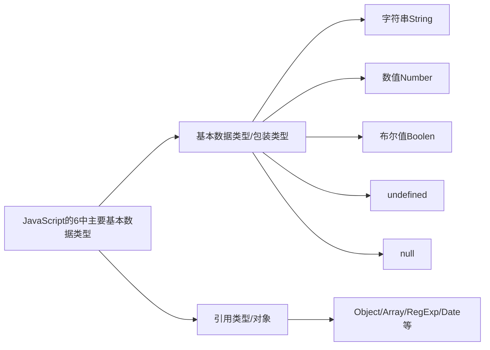

:material-pen-plus: `本文创建于2025-5-28`

## 一、作用域

作用域（scope）规定了变量能够被访问的“范围”，离开了这个“范围”变量便不能被访问，作用域分为：

- 局部作用域
    - 函数作用域
    - 块作用域
- 全局作用域

### 1.1 局部作用域

局部作用域分为函数作用域和块作用域。

函数作用域：在函数内部声明的变量只能在函数内部被访问，外部无法直接访问。

???+ note
    - 函数内部声明的变量，在函数外部无法被访问
    - 函数的参数也是函数内部的局部变量
    - 不同函数内部声明的变量无法互相访问
    - 函数执行完毕后，函数内部的变量实际被清空了

块作用域：在 JavaScript 中使用 `{ }` 包裹的代码称为代码块，代码块内部声明的变量外部将 **有可能** 无法被访问。

???+ note
    - `let` 声明的变量会产生块作用域， `var` 不会产生块作用域
    - `const` 声明的常量也会产生块作用域
    - 不同代码块之间的变量无法互相访问
    - 推荐使用 `let` 或 `const`

### 1.2 全局作用域

`<script>` 标签 和 `.js` 文件 的 **最外层** 就是全局作用域，在此声明的变量在函数内部也可以被访问。全局作用域中声明的变量，任何其它作用域都可以被访问

???+ warning
    - 为 `window` 对象动态添加的属性默认也是全局的，不推荐
    - 函数中未使用任何关键字声明的变量为全局变量，不推荐
    - 尽可能少的声明全局变量，防止全局变量被污染

### 1.3 作用域链

作用域链本质上是底层的变量查找机制。在函数被执行时，会优先查找当前函数作用域中查找变量. 如果当前作用域查找不到则会依次逐级查找父级作用域直到全局作用域

???+ note
    - 嵌套关系的作用域串联起来形成了作用域链
    - 相同作用域链中按着从小到大的规则查找变量
    - 子作用域能够访问父作用域，父级作用域无法访问子级作用域

### 1.4 JS垃圾回收机制

垃圾回收机制(Garbage Collection) 简称 GC.

JS中内存的分配和回收都是自动完成的，内存在不使用的时候会被垃圾回收器自动回收。正因为垃圾回收器的存在，许多人认为JS不用太关心内存管理的问题.但如果不了解JS的内存管理机制，我们同样非常容易成内存泄漏（内存无法被回收）的情况.不再用到的内存，没有及时释放，就叫做内存泄漏

**内存的生命周期**

JS环境中分配的内存, 一般有如下生命周期：

1. 内存分配：当我们声明变量、函数、对象的时候，系统会自动为他们分配内存
2. 内存使用：即读写内存，也就是使用变量、函数等
3. 内存回收：使用完毕，由垃圾回收自动回收不再使用的内存

???+ note
    - 全局变量一般不会回收(关闭页面回收)；
    - 一般情况下局部变量的值, 不用了, 会被自动回收掉

??? info "JS垃圾回收机制算法"
堆栈空间分配区别：

- 栈（操作系统）: 由操作系统自动分配释放函数的参数值、局部变量等，基本数据类型放到栈里面。
- 堆（操作系统）: 一般由程序员分配释放，若程序员不释放，由垃圾回收机制回收。复杂数据类型放到堆里面。

下面介绍两种常见的浏览器垃圾回收算法: **引用计数法(IE浏览器)** 和 **标记清除法**

**引用计数**

IE采用的引用计数算法, 定义“内存不再使用”，就是看一个对象是否有指向它的引用，没有引用了就回收对象

算法：

1. 跟踪记录被引用的次数
2. 如果被引用了一次，那么就记录次数1,多次引用会累加
3. 如果减少一个引用就减1
4. 如果引用次数是0 ，则释放内存

但它却存在一个致命的问题：嵌套引用（循环引用）.如果两个对象相互引用，尽管他们已不再使用，垃圾回收器不会进行回收，导致内存泄露。因为他们的引用次数永远不会是0。这样的相互引用如果说很大量的存在就会导致大量的内存泄露

**标记清除法**

现代的浏览器已经不再使用引用计数算法了。现代浏览器通用的大多是基于标记清除算法的某些改进算法，总体思想都是一致的。

核心： 从根部扫描对象，能查找到的就是使用的，查找不到的就要回收

1. 标记清除算法将“不再使用的对象”定义为“无法达到的对象”。
2. 就是从根部（在JS中就是全局对象）出发定时扫描内存中的对象。 凡是能从根部到达的对象，都是还需要使用的。
3. 那些无法由根部出发触及到的对象被标记为不再使用，稍后进行回收。

### 1.5 闭包Closure

一个函数对周围状态的引用捆绑在一起，内层函数中访问到其外层函数的作用域. 简单理解：闭包 =  内层函数 + 外层函数的变量 

```js
// 闭包的简单写法
function outer() {
   let i = 1
   function fn() {
       console.log(i)
   }
   fn()
}
outer() // 输出结果 1
```


闭包作用：封闭数据，提供操作，外部也可以访问函数内部的变量

闭包基本格式:

```js
// 写法一
function outer() {
    let i = 1
    function fn() {
        console.log(1)
    }
    return fn
}
const fun = outer() // 变量fun实际上是函数fn
fun()  // 输出结果 1 // 调用函数fun, 实际上是调用了函数fn
```

```js
// 写法二
function outer() {
    let i = 1
    return function() {
        console.log(i)
    } // 实际上是将写法一中的函数fn()
}
const fun = outer()
fun() // 输出结果 1
```

闭包应用：实现数据的私有. 比如，我们要做个统计函数调用次数，函数调用一次，就++

在控制台输出函数被调用的次数:

不使用闭包:

```js
let i = 0
function fn() {
    i ++ 
    console.log(`函数被调用了${i}次`)
}
fn() // 函数被调用了1次
fn() // 函数被调用了2次

i = 100 // i是全局变量，很容易被修改,从而影响调用函数fn()的结果
fn() // 函数被调用了101次
```

使用闭包:

```js
function fn() {
    let i = 0
    function fun() {
        i ++ 
        console.log(`函数被调用了${i}次`)
    }
    return fun
}
const result = fn()

result() // 函数被调用了1次
result() // 函数被调用了2次

i = 100
result() // 函数被调用了3次
```

???+ note
    闭包的作用: 封闭数据，实现数据私有，外部也可以访问函数内部的变量. 闭包很有用，因为它允许将函数与其所操作的某些数据（环境）关联起来
    
    闭包可能引起的问题: 内存泄漏

### 1.6 变量提升

变量提升是 JavaScript 中比较“奇怪”的现象，它允许在变量声明之前即被访问（仅存在于var声明变量）

```js
// 使用 var 声明变量,可以先使用变量,再声明变量
// 因为变量提升会自动将 var 声明的变量移动到当前作用域的最前面
console.log(msg + ' world!') // 输出结果 undefined world!
var msg = 'Hello'

// 以上代码相当于
// var msg
// console.log(msg + ' world!') // 输出结果 undefined world!
// msg = 'Hello'
```

???+ warning
    - 变量在未声明即被访问时会报语法错误
    - 变量在var声明之前即被访问，变量的值为 undefined
    - let/const 声明的变量不存在变量提升
    - 变量提升出现在相同作用域当中
    - 实际开发中推荐先声明再访问变量

???+ note
    使用 `var` 关键字声明变量会有变量提升, 因此不建议使用 `var` 声明变量

    变量提升的流程:

    - 先把var 变量提升到当前作用域于最前面
    - 只提升变量声明， 不提升变量赋值
    - 然后依次执行代码

## 二、函数

### 2.1 函数提升

函数提升与变量提升比较类似，是指函数在声明之前即可被调用(Python函数只能先声明再调用)。

总结：

- 函数提升能够使函数的声明调用更灵活
- 函数表达式不存在提升的现象
- 函数提升出现在相同作用域当中

```js
// JS 可以先调用函数,再声明函数
fn() // 输出结果 Hello world!

function fn() {
    console.log('Hello world!')
}
```

```js
// 函数表达式没有函数提升
// fun() // 报错 Uncaught TypeError: fun is not a function
var fun = function () {
    console.log('Hello world!')
}

fun() // 输出结果 Hello world!

// 以上代码相当于
// var fun 
// // fun() // Uncaught TypeError: fun is not a function
// fun = function () {
//     console.log('Hello world!')
// }
// fun() // 输出结果 Hello world!
```

### 2.2 动态参数和剩余参数

JS 中的动态参数和剩余参数相当于 Python 中的不定长参数 `*args`

**动态参数:**

arguments 是函数内部内置的伪数组变量，它包含了调用函数时传入的所有实参

```js
function print_sum() {
    // console.log(arguments) // 返回传入实参的伪数组
    let sum = 0
    for (let i=0; i < arguments.length; i++) {
        sum += arguments[i]
    }
    console.log(sum)
}

print_sum(1, 2) // 输出结果 3
```

???+ note
    - `arguments` 是一个伪数组，只存在于函数中
    - `arguments` 的作用是动态获取函数的实参
    - 可以通过for循环依次得到传递过来的实参

**剩余参数:**

剩余参数允许我们将一个不定数量的参数表示为一个数组, 用法与 Python 不定长参数几乎完全相同

```js
function print_args(...other) {
    console.log(other)
}

print_args(1, 5, 6) // 输出传入实参的数组(并不是伪数组)
```

???+ note
    - `...` 是语法符号，置于最末函数形参之前，用于获取多余的实参, 和python中的 `*` 类似
    - 借助 `...` 获取的剩余实参，是个真数组
    - 开发中，在可以使用动态参数和剩余参数时优先使用 **剩余参数**

=== "JS"
    ```js
    let nums = [1, 2, 3]
    console.log(...nums) // 输出结果 1 2 3
    ```

=== "Python"
    ```py
    nums = [1, 2, 3]
    print(*nums) # 输出结果 1 2 3
    ```

???+ info "展开运算符..."
展开运算符(…),将一个数组进行展开, 不会修改原数组. 典型运用场景： 求数组最大值(最小值)、合并数组等

剩余参数：函数参数使用，得到真数组. 展开运算符：数组中使用，数组展开

=== "求数组最值"
    ```js
    let arr = [8, 4, 6, 9, 1]
    let max = Math.max(...arr)
    let min = Math.min(...arr)
    console.log(`数组最大值为${max}`) // 数组最大值为9
    console.log(`数组最小值为${min}`) // 数组最大值为1
    ```

=== "合并数组"
    ```js
    let arr1 = ['py', 'c', 'cpp']
    let arr2 = ['html', 'css', 'js']
    let arr = [...arr1, ...arr2]
    console.log(arr) // ['py', 'c', 'cpp', 'html', 'css', 'js']
    ```

### 2.3 箭头函数

引入箭头函数的目的是更简短的函数写法并且不绑定this，箭头函数的语法比函数表达式更简洁. 使用场景：箭头函数更适用于那些本来需要匿名函数的地方

#### 2.3.1 箭头函数基本语法

=== "基本写法"
    ```js
    // 普通函数
    // function fn() {
    //     console.log('Hello world!')
    // }

    // 箭头函数
    const fn = () => {
        console.log('Hello world!')
    }
    fn() // 输出结果 Hello world!
    ```

=== "省略小括号"
    只有一个参数可以省略小括号

    ```js
    //  普通函数
    // function fn(x) {
    //     return x + x
    // }

    // 箭头函数
    // const fn = (x) => {
    //     return x + x
    // }

    // 箭头函数(只有一个参数时可以省略括号)
    const fn = x => {
        return x + x
    }

    const result = fn(5)
    console.log(result) // 输出结果 10
    ```

=== "省略return"
    如果函数体只有一行代码(return语句)，可以写到一行上，并且无需写 return 直接返回值

    ```js
    // 普通函数
    // function fn(x, y) {
    //     return x + y
    // }

    // 箭头函数
    // const fn = (x, y) => {
    //     return x + y
    // }

    // 箭头函数(函数体只用return语句时,可以省略花括号和return)
    const fn = (x, y) => x + y

    const result = fn(4, 7)
    console.log(result) // 输出结果 11
    ```

=== "返回对象的箭头函数"
    ```js
    // 箭头函数(返回值是对象数据类型时,要使用小括号包裹对象的花括号,用以区分函数体的花括号)
    const fn = uname => ({ name: uname })

    const result = fn('wq')
    console.log(result) // 输出结果 {name: 'wq'}
    ```

???+ note
    - 箭头函数属于表达式函数，因此不存在函数提升
    - 箭头函数只有一个参数时可以省略圆括号 ()
    - 箭头函数函数体只有一行代码时可以省略花括号 {}，并自动做为返回值被返回
    - 加括号的函数体返回对象字面量表达式

#### 2.3.2 箭头函数参数

普通函数有 `arguments` 动态参数, 但是箭头函数没有 `arguments` 动态参数，有 剩余参数 `..args`

```js
// 普通函数使用动态参数
// function get_sum() {
//     let sum = 0
//     for (let i=0; i < arguments.length; i++) {
//         sum += arguments[i]
//     }
//     return sum
// }

// 普通函数使用剩余参数
// function get_sum(...args) {
//     let sum = 0
//     for (let i=0; i < args.length; i++) {
//         sum += args[i]
//     }
//     return sum
// }

// 箭头函数使用剩余参数
const get_sum = (...args) => {
    let sum = 0
    for (let i=0; i < args.length; i++) {
        sum += args[i]
    }
    return sum
}

const result = get_sum(1, 5, 9, 3)
console.log(result) // 输出结果 18
```

#### 2.3.3 箭头函数this

在箭头函数出现之前，每一个新函数根据它是被如何调用的来定义这个函数的this值， 非常令人讨厌。箭头函数不会创建自己的this,它只会从自己的作用域链的上一层沿用this

```html
<button>submit</button>
<script>
    console.log(this) // 此处this指向window对象

    const fn = function() {
        console.log(this)
    }
    fn() // 普通函数this指向调用者, 此处指向window对象

    const btn = document.querySelector('button')
    btn.addEventListener('click', function() {
        console.log(this) // 事件监听,this指向DOM对象,此处指向btn对象
    })   
</script>
```

```js
<button>submit</button>
<script>
    const fn = () => {
        console.log(this) // this指向window对象
    }
    fn()

    const btn = document.querySelector('button')
    btn.addEventListener('click', () => {
        console.log(this) // this指向window对象, 不指向btn对象,因此时间监听不建议使用箭头函数
    })

    const user = {
        name: 'wq',
        fn: () => {
            console.log(this) // 指向window对象
        }
    }
    user.fn()

    const superuser = {
        name: 'WQ',
        fn: function () {
            console.log(this) // 普通函数的this指向调用者,此处指向superuser对象
            const fun = () => {
                console.log(this) // 此处this指向普通函数fn()的调用者superuser对象
            }
            fun()
        }
    }
    superuser.fn()
```

在开发中使用箭头函数前需要考虑函数中 this 的值，事件回调函数使用箭头函数时，this 为全局的 window，因此DOM事件回调函数为了简便，不推荐使用箭头函数

## 三、解构赋值

### 3.1 数组解构

解构赋值是一种快速为变量赋值的简洁语法，本质上仍然是为变量赋值。类似于 Python 使用元组同时为多个变量赋值.

基本语法： 赋值运算符 `=` 左侧的 `[]` 用于包裹批量声明变量，右侧数组的元素值将被赋值给左侧的变量. 变量的顺序对应数组单元值的位置依次进行赋值操作

```js
const arr = [5, 3, 6]
const [a, b, c] = arr
console.log(`a=${a}, b=${b}, c=${c}`) // a=5, b=3, c=6
```

可以使用这种方法交换两个变量的值

```js
let a = 5
let b = 7; // 此处的";"必不可少,因为当方括号位于句首时,前面必须要有结束符号";",否则会报错
[a, b] = [b, a]
console.log(`a=${a}, b=${b}`) // a=7, b=5
```

???+ info "js 前面必须加分号情况"
    - 立即执行函数

        ```js
        // 写法一
        (function fn() {})();

        // 写法二
        ;(function fn() {})()
        ```

    - 数组解构

        ```js
        ;[a, b] = [b, a]
        ```

变量的数量大于数组元素值数量时，多余的变量将被赋值为 `undefined`

```js
const arr = ['py', 'c']
const [a, b, c] = arr
console.log(a) // py
console.log(b) // c
console.log(c) // undefined
```

变量的数量小于数组元素值数量时，多余的元素值不分配,或使用剩余参数全分配给最后一个变量

```js
const arr = ['py', 'c', 'js', 'html', 'css']

// 多余的数组元素不分配
// const [a, b, c] = arr
// console.log(a) // py
// console.log(b) // c
// console.log(c) // js

// 将剩余数组元素分配给最后一个变量
const [a, b, ...c] = arr
console.log(a) // py
console.log(b) // c
console.log(c) // ['js', 'html', 'css']
```

设置默认值,防止有 `undefined`

```js
// 设置默认值,防止出现undefined
const arr = ['py', 'c']
const [a='cpp', b='cpp', c='cpp'] = arr
console.log(a) // py
console.log(b) // c
console.log(c) // cpp
```

故意跳过某些值

```js
// 故意跳过 'c'
const arr = ['py', 'c', 'js', 'html']
const [a, , c, d] = arr
console.log(a) // py
console.log(c) // js
console.log(d) // html
```

多维数组

```js
const arr = ['py', ['js', 'html']]

// const [a, b] = arr
// console.log(a) // py
// console.log(b) // ['js', 'html']

const [a, [b, c]] = arr
console.log(a) // py
console.log(b) // js
console.log(c) // html
```

### 3.2 对象解构

对象解构是将对象属性和方法快速批量赋值给一系列变量的简洁语法

基本语法：

- 赋值运算符 `=` 左侧的 `{}` 用于包裹需要批量声明的变量，右侧对象的属性值将被赋值给左侧的变量
- 对象属性的值将被赋值给与属性名相同的变量
- 注意解构的变量名不要和外面的变量名冲突否则报错
- 对象中找不到与变量名一致的属性时变量值为 `undefined`

```js
// 创建一个对象
const user = {
    name: 'wq',
    age: 18
}

// 对象解构
// const {name, age} = user
// console.log(name) // wq
// console.log(age) // 18

// 对象解构,并通过':'自定义变量名
const {name: uname, age} = user
console.log(uname) // wq
console.log(age) // 18
```

对数组对象进行对象解构:

```js
// 创建一个数组对象
const user = [
    {
        name: 'wq',
        age: 18
    }
]

// 对象解构
const [{name, age}] = user
console.log(name) // wq
console.log(age) // 18
```

多级对象解构:

```js
// 创建一个对象
const lang = {
    msg: 'Hello world!',
    h5: {
        body: 'html',
        style: 'css',
        action: 'js'
    }
}

// 对象解构
const {msg, h5: {body, style, action}} = lang
console.log(msg) // Hello world!
console.log(body) // html
console.log(style) // css
console.log(action) // js
```

可以根据自己的实际需要进行对象解构:

```js
// 创建一个对象
const lang = {
    msg: 'Hello world!',
    h5: {
        body: 'html',
        style: 'css',
        action: 'js'
    }
}

// 对象解构
const {h5} = lang
console.log(h5) // {body: 'html', style: 'css', action: 'js'}
```

## 四、对象

### 4.1 创建对象的三种方式

- 方式一: 通过字面量创建

    ```js
    // 通过字面量创建
    const obj = {
        name: 'wq',
        age: 18
    }
    ```

- 方式二: new Object

    ```js
    // new Object
    const obj = new Object({
        name: 'wq',
        age: 18
    })
    ```

- 方式三: 利用构造函数创建对象

### 4.2 构造函数

构造函数 ：是一种特殊的函数，主要用来初始化对象. 可以通过构造函数来快速创建多个类似的对象. 类似于 Python 通过类的实例化创建对象. 构造函数在技术上是常规函数

```js
function Person(name, age) {
    this.name = name
    this.age = age
}

const person1 = new Person('wq', 18)
console.log(person1) // {name: 'wq', age: 18}

const person2 = new Person('jerry', 20)
console.log(person2) // {name: 'jerry', age: 20}
```

???+ note
    - 它们的命名以大写字母开头, 大驼峰命名法
    - 它们只能由 `new` 操作符来执行
    - 使用 `new` 关键字调用函数的行为被称为实例化
    - 实例化构造函数时没有参数时可以省略 `()`
    - 构造函数内部无需写 `return`，返回值即为新创建的对象
    - 构造函数内部的 `return` 返回的值无效，所以不要写 `return`
    - `new Object()` `new Date()` 也是实例化构造函数

??? info "实例化执行过程"
    - 创建新对象
    - 构造函数this指向新对象
    - 执行构造函数代码，修改this，添加新的属性
    - 返回新对象

### 4.3 实例成员和静态成员

实例成员：通过构造函数创建的对象称为实例对象，实例对象中的属性和方法称为实例成员。类似于 Python 中的实例属性和实例方法.

???+ note
    - 实例对象的属性和方法即为实例成员
    - 为构造函数传入参数，动态创建结构相同但值不同的对象
    - 构造函数创建的实例对象彼此独立互不影响。

静态成员：构造函数的属性和方法被称为静态成员. 类似于 Python 类属性和类方法.

???+ note
    - 构造函数的属性和方法被称为静态成员
    - 一般公共特征的属性或方法静态成员设置为静态成员
    - 静态成员方法中的 this 指向构造函数本身

### 4.4 内置构造函数



字符串、数值、布尔、等基本类型也都有专门的构造函数，这些我们称为包装类型。JS中几乎所有的数据都可以基于构成函数创建。

#### 4.4.1 对象Object

`Object` 是内置的构造函数，用于创建普通对象。 推荐使用字面量方式声明对象，而不是 Object 构造函数

```js
// 使用构造函数创建对象
// const user = new Object({
//     name: 'wq',
//     age: 18
// })

// 通过字面量创建对象
const user = {
    name: 'wq',
    age: 18
}
```

不使用对象的静态方法时, 要想要遍历对象的值需要使用 `for (in)` 语句

```js
const user = {
    name: 'wq',
    age: 18
}

for (let key in user) {
    console.log(key) // 遍历user对象的属性
    console.log(user[key]) // 遍历user对象的属性值
}
```

这种方法明显不够简便, 使用对象的静态方法可以简化此过程.

对象的三个常用静态方法:

- `Object.keys()` 传入对象,获取对象的全部属性,返回属性列表, 类似于Python字典的 `.keys()` 方法,只不过Python字典的 `.keys()`方法只用于遍历

    ```js
    const user = {
        name: 'wq',
        age: 18
    }
    
    const arr = Object.keys(user)
    console.log(arr) // ['name', 'age']]
    ```

- `Object.values()` 传入对象,获取对象的全部属性值,返回属性值列表, 类似于Python字典的 `.values()` 方法

    ```js
    const user = {
        name: 'wq',
        age: 18
    }
    
    const arr = Object.values(user)
    console.log(arr) // ['wq', 18]]
    ```

- `Object.assign(obj1, obj2)` 将obj2拷贝到obj1, 常用于对象添加属性

    ```js
    const obj1 = {}
    const obj2 = {
        name: 'wq',
        age: 18
    }
    Object.assign(obj1, obj2)  
    console.log(obj1) // {name: 'wq', age: 18}  
    ```

    ```js
    const user = {
        name: 'wq',
        age: 18
    }
    Object.assign(user, {hobby: 'python'})
    console.log(user) // {name: 'wq', age: 18, hobby: 'python'}
    ```

#### 4.4.2 数组Array

`Array` 是内置的构造函数，用于创建数组. 创建数组建议使用字面量创建，不用 Array构造函数创建

```js
// 使用构造函数创建数组
// const arr = new Array(1, 2, 3) // 不需要方括号
// console.log(arr) // [1, 2, 3]

// 使用字面量创建数组
const arr = [1, 2, 3]
```

数组常用实例方法:

- `.forEach()` 遍历数组, 无返回值

    `.forEach()` 方法用于调用数组的每个元素，并将元素传递给回调函数. 这个方法没有返回值,它的作用就是遍历数组, 类似于python的`enumerate()`函数

    语法:

    ```js
    arr.forEach(function(item, index) {
        // 函数体
    })

    // 或
    arr.forEach(function(item) {
        // 函数体
    })
    ```

    === "Python"
        ```py
        mylist = ['py', 'c', 'js', 'css']
        for index, item in enumerate(mylist):
            print(index) # 遍历下标
            print(item) # 遍历列表
        ```

    === "JavaScript"
        ```js
        const arr = ['py', 'c', 'js', 'css']

        // forEach可以同时遍历数组元素和下标
        arr.forEach(function(item, index) {
            console.log(item) // 遍历数组
            console.log(index) // 遍历下标
        })
        ```

- `.filter()` 过滤数组, 筛选数组元素,返回新数组

    `.filter()` 方法创建一个新的数组，新数组中的元素是通过检查指定数组中符合条件的所有元素. 用于筛选数组符合条件的元素，并返回筛选之后元素的新数组

    语法:

    ```js
    arr.filter(function(item, index){
        return 筛选条件
    })

    // 或
    arr.filter(function(item){
        return 筛选条件
    })
    ```

    返回值：返回数组，包含了符合条件的所有元素。如果没有符合条件的元素则返回空数组. 因为返回新数组，所以不会影响原数组

    ```js
    const arr = [51, 2, 7, 15, 37, 20]

    const newArr = arr.filter(function(item, index){
        return item > 20
    })
    console.log(newArr) // [51, 37]
    ```

- `.map()` 迭代数组

    数组的 `.map(function (item, index) {})` 方法, 类似于python列表推导式,可以用于产生新数组. 也类似于python列表遍历的 `enumerate()` 函数,可以同时遍历数组的元素和下标(但是这种遍历方法不推荐使用,因为 `.map()` 方法是用来产生新元组的).

    语法:

    ```js
    const arr = ['py', 'js', 'html', 'css']
    const newArr = arr.map(function (item, index) {
        console.log(item, index) // 遍历数组,依次输出数组元素和下标
        return item + '语言'
    })
    console.log(newArr) // ['py语言', 'js语言', 'html语言', 'css语言']
    ```

- `.reduce()` 累加器, 用于数组求和

    基本语法: `arr.reduce(function(累计值, 当前元素, 索引号, 原数组){}, 起始值)` 起始值可以省略，如果写就作为第一次累计的起始值. 索引号和原数组可省略

    ???+ note
        - 如果有起始值，则以起始值为准开始累计， 累计值 = 起始值
        - 如果没有起始值， 则累计值以数组的第一个数组元素作为起始值开始累计
        - 后面每次遍历就会用后面的数组元素 累计到 累计值 里面 （类似求和里面的 sum ）
        - 有起始值最后的求和结果相当于没有起始值时的结果加上起始值

    ```js
    const arr = [1, 7, 6]

    // 无起始值
    // const total = arr.reduce(function(prev, current){
    //     return prev + current
    // })
    // 使用箭头函数
    const total1 = arr.reduce((prev, current) => prev + current)
    console.log(total1) // 14

    // 有起始值
    const total2 = arr.reduce((prev, current) => prev + current, 10)
    console.log(total2) // 24
    ```

- `.join()` 将数组元素拼接为字符串,返回字符串

    数组的 `.join()`  可以用来将数组中的元素拼接为一个字符串, 类似于python中的 `','.join(list)` 方法,只不过js中的 `.join()` 不传参时,相当于传入了默认值 `','`

    ```js
    const arr = ['py', 'js', 'html', 'css']
    const newArr1 = arr.join()
    console.log(newArr1) // py,js,html,css
    const newArr2 = arr.join('')
    console.log(newArr2) // pyjshtmlcss
    ```

- `.find()` 查找元素,符合测试条件的第一个数组元素值，如果没有符合条件的则返回 `undefined`

    ```js
    const arr = [
        {
            lang: 'python',
            suffix: 'py'
        },
        {
            lang: 'javascript',
            suffix: 'js'
        }
    ]
    
    const js = arr.find(function(item){
        return item.suffix === 'js'
    })
    console.log(js) // {lang: 'javascript', suffix: 'js'}
    ```

- `.every()`  检测数组所有元素是否都符合指定条件，如果所有元素都通过检测返回true，否则返回false
- `.some()`  检测数组中的元素是否满足指定条件如果数组中有元素满足条件返回true，否则返回false
- `.concat()` 合并两个数组，返回生成新数组
- `.sort()` 对原数组单元值排序
- `.splice()` 删除或替换原数组单元
- `.reverse()` 反转数组
- `.findIndex()` 查找元素的下标
- 静态方法 `Array.from()` 将伪数组转换为数组

#### 4.4.3 字符串String

在 JavaScript 中的字符串、数值、布尔具有对象的使用特征，如具有属性和方法. 之所以具有对象特征的原因是字符串、数值、布尔类型数据是 JavaScript 底层使用 Object 构造函数“包装”来的，被称为包装类型。

- `.length`属性 用来获取字符串的长度
- `.split('分隔符')` 用来将字符串拆分成数组, 和数组的`.join()`功能相反

    ```js
    // 将字符串拆分为数组
    const str = 'js,html,css'
    const arr = str.split(',')
    console.log(arr) // ['js', 'html', 'css']
    // 将数组拼接为字符串
    const str2 = arr.join()
    console.log(str2) // js,html,css
    ```

- `.substring(开始下标[,结束下标])` 用于字符串截取,类似于python字符串的切片

    ```js
    const str = 'Hello world!'
    const newStr = str.substring(3)
    console.log(newStr) // lo world!
    ```

- `.startsWith(检测字符串[，检测位置索引号])` 检测是否以某字符开头,返回布尔值
- `.includes(搜索的字符串[，检测位置索引号])` 判断一个字符串是否包含在另一个字符串中，根据情况返回true 或false
- `.toUppercase()` 用于将字母转换成大写
- `.toLowerCase()` 用于将字母转换成小写
- `.indexOf()` 检测是否包含某字符
- `.endsWith()` 检测是否以某字符结尾,返回布尔值
- `.replace()` 用于替换字符串，支持正则匹配
- `.match()` 用于查找字符串，支持正则匹配

#### 4.4.4 数组Number

`Number` 是内置的构造函数，用于创建数值

常用方法： `toFixed()` 设置保留小数位的长度,四舍五入

```js
const num = 3.1415
console.log(num.toFixed(3)) // 3.142
```

## 五、面向对象(OOP)

前端语言主要使用面向过程(函数式编程)

### 5.1 编程思想

面向过程就是分析出解决问题所需要的步骤，然后用函数把这些步骤一步一步实现，使用的时候再一个一个的依次调用就可以了。面向过程，就是按照我们分析好了的步骤，按照步骤解决问题. 函数式编程

面向对象是把事务分解成为一个个对象，然后由对象之间分工与合作. 面向对象是以对象功能来划分问题，而不是步骤

在面向对象程序开发思想中，每一个对象都是功能中心，具有明确分工。面向对象编程具有灵活、代码可复用、容易维护和开发的优点，更适合多人合作的大型软件项目。 面向对象的特性： 封装性, 继承性, 多态性.

- 面向过程编程
    - 优点：性能比面向对象高，适合跟硬件联系很紧密的东西，例如单片机就采用的面向过程编程。
    - 缺点：没有面向对象易维护、易复用、易扩展
- 面向对象编程
    - 优点：易维护、易复用、易扩展，由于面向对象有封装、继承、多态性的特性，可以设计出低耦合的系统，使系统 更加灵活、更加易于维护
    - 缺点：性能比面向过程低

### 5.2 构造函数

封装是面向对象思想中比较重要的一部分，js面向对象可以通过构造函数实现的封装。 同样的将变量和函数组合到了一起并能通过 this 实现数据的共享，所不同的是借助构造函数创建出来的实例对象之间是彼此不影响的, 因此存在浪费内存的问题

???+ note
    - 构造函数体现了面向对象的封装特性
    - 构造函数实例创建的对象彼此独立、互不影响

```js
function User(name, age) {
    this.name = name,
    this.age = age
    this.sayHi = function(){
        console.log('Hello world!')
    }
}

const bob = new User('bob', 10)
const mike = new User('mike', 20)
console.log(bob.sayHi === mike.sayHi) // false 
// 这说明不同对象的方法占据了不同的内存空间,因此造成了内存浪费
```

### 5.3 原型

#### 5.3.1 原型对象 `prototype`

通过原型可以解决前面构造函数造成的内存浪费.

构造函数通过原型分配的函数是所有对象所 共享的。 JavaScript 规定，每一个构造函数都有一个 prototype 属性，指向另一个对象，所以我们也称为原型对象.  这个对象可以挂载函数，对象实例化不会多次创建原型上函数，节约内存. 我们可以把那些不变的方法，直接定义在 prototype 对象上，这样所有对象的实例就可以共享这些方法。 构造函数和原型对象中的this 都指向 实例化的对象

使用原型改进前面的构造函数:

```js
function User(name, age) {
    this.name = name,
    this.age = age
}
User.prototype.sayHi = function(){
    console.log('Hello world!')
}

const bob = new User('bob', 10)
const mike = new User('mike', 20)
console.log(bob.sayHi === mike.sayHi) // true 
// 解决了以前写法造成的内存浪费
```

#### 5.3.2 constructor 属性

每个原型对象里面都有个`constructor` 属性（`constructor` 构造函数）. 作用：该属性指向该原型对象的构造函数

使用场景：如果有多个对象的方法，我们可以给原型对象采取对象形式赋值.但是这样就会覆盖构造函数原型对象原来的内容，这样修改后的原型对象 `constructor` 就不再指向当前构造函数了.此时，我们可以在修改后的原型对象中，添加一个 `constructor` 指向原来的构造函数。

```js
function User(){}

// 为User构造函数添加方法

// 追加方式添加
// User.prototype.sayHi = function(){
//     console.log('Hello World!')
// }
// User.prototype.hobby = function(){
//     console.log('I like js!')
// }

// 修改原型添加
User.prototype = {
    constructor: User, // 如果没有这行代码,User.prototype.constructor将指向Object
    sayHi: function(){
        console.log('Hello World!')
    },
    hobby: function(){
        console.log('I like js!')
    }
}
console.log(User.prototype.constructor) // 指向 User
```

#### 5.3.3 对象原型 `__proto__`

构造函数可以创建实例对象，构造函数还有一个原型对象，一些公共的属性或者方法放到这个原型对象身上.

对象都会有一个属性 `__proto__` 指向构造函数的 `prototype` 原型对象，之所以我们对象可以使用构造函数 `prototype` 原型对象的属性和方法，就是因为对象有 `__proto__` 原型的存在

???+ note
    - `__proto__` 是JS非标准属性
    - `[[prototype]]`和`__proto__`意义相同
    - 用来表明当前实例对象指向哪个原型对象 `prototype`
    - `__proto__` 对象原型里面也有一个 `constructor` 属性，指向创建该实例对象的构造函数

???+ note
    - `prototype` 是 **原型(原型对象)** ,构造函数都自动有原型
    - `prototype` 原型 和 对象原型 `__proto__` 里面都有 `constructor` 属性, 这个属性都指向创建实例对象/原型的构造函数
    - `__proto__` 属性在实例对象里面,指向原型 `prototype`

#### 5.3.4 原型继承

继承是面向对象编程的另一个特征，通过继承进一步提升代码封装的程度，JavaScript 中大多是借助原型对象实现继承的特性。

```js
function Dog() {
    this.eyes = 2
    this.ears = 2
}

// 继承Dog()
function PetDog() {}
PetDog.prototype = new Dog()
PetDog.prototype.constructor = PetDog
// 为PetDog()定义新方法
PetDog.prototype.sit = function(){
    console.log('Sit down.')
}
```

#### 5.3.5 原型链

基于原型对象的继承使得不同构造函数的原型对象关联在一起，并且这种关联的关系是一种链状的结构，我们将原型对象的链状结构关系称为原型链

???+ note "原型链-查找规则"
    - 当访问一个对象的属性（包括方法）时，首先查找这个对象自身有没有该属性。
    - 如果没有就查找它的原型（也就是 `__proto__` 指向的 `prototype` 原型对象）
    - 如果还没有就查找原型对象的原型（`Object`的原型对象）
    - 依此类推一直找到 `Object` 为止（null）
    - `__proto__` 对象原型的意义就在于为对象成员查找机制提供一个方向，或者说一条路线
    - 可以使用 `instanceof` 运算符用于检测构造函数的 `prototype` 属性是否出现在某个实例对象的原型链上

## 六、技巧

### 6.1 拷贝

```js
const obj1 = {
    name: 'wq',
    age: 10
}
const obj2 = obj1
console.log(obj1, obj2) // {name: 'wq', age: 10} {name: 'wq', age: 10}
// 修改obj2,实际上也修改了obj1,因为这两个对象指向同一个地址
obj2.age = 20
console.log(obj1, obj2) // {name: 'wq', age: 20} {name: 'wq', age: 20}
```

要解决这种问题需要用到深拷贝和浅拷贝, 浅拷贝和深拷贝只针对引用类型.

#### 6.1.1 浅拷贝

浅拷贝：拷贝的是地址

常见方法：

- 拷贝对象
    - 方法一 `Object.assgin()` 
    - 方法二: 使用展开运算符 `{...obj}`
- 拷贝数组
    - 方法一 `.concat()` 方法
    - 方法二 `[...arr]`

```js
const obj1 = {
    name: 'wq',
    age: 10
}

// 通过展开运算符浅拷贝
// const obj2 = {...obj1}

// 通过Object.assgin()浅拷贝
const obj2 = {}
Object.assign(obj2, obj1)

console.log(obj1, obj2) // {name: 'wq', age: 10} {name: 'wq', age: 10}
// 修改obj2,不影响obj1
obj2.age = 20
console.log(obj1, obj2) // {name: 'wq', age: 10} {name: 'wq', age: 20}
```

```js
const arr1 = [1, 2, 3]

// 使用展开运算符浅拷贝
// const arr2 = [...arr1]

// 使用 .concat() 方法
const arr2 = arr1.concat()

console.log(arr1, arr2) // [1, 2, 3] [1, 2, 3]

arr2[0] = 9
console.log(arr1, arr2) // [1, 2, 3] [9, 2, 3]
```

但是对于嵌套的数组和对象,浅拷贝也无济于事.

???+ note "直接赋值和浅拷贝的区别"
    - 直接赋值的方法，只要是对象，都会相互影响，因为是直接拷贝对象栈里面的地址
    - 浅拷贝如果是一层对象，不相互影响，如果出现多层对象拷贝还会相互影响

???+ note
    拷贝对象之后，里面的属性值是简单数据类型直接拷贝值. 如果属性值是引用数据类型则拷贝的是地址

#### 6.1.2 深拷贝

深拷贝：拷贝的是对象，不是地址

常见的实现深拷贝的方法：

- 通过递归实现深拷贝
- js库lodash
- 通过 `JSON.stringify()` 实现 (推荐) 先将对象转换为JSON,再把JSON字符串转换为对象

???+ info "递归"
    如果一个函数在内部可以调用其本身，那么这个函数就是递归函数. 简单理解:函数内部自己调用自己, 这个函数就是递归函数, 递归函数的作用和循环效果类似, 由于递归很容易发生“栈溢出”错误（stack overflow），所以必须要加退出条件 `return`, 此时的 `return` 类似于 循环中的 `break`

    ```js
    let i = 1
    function fn() {
        console.log(i)
        if (i >= 3) {
            return
        }
        i ++
        fn()
    }

    fn() // 这是一个递归函数
    ```

???+ tip "通过JSON实现深拷贝"
    ```js
    const user1 = {
        name: 'wq',
        age: 18,
        hobby: {
            langs: ['python', 'javascript'],
            sport: 'walking'
        }
    }
    const user2 = JSON.parse(JSON.stringify(user1))
    console.log(user2)
    ```

### 6.2 异常处理

异常处理是指预估代码执行过程中可能发生的错误，然后最大程度的避免错误的发生导致整个程序无法继续运行.

#### 6.2.1 抛出异常

- throw 抛出异常信息，程序也会终止执行
- throw 后面跟的是错误提示信息
- Error 对象配合 throw 使用，能够设置更详细的错误信息

```js
function getSum(x, y) {
    if (!x || !y) {
        throw new Error('参数不能为空')
    }
    return x + y
}

getSum() // 报错
```

#### 6.2.2 捕获异常

我们可以通过try / catch 捕获错误信息（浏览器提供的错误信息） try 试试 catch 拦住 finally 最后

???+ note
    - `try` `catch` 用于捕获错误信息
    - 将预估可能发生错误的代码写在 `try` 代码段中
    - 如果 `try` 代码段中出现错误后，会执行 `catch` 代码段，并截获到错误信息, 程序不终止
    - `finally` 不管是否有错误，都会执行

```js
function fn() {
    try {
        // 可能发送错误的代码 要写到 try
        const p = document.querySelector('.p')
        p.style.color = 'red'
    } catch (err) {
        // 拦截错误，提示浏览器提供的错误信息，但是不中断程序的执行
        console.log(err.message)
        throw new Error('你看看，选择器错误了吧')
        // 加return 可以中断程序
        // return
    } finally {
        // 不管是否有异常，一定会执行的代码
        alert('弹出对话框')
    }
    console.log(11) // 如果有异常,这行代码不执行
}

fn()
```

#### 6.2.3 debugger

打开开发者工具就开始自动暂停程序

### 6.3 this

#### 6.3.1 普通函数的this指向

普通函数的调用方式决定了 this 的值，即【谁调用 this 的值指向谁】.普通函数没有明确调用者时 this 值为 window，严格模式下没有调用者时 this 的值为 undefined (在作用域开头写 `'use strict'`开启严格模式,严格模式下全局作用域下的内置函数或全局变量不默认指向window)

#### 6.3.2 箭头函数this指向

箭头函数中的 this 与普通函数完全不同，也不受调用方式的影响，事实上箭头函数中并不存在 this

- 箭头函数会默认帮我们绑定外层 this 的值，所以在箭头函数中 this 的值和外层的 this 是一样的
- 箭头函数中的this引用的就是最近作用域中的this
- 向外层作用域中，一层一层查找this，直到有this的定义

???+ warning
    - 在开发中【使用箭头函数前需要考虑函数中 this 的值】，事件回调函数使用箭头函数时，this 为全局的 window . 因此DOM事件回调函数如果里面需要DOM对象的this，则不推荐使用箭头函数. 事件监听不推荐使用箭头函数
    - 同样由于箭头函数 this 的原因，基于原型的面向对象也不推荐采用箭头函数. 对象中的函数不推荐使用箭头函数

#### 6.3.3 改变this指向

JavaScript 中还允许指定函数中 this 的指向，有 3 个方法可以动态指定普通函数中 this 的指向

- `.call()`

    ???+ info ".call()方法"
        使用 call 方法调用函数，同时指定被调用函数中 this 的值

        语法：`fn.call(thisArg, arg1, arg2, ...)`, 参数说明:

        - `thisArg` 在 `fn` 函数运行时指定的 `this` 值,改变this的指向
        - arg1，arg2 用于传递函数fn的参数
        - 返回值就是函数的返回值

        ```js
        const obj = {
            name: 'wq'
        }
        function fn(x, y) {
            console.log(this)
            console.log(x + y)
        }
        fn(1, 2) // 通过()调用函数,此时this指向window
        fn.call(obj, 1, 2) // 通过call调用函数,让this指向obj
        ```
  
- `.apply()`

    ???+ info ".apply()方法"
        使用 apply 方法调用函数，同时指定被调用函数中 this 的值, 配合 `Math.max` 和 `Math.min` 可求数组最大值和最小值.

        语法：`fn.apply(thisArg, [argsArray])` 参数说明:

        - thisArg：在fn函数运行时指定的 this 值
        - argsArray：传递的值，必须包含在数组里面
        - 返回值就是函数的返回值

        ```js
        const obj = {
            name: 'wq'
        }
        function fn(x, y) {
            console.log(this)
            console.log(x + y)
        }
        fn(1, 2) // 通过()调用函数,此时this指向window
        // apply和call传参的方式不同
        fn.apply(obj, [1, 2]) // 通过call调用函数,让this指向obj
        ```

        ```js
        const arr = [9, 2, 6]
        // 通过apply求数组最大值
        // const max = Math.max.apply(null, arr)
        // 通过展开运算符求数组最大值
        const max = Math.max(...arr)
        console.log(max) // 9
        ```

- `.bind()`

    ???+ info ".bind()"
        bind() 方法不会调用函数。但是能改变函数内部this 指向

        语法：`fn.bind(thisArg, arg1, arg2, ...)` 参数说明:

        - thisArg：在 fun 函数运行时指定的 this 值
        - arg1，arg2：传递的其他参数
        - 返回新函数, 这个函数是原函数改变了this指向的函数

        ```js
        const obj = {
            name: 'wq'
        }
        function fn(x, y) {
            console.log(this)
            console.log(x + y)
        }
        fn(1, 2) // this指向window
        const fun = fn.bind(obj, 1, 2)
        fun() // this指向obj
        ```

???+ note "call apply bind 总结"
    - 相同点: 都可以改变函数内部的this指向.
    - 区别点: 
        - `call` 和 `apply` 会调用函数, 并且改变函数内部this指向.
        - `call` 和 `apply` 传递的参数不一样
        - `bind` 不会调用函数, 可以改变函数内部this指向.
    - 主要应用场景: 
        - `call` 调用函数并且可以传递参数
        - `apply` 经常跟数组有关系. 比如借助于数学对象实现数组最大值最小值
        - `bind` 不调用函数,但是还想改变this指向. 比如改变定时器内部的this指向

### 6.4 性能优化

- 节流（throttle）

    所谓节流，就是指连续触发事件但是在 n 秒中只执行一次函数(只执行第一次触发的函数). 类似于王者荣耀技能释放一次就开始冷却,冷却期间无法再次使用技能

- 防抖（debounce）

    所谓防抖，就是指触发事件后在 n 秒内函数只能执行一次，如果在 n 秒内又触发了事件，则会重新计算函数执行时间(只执行最后一次触发的函数). 类似于王者荣耀回城时被打断又要重新计时

???+ note "节流和防抖的区别"
    - 节流: 就是指连续触发事件但是在 n 秒中只执行一次函数,比如可以利用节流实现 1s之内 只能触发一次鼠标移动事件
    - 防抖：如果在 n 秒内又触发了事件，则会重新计算函数执行时间

???+ note "节流和防抖的使用场景"
    - 节流: 鼠标移动，页面尺寸发生变化，滚动条滚动等开销比较大的情况下
    - 防抖: 搜索框输入，设定每次输入完毕n秒后发送请求，如果期间还有输入，则从新计算时间