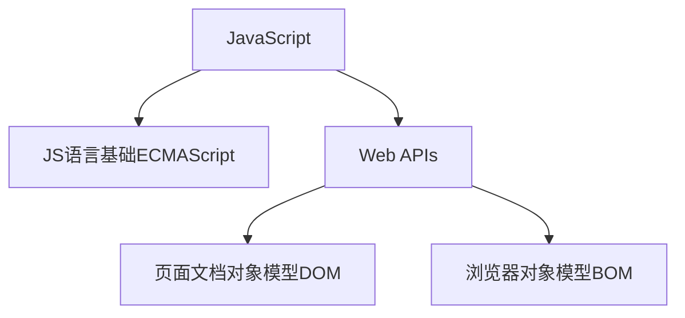

:material-pen-plus: `本文创建于2025-4-18`

## 一、Web APIs 简介

???+ note "变量声明"
    常用 `const` 和 `let` 关键字进行变量声明，在两者都可以使用的情况下，优先使用 `const` 进行变量声明。因为js中很多变量声明之后就不会再更改了，使用 `const` 声明变量语义化更好。

    ???+ tip 
        - 数组和对象建议使用 `const` 进行声明，虽然数组和对象可以使用方法进行修改，但是修改时并不会改变他们的地址，因此可以使用const声明
        - for循环条件中的变量需要使用let声明



### 1.1 DOM简介

DOM（Document Object Model——文档对象模型）是用来呈现以及与任意 HTML 或 XML文档交互的API，即DOM是浏览器提供的一套专门用来 操作网页内容 的功能，用来开发网页内容特效和实现用户交互

**DOM树**

将 HTML 文档以树状结构直观的表现出来，我们称之为文档树或 DOM 树，用来描述网页内容关系的名词，文档树直观的体现了标签与标签之间的关系


**DOM对象**

DOM对象：浏览器根据html标签生成的 JS对象，所有的html标签都视为DOM对象，html标签属性都可以在这个对象上面找到，修改这个对象的属性会自动映射到标签身上

DOM的核心思想 把网页内容当做对象来处理

document 对象 是 DOM 里提供的一个对象，所以它提供的属性和方法都是用来访问和操作网页内容的 例如：document.write()

网页所有内容都在document里面，document代表整个html文件

### 1.2 使用CSS选择器获取DOM元素

- `document.querySelector('css选择器')` 传入css选择器，返回CSS选择器匹配到的第一个HTMLelement对象
- `document.querySelectorAll('css选择器')` 同上，返回所有匹配元素的NodeList对象，相当于是返回一个数组
    - 这个数组并不是真正的数组，只是和数组类似
    - 可以使用数组的下标访问元素
    - 但是不能使用pop()、push()等数组方法

??? info "其他获取DOM元素的方法（不推荐使用）"
    - `document.getElementById()` 传入元素id值，通过id获取匹配到的第一个元素
    - `document.getElementByTagName()` 传入html标签名，通过元素选择器获取匹配到的所有元素
    - `document.getElementByClassName()` 传入类名，通过类选择器获取匹配到的所有元素

### 1.3 操作元素文本内容

- `对象.innerText` 属性 修改html标签的文本内容，显示纯文本，不解析html标签
- `对象.innerHTML` 属性 修改html标签的文本内容，显示纯文本，解析html标签

### 1.4 操作元素属性

**操作常用属性**

`对象.属性名 = 值` 直接通过属性名修改元素属性值，最常见的属性比如： href、title、src 等

**操作元素样式**

=== "直接通过style修改"
    `对象.style.样式属性 = 值` 样式属性就是CSS的属性，由于CSS属性名是使用`-`来命名的，在JS中使用时统一使用小驼峰格式的命名表示CSS属性名。实际上生成的是行内样式

=== "使用类名className修改"
    `对象.className = 值` 先使用CSS在style标签中创建一个类选择器的样式表，再将这个类的类名赋值给此对象的className属性，如果该对象原先也有类名，则会被替换，多个类名看做一个处理，值应该传入类名，而不是类选择器。

=== "使用classList修改（推荐）"
    - `对象.classList.add(类名)` 添加类名，值应该传入类名，而不是类选择器，不会替换原有类名，而是会添加到原有类名后面
    - `对象.classList.remove(类名)` 删除传入的类名
    - `对象.classList.toggle(类名)` 切换对象的一个类名，如果对象原先有这个类名，则会移除，如果对象原先没有这个类名，则会添加

**操作表单属性**

- 与**操作常用属性**用法类似，但是表单属性比较特殊，表单属性一般都是通过`对象.属性名`来获取
- `对象.value` 获取input等标签的输入内容，通过赋值可以更改内容
- `对象.type` 获取input等标签的type属性值，通过赋值可以更改输入框类型
- 表单属性中的 `disabled` `checked` `selected` 等没有属性值的属性，通过js操作时将其值看作是布尔值，如果为true 代表添加了该属性 如果是false 代表移除了该属性
 
**自定义属性**

在html5中推出来了专门的`data-`自定义属性，在标签上一律以`data-`开头，在DOM对象上一律以`dataset`对象方式获取，使用dataset获取属性值时不需要写`data-`前缀

    <div data-id="demo" data-msg="hello">This is a demo!</div>
    <script>
        const div = document.querySelector('div')
        console.log(div.dataset)
        console.log(div.dataset.id) // demo
        console.log(div.dataset.msg) // hello
    </script>

### 1.5 定时器（间歇函数）

每隔一段时间，重复调用一个函数

- `setInterval(函数名或匿名函数, 间隔时间)` 开启定时器，每隔一段时间执行一次函数，间隔时间的单位是毫米，返回一个整数，表示这个定时器的ID，声明变量时使用`let`关键字
- `clearInterval(定时器ID)` 传入代表定时器ID的变量，关闭定时器

## 二、事件

### 2.1 事件监听（事件绑定）

`对象.addEventListener(事件类型, 函数名或匿名函数)` 为对象绑定一个事件，当对象触发这个事件时，会执行函数，这个函数也被称为回调函数。这种绑定事件的方法称为 `L2` 级事件绑定

???+ note "回调函数"
    如果将函数 A 做为参数传递给函数 B 时，我们称函数 A 为回调函数。简单理解： 当一个函数当做参数来传递给另外一个函数的时候，这个函数就是回调函数。

    `setInterval(函数名或匿名函数, 间隔时间)`和`对象.addEventListener(事件类型, 函数名或匿名函数)`都是将函数作为参数传递给另外一个函数，这个函数就是回调函数。

`对象.on事件类型 = 函数名或匿名函数` 为对象绑定一个事件，当对象触发这个事件时，会执行函数，这种方式不推荐使用，因为会覆盖原有的事件处理函数。这种绑定事件的方法称为 `L0` 级事件绑定

事件监听三要素：

- 事件源： DOM对象
- 事件类型： 用什么方式触发
  
    ???+ info "事件类型"
        - 鼠标事件：鼠标点击`click`、鼠标进入`mouseenter`、鼠标离开`mouseleave`

            ??? warning
                鼠标进入有两种表示方式 `mouseover`和 `mouseenter` ，鼠标离开有两种表示方式 `mouseout` 和 `mouseleave` ，二者区别如下：

                - `mouseover` 和 `mouseout` 会有冒泡效果
                - `mouseenter` 和 `mouseleave` 没有冒泡效果 (推荐)

        - 键盘事件：键盘按下`keydown`、键盘抬起`keyup`，一般使用`keyup`
        - 文本事件：用户输入`input`
        - 焦点事件：表单获得焦点`focus`、失去焦点`blur`
        - 页面加载事件：页面加载完成`load`、 DOM（HTML标签）加载完成`DOMContentLoaded`
        - 页面滚动事件：页面滚动`scroll`
        - 页面尺寸事件：页面尺寸变化`resize`
        
        ???+ info "移动端事件"
            移动端事件（M端事件），针对手机平板等触屏设备。触屏事件 `touch` ，touch 对象代表一个触摸点。触摸点可能是一根手指，也可能是一根触摸笔。触屏事件可响应用户手指（或触控笔）对屏幕或者触控板操作。M端事件一般使用JS插件完成，例如swiper插件

            [Swiper官网](https://www.swiper.com.cn/){ .md-button .md-button--primary }
            
            常见的触屏事件：

            - `touchstart` 手指触摸到一个DOM元素时触发
            - `touchmove` 手指在一个DOM元素上滑动时触发
            - `touchend` 手指从一个DOM元素上移开时触发

- 事件调用的函数（回调函数）： 要做什么事

### 2.2 事件对象

事件对象：事件触发时，浏览器会自动创建一个事件对象，这个事件对象会作为参数传递给事件处理函数，我们可以在事件处理函数中使用这个事件对象，来获取事件的详细信息

一般命名为 `event` `ev` `e`，以下用 `e` 表示事件对象

`对象.addEventListener(事件类型, function (e) {})` 为对象绑定一个事件，当对象触发这个事件时，会执行函数。在事件绑定的回调函数的第一个参数 `e` 就是事件对象

???+ tip "事件对象常用属性"
    - `type` 获取当前的事件类型，即`addEventListener()`的第一个参数
    - `clientX` `clientY` 获取光标相对于浏览器可见窗口左上角的位置
    - `offsetX` `offsetY` 获取光标相对于当前DOM元素左上角的位置
    - `key` 用户按下的键盘键的值，比如`Enter`、`Space`、`ArrowUp`、`ArrowDown`、`ArrowLeft`、`ArrowRight`等

### 2.3 环境对象this

环境对象：指的是函数内部特殊的变量 `this` ，它代表着当前函数运行时所处的环境，类似于python类的 `self`。弄清楚this的指向，可以让我们代码更简洁

- 函数的调用方式不同，this 指代的对象也不同
- 粗略判断this的指向：谁调用， this 就是谁
- 直接调用函数，其实相当于是 window.函数，所以 this 指向 window

???+ example
    ```js
    const btn = document.querySelector('button')
    btn.addEventListener('click', function (e) {
        btn.style.backgroundColor = 'red'
        // 此处this指向对象btn，因此上面的代码也可写成：
        this.style.backgroundColor = 'red'
    })
    ```

### 2.4 事件流

事件流：事件流指的是事件完整执行过程中的流动路径。当触发事件时，会经历两个阶段，分别是捕获阶段、冒泡阶段

- 捕获阶段：从DOM的根元素开始去执行对应的事件 （从外到里）。有同类型事件，先触发祖先元素的事件，再触发父元素的事件，最后触发子元素的事件。

    ??? info "事件捕获"
        `对象.addEventListener(事件类型, 函数名或匿名函数, true)` 第三个参数为true时，事件会在捕获阶段执行（很少使用）。第三个参数为false，代表冒泡阶段触发，默认就是false

- 冒泡阶段：当一个元素的事件被触发时，同样的事件将会在该元素的所有祖先元素中依次被触发。这一过程被称为事件冒泡。有同类型事件，先触发子元素本身的事件，再触发父元素的事件，最后触发祖先元素的事件。`对象.addEventListener(事件类型, 函数名或匿名函数, false)`或`对象.addEventListener(事件类型, 函数名或匿名函数)`
- 捕获阶段是从父到子，冒泡阶段是从子到父。实际工作都是使用事件冒泡为主

阻止冒泡 `e.stopPropagation()` 此方法可以阻断事件流动传播，不光在冒泡阶段有效，捕获阶段也有效，阻止事件冒泡需要拿到事件对象，此处用 `e` 表示

阻止默认行为 `e.preventDefault()` 此方法可以阻止默认行为，比如a标签的跳转行为，表单的提交行为，右键菜单的弹出行为等，阻止默认行为需要拿到事件对象，此处用 `e` 表示

### 2.5 解绑事件

`对象.on事件类型 = null` 适用于 L0 事件，直接使用null覆盖原有事件处理函数，将事件处理函数解绑

`removeEventListener(事件类型, 事件处理函数, [获取捕获true或者冒泡阶段false])` 适用于 L2 事件，移除对象的事件监听，第一个参数为事件类型，第二个参数为事件处理函数名。匿名函数无法被解绑，所以需要解绑时，`addEventListener()`绑定事件时不能使用匿名函数

??? info "L0和L2事件绑定的区别"
- 传统on注册（L0）
    - 同一个对象,后面注册的事件会覆盖前面注册(同一个事件)
    - 直接使用null覆盖偶就可以实现事件的解绑
    - 都是冒泡阶段执行的
- 事件监听注册（L2）
    - 语法: `addEventListener(事件类型, 事件处理函数, 是否使用捕获)`
    - 后面注册的事件不会覆盖前面注册的事件(同一个事件)
    - 可以通过第三个参数去确定是在冒泡或者捕获阶段执行
    - 解绑必须使用`removeEventListener(事件类型, 事件处理函数, 获取捕获或者冒泡阶段)`
    - 匿名函数无法被解绑

### 2.6 事件委托

事件委托是利用事件流的特征解决一些开发需求的知识技巧

- 优点：减少事件绑定的次数，可以提高程序性能
- 原理：事件委托其实是利用事件冒泡的特点。给父元素注册事件，当我们触发子元素的时候，会冒泡到父元素身上，从而触发父元素的事件
- 实现：`e.target.tagName` 可以获得真正触发事件的元素的标签名（标签名采用全大写），`e` 表示事件对象，`e.target` 表示真正触发事件的元素（对象）

???+ example "事件委托"
    ```html
    <ul>
        <li>事件1</li>
        <li>事件2</li>
        <li>事件3</li>
        <li>事件4</li>
        <li>事件5</li>
        <p>事件6</p>
    </ul>
    <script>
        const ul = document.querySelector('ul')
        ul.addEventListener('click', function(e){
            if(e.target.tagName === 'LI'){
                e.target.style.color = 'red'
            }
        })
    </script>
    ```
    点击每个li标签，都会变成红色，但是点击p标签不会变成红色，因为p标签不是li标签，所以不会触发事件，使用这种写法可以避免为每个li标签都绑定事件，提高程序性能

### 2.7 页面加载事件

加载外部资源（如图片、外联CSS和JavaScript等）加载完毕时触发的事件

1. `load` 事件：页面完全加载再执行回调函数，此时可以将script标签放在head标签内部

    给 `window` 添加 `load` 事件 `window.addEventListener('load', function(){})`，监听页面所有资源加载完毕，加载完毕之后再调用回调函数

    注意：不光可以监听整个页面资源加载完毕，也可以针对某个资源绑定load事件

2. `DOMContentLoaded` 事件：DOM（网页HTML）加载完毕再执行回调函数，而无需等待样式表、图像等完全加载，此时可以将script标签放在head标签内部。监听页面DOM加载完毕：给 `document` 添加 `DOMContentLoaded` 事件，`document.addEventListener('DOMContentLoaded', function(){})`

### 2.8 页面滚动事件

`scroll` 事件：页面滚动时触发的事件，滚动条滚动时触发。通常给 `window` （有时也给 `document` ） 添加 `scroll` 事件，监听某个元素的内部滚动直接给某个元素加即可

`scrollLeft` 和 `scrollTop` 属性： 获取滚动条滚动像素数的大小，返回数字，可以对其赋值，常使用 `scrollTop`获取竖直方向滚动的大小

开发中，我们经常检测页面滚动的距离

```js
window.addEventListener('scroll', function(){
    // document.documentElement 返回HTML标签表示的对象
    console.log(document.documentElement.scrollTop)
})
```

`元素.scrollTo(x, y)` 方法可把内容滚动到指定的坐标，x 是水平方向滚动的像素数，y 是垂直方向滚动的像素数，常用 `window.scrollTo(0, 0)` 回到顶部

### 2.9 页面尺寸事件

`resize` 事件：页面尺寸变化时触发的事件，通常给 window 添加 resize 事件，监听页面尺寸变化

获取盒子宽高 `clientWidth` 和 `clientHeight` 属性： 获取元素的可见部分宽高（盒子的宽高，不包含border和margin），返回数字，常 `clientWidth` 获取元素的可见部分宽度，`clientHeight` 获取元素的可见部分高度。`document.documentElement.clientWidth` 可以获取浏览器窗口的宽度，`document.documentElement.clientHeight` 可以获取浏览器窗口的高度

获取宽高 `offsetWidth` 和 `offsetHeight` 属性：获取元素的自身宽高（包含元素自身设置的宽高、padding、border），获取出来的是数值。获取的是可视宽高, 如果盒子是隐藏的,获取的结果是0

获取位置 `offsetLeft` 和 `offsetTop` 属性：获取元素距离自己定位父级元素的左、上距离（如果祖先元素没有开启定位，以 文档左上角为基准），可以通过这种方式获取元素在页面中的位置，从而避免使用css计算宽高，这两个属性不可以赋值

获取位置 `对象.getBoundingClientRect()`方法 返回元素的大小及其相对于视口的位置

## 三、日期对象

日期对象：用来表示时间的对象。作用：可以得到当前系统时间

???+ note "实例化"
    在代码中使用 new 关键字，一般将这个操作称为实例化

创建一个时间对象并获取时间：

- `new Date()` 不传参，获取的是当前时间
- `new Date(时间字符串)` 传入时间字符串，获取的是指定时间

日期对象常用方法：

- `getFullYear()` 获得年份 获取四位年份
- `getMonth()` 获得月份 取值为 0 ~ 11，实际月份为 `日期对象.getMonth() + 1`
- `getDate()` 获取月份中的每一天 不同月份取值也不相同
- `getDay()` 获取星期 取值为 0 ~ 6，星期日的序号为0
- `getHours()` 获取小时 取值为 0 ~ 23
- `getMinutes()` 获取分钟 取值为 0 ~ 59
- `getSeconds()` 获取秒 取值为 0 ~ 59
- `toLocaleString()` 转换为本地时间字符串，格式和Windows右下角的日期和时间相同
- `toLocaleDateString()` 转换为本地日期字符串，格式和Windows右下角的日期相同

**时间戳**

时间戳是指1970年01月01日00时00分00秒起至现在的毫秒数，它是一种特殊的计量时间的方式

获取时间戳的三种方式：

- `+new Date()`（推荐使用） 方法返回当前时间的时间戳，单位为毫秒
- `Date.now()` 方法返回当前时间的时间戳，单位为毫秒，只能获取当前的时间戳
- `new Date().getTime()` 方法返回当前时间的时间戳，单位为毫秒。先创建日期对象，再使用 `getTime()` 方法获取时间戳


## 四、节点操作

### 4.1 节点

**DOM节点** DOM树里每一个内容都称之为节点

节点类型：

- **元素节点** 所有的标签 比如 body、 div，html 是根节点
- 属性节点 所有的属性 比如 href属性、class属性等
- 文本节点 所有的文本
- 其他


### 4.2 查找节点

- 获取父节点 `对象.parentNode` 返回的是父节点对象，如果没有父节点，则返回 `null`
- 获取所有子节点 `对象.childNodes` 不推荐使用，获得所有子节点、包括文本节点（空格、换行）、注释节点等
- 获取元素子节点 `对象.children` 推荐使用，获得所有元素子节点，返回的是一个伪数组，与 `querySelectorAll()` 类似
- 获取下一个兄弟元素节点 `对象.nextElementSibling`
- 获取上一个兄弟元素节点 `对象.previousElementSibling`

### 4.3 创建节点和添加节点

添加节点，一般要先创建，然后追加节点或插入节点

- 创建节点 `document.createElement(标签名)` 创建一个指定标签名的元素节点，返回的是元素节点对象
- 追加节点 `对象.appendChild(节点对象)` 将节点对象追加到指定对象的子节点列表的末尾，类似于给数组追加元素
- 插入节点 `父元素对象.insertBefore(要插入的节点对象, 参照节点对象)` 将节点对象插入到参照节点对象的前面，`父元素对象.children[0]`为第二个参数时，可以将要插入的节点插入到最前面

### 4.4 克隆节点和添加节点

特殊情况下，我们新增节点，按照如下操作：复制一个原有的节点，再把复制的节点放入到指定的元素内部

克隆节点 `对象.cloneNode(布尔值)` 克隆出一个跟原标签一样的元素，括号内传入布尔值

- 若为 `true` ，则代表克隆时会包含后代节点一起克隆，完全克隆
- 若为 `false` ，默认，则代表克隆时不包含后代节点，只克隆html标签，标签内的文字和标签不会被克隆

### 4.5 删除节点

删除节点 `父元素对象.removeChild(要删除的元素对象)` 通过父节点删除子节点，从html中删除节点对应的元素

## 五、window对象

### 5.1 BOM

- BOM(Browser Object Model ) 是浏览器对象模型
- `window` 对象是一个全局对象，也可以说是JavaScript中的顶级对象
- 像 `document` 、 `alert()` 、`console.log()` 这些都是 `window` 的属性，基本BOM的属性和方法都是 `window` 的
- 所有通过var定义在全局作用域中的变量、函数都会变成window对象的属性和方法
- window对象下的属性和方法调用的时候可以省略window


### 5.2 定时器-延时函数

`setTimeout(函数名或匿名函数, 间隔时间)` 让代码延迟执行的函数，类似于 `setInterval(函数名或匿名函数, 间隔时间)` ，但回调函数仅仅只执行一次，所以可以理解为就是把一段代码延迟执行, 平时省略window

`clearTimeout()` 清除延时函数

???+ warning
    - 延时器需要等待,所以后面的代码先执行
    - 每一次调用延时器都会产生一个新的延时器
    - 延时函数`setTimeout(函数名或匿名函数, 间隔时间)`: 执行一次
    - 间歇函数`setInterval(函数名或匿名函数, 间隔时间)`:每隔一段时间就执行一次,除非手动清除
  
### 5.3 JS执行机制

JavaScript 语言的一大特点就是单线程，也就是说，同一个时间只能做一件事。这是因为 Javascript 这门脚本语言诞生的使命所致——JavaScript 是为处理页面中用户的交互，以及操作DOM 而诞生的。比如我们对某个 DOM 元素进行添加和删除操作，不能同时进行。 应该先进行添加，之后再删除。单线程就意味着，所有任务需要排队，前一个任务结束，才会执行后一个任务。这样所导致的问题是：如果 JS 执行的时间过长，这样就会造成页面的渲染不连贯，导致页面渲染加载阻塞的感觉。

为了解决这个问题，利用多核 CPU 的计算能力，HTML5 提出 Web Worker 标准，允许 JavaScript 脚本创建多个线程。于是，JS 中出现了同步和异步（二者的本质区别是执行顺序不同）： 

- **同步** 前一个任务结束后再执行后一个任务，程序的执行顺序与任务的排列顺序是一致的、同步的。比如做饭的同步做法：我们要烧水煮饭，等水开了（10分钟之后），再去切菜，炒菜。 
- **异步** 你在做一件事情时，因为这件事情会花费很长时间，在做这件事的同时，你还可以去处理其他事情。比如做饭的异步做法，我们在烧水的同时，利用这10分钟，去切菜，炒菜。

**同步任务** 同步任务都在主线程上执行，形成一个执行栈。 

**异步任务** JS 的异步是通过回调函数实现的。一般而言，异步任务有以下三种类型:
- 普通事件，如 click、resize 等
- 资源加载，如 load、error 等
- 定时器，包括 setInterval、setTimeout 等

异步任务添加到任务队列中（任务队列也称为消息队列）：

1. 先执行执行栈中的同步任务。
2. 异步任务放入任务队列中。
3. 一旦执行栈中的所有同步任务执行完毕，系统就会按次序读取任务队列中的异步任务，于是被读取的异步任务结束等待状态，进入执行栈，开始执行。

由于主线程不断的重复获得任务、执行任务、再获取任务、再执行，所以这种机制被称为事件循环（ event loop）

### 5.4 location对象

`location` 对象，它拆分并保存了 URL 地址的各个组成部分。常用属性和方法：

- `href` 属性获取完整的 URL 地址，对其赋值时用于地址的跳转
- `search` 属性获取地址中携带的参数，符号 ？后面部分的字符串，包括问号
- `hash` 属性获取地址中的啥希值（后期vue路由的铺垫，经常用于不刷新页面，显示不同页面，比如 网易云音乐），符号 # 后面部分，包括 #
- `reload` 方法用来刷新当前页面，相当于 ++f5++ ，传入参数 true 时表示强制刷新，相当于 ++ctrl+f5++

### 5.5 navigator对象

`navigator` 对象，该对象下记录了浏览器自身的相关信息

常用属性 `userAgent` 检测浏览器的版本及平台，常常通过 UA 将 PC站跳转到 m站

```js
// 检测 userAgent（浏览器信息）
!(function () {
    const userAgent = navigator.userAgent
    // 验证是否为Android或iPhone
    const android = userAgent.match(/(Android);?[\s\/]+([\d.]+)?/)
    const iphone = userAgent.match(/(iPhone\sOS)\s([\d_]+)/)
    // 如果是Android或iPhone，则跳转至移动站点
    if (android || iphone) {
        location.href = '移动端url' 
    }
})()
```

### 5.6 history对象

`history` 对象，此对象不常用，主要管理历史记录，该对象与浏览器地址栏的操作相对应，如前进、后退、历史记
录等，常用方法如下：

- `back()` 后退，相当于 `go(-1)`
- `forward()` 前进，相当于 `go(1)`
- `go(数字)` 前进或后退，数字为正数时前进，数字为负数时后退，数字为0时刷新当前页面

### 5.7 本地存储

随着互联网的快速发展，基于网页的应用越来越普遍，同时也变的越来越复杂，为了满足各种各样的需求，会经常性在本地存储大量的数据，HTML5规范提出了相关解决方案。

- 数据存储在用户浏览器中
- 设置、读取方便、甚至页面刷新不丢失数据
- 容量较大，本地存储分为 `sessionStorage` 和 `localStorage`, 存储的内容约 5Mb 左右

???+ info "localStorage"
    可以将数据永久存储在本地(用户的电脑), 除非手动删除，否则关闭页面也会存在

    - 存储数据 `localStorage.setItem('键', '值')` 存储的数据在 `开发者工具` 的 `应用Application` 选项卡 中查看
    - 获取数据 `localStorage.getItem('键')` 类似于python字典通过键获取值
    - 删除数据 `localStorage.removeItem('键')` 通过键删除键值对
    
    特性：

    - 可以多窗口（页面）共享（同一浏览器可以共享）
    - 以键值对的形式存储使用

???+ info "sessionStorage"
    特性：

    - 生命周期为关闭浏览器窗口
    - 在同一个窗口(页面)下数据可以共享
    - 以键值对的形式存储使用
    - 用法跟 `localStorage` 基本相同, 不常用

### 5.8 用本地存储存储复杂数据类型(对象)

本地只能存储字符串,无法存储复杂数据类型(对象等). 如果复杂数据类型需要使用本地存储,需要先把复杂数据类型转换成JSON字符串(JSON字符串的键和值都使用双引号包裹)

- `JSON.stringify(对象)` 将对象转换为JSON字符串
- `JSON.parse(JSON字符串)` 将JSON字符串转换为对象

存储数据 `localStorage.setItem('键', JSON.stringify(对象))`

获取数据 `localStorage.getItem('键')` 获取键对应的JSON字符串,并不是对象,还需要对其返回值使用 `JSON.parse(JSON字符串)` 才能获取到对象

## 六、正则表达式

???+ error
    所有正则表达式都不要随便加空格,符合之间不需要任何空格

### 6.1 简介

正则表达式（Regular Expression）是用于匹配字符串中字符组合的模式。在 JavaScript中，正则表达式也是对象通常用来查找、替换那些符合正则表达式的文本，许多语言都支持正则表达式。

正则表达式在 JavaScript中的使用场景：

- 表单验证（匹配）
- 过滤敏感词（替换）
- 字符串中提取我们想要的部分（提取）

### 6.2 语法

使用正则表达式,首先需要定义规则(创建正则表达式对象)

`const regExp = /正则表达式/`

???+ warning
    两个 `/` 之间的正则表达式不需要使用引号包裹, `/` 与 正则表达式之间不要随便加空格

- `regExp.test(字符串)` 判断字符串中是否有符合匹配的内容,返回布尔值
- `regExp.exec(字符串)` 检索符合匹配的内容, 返回元组, 如果没有符合匹配的内容,则返回 `null`

### 6.3 元字符

普通字符: 大多数的字符仅能够描述它们本身，这些字符称作普通字符，例如所有的字母和数字。也就是说普通字符只能够匹配字符串中与它们相同的字符。例如 `/hello/` 这个正则表达式使用的就是普通字符

元字符(特殊字符) 是一些具有特殊含义的字符，可以极大提高了灵活性和强大的匹配功能。比如，规定用户只能输入英文26个英文字母，普通字符的话`/abcdefghijklmnopqrstuvwxyz/`, 但是换成元字符写法： `[a-z]`

参考文档：[MDN正则表达式文档](https://developer.mozilla.org/zh-CN/docs/Web/JavaScript/Guide/Regular_expressions){ .md-button .md-button--primary }
[开源中国正则测试工具](http://tool.oschina.net/regex){ .md-button }

元字符分为以下三类:

- 边界符（表示位置，开头和结尾，必须用什么开头，用什么结尾）
    - `^` 以什么开始
    - `$` 以什么结尾
    - 如果 `^` 和 `$` 在一起，表示必须是精确匹配

    ???+ example 
        ```js
        // 普通字符, 只要字符串中有 h 就返回 true
        console.log(/h/.test('hello')) // true
        console.log(/h/.test('high')) // true

        // 使用^, 必须以 h 开头
        console.log(/^h/.test('hello')) // true
        console.log(/^h/.test('lunch')) // false

        // 使用$, 必须以 h 结尾
        console.log(/h$/.test('lunch')) // true
        console.log(/h$/.test('hello')) // false

        // 同时使用^和$, 只匹配 h
        console.log(/^h$/.test('lunch')) // false
        console.log(/^h$/.test('h')) // true
        console.log(/^h$/.test('hh')) // false
        ```

- 量词 （表示重复次数）
    - `*` 重复0次或更多次
    - `+` 重复1次或更多次
    - `?` 重复0次或1次
    - `{n}` 重复n次
    - `{n,}` 重复n次或更多次,不要随便加空格,逗号之后也不要空格
    - `{n,m}` 重复n次到m次,包括m和n,不要随便加空格,逗号之后也不要空格

    ???+ example
        ```js
        // 使用*, 重复0次或更多次(字符串中只能有h,但h可以重复任意次)
        console.log(/^h*$/.test('')) // true
        console.log(/^h*$/.test('h')) // true
        console.log(/^h*$/.test('hhhhhhhhh')) // true

        // 使用+, 重复1次或更多次(字符串中只能有h,但h可以重复1次及其以上)
        console.log(/^h+$/.test('')) // false
        console.log(/^h+$/.test('h')) // true
        console.log(/^h+$/.test('hhhhhhh')) // true

        // 使用?, 重复0次或1次(字符串中只能有1个h,或者为空字符串)
        console.log(/^h?$/.test('')) // true
        console.log(/^h?$/.test('h')) // true
        console.log(/^h?$/.test('hh')) // false

        // 使用{n}, 重复n次(字符串只能为'hhh')
        console.log(/^h{3}$/.test('hh')) // false
        console.log(/^h{3}$/.test('hhh')) // true
        console.log(/^h{3}$/.test('hhhh')) // false

        // 使用{n,}, 重复n次及其以上(字符串中只能有h, 且至少有3个h)
        console.log(/^h{3,}$/.test('hh')) // false
        console.log(/^h{3,}$/.test('hhh')) // true
        console.log(/^h{3,}$/.test('hhhhhhhh')) // true

        // 使用{n,m}, 重复n到m次,包括端点(字符串只能是'hhh', 'hhhh', 'hhhhh')
        console.log(/^h{3,5}$/.test('hh')) // false
        console.log(/^h{3,5}$/.test('hhh')) // true
        console.log(/^h{3,5}$/.test('hhhh')) // true
        console.log(/^h{3,5}$/.test('hhhhh')) // true
        console.log(/^h{3,5}$/.test('hhhhhh')) // false
        ```

- 字符类 （比如 \d 表示 0~9）
    - `[]` 匹配字符集合, 只要字符串中有正则表达式方括号中任一字符, 就符合匹配, 在 `[]`中还可以使用 `-`, 比如 
        - `[0-9]` 相当于 `[0123456789]`
        - `[a-z] ` 相当于 小写英文字母的字符集合
        - `[a-zA-Z]` 相当于 英文字母的字符集合
        - 腾讯QQ号从10000开始, 因此可表示为 `^[1-9][0-9]{4,}$`

        ???+ example
            ```js
            // 只要字符串中有a,b,c三者中的一个,就符合匹配
            console.log(/[abc]/.test('java')) // true
            console.log(/[abc]/.test('boy')) // true
            console.log(/[abc]/.test('css')) // true
            console.log(/[abc]/.test('html')) // false

            // 字符串必须是'a', 'b', 'c' 三者之一
            console.log(/^[abc]$/.test('api')) // false
            console.log(/^[abc]$/.test('abc')) // false
            console.log(/^[abc]$/.test('a')) // true
            console.log(/^[abc]$/.test('b')) // true
            console.log(/^[abc]$/.test('c')) // true

            // 字符串必须是 a, b, c中二者的组合而成的字符串, 例如 'aa', 'ab', 'ac'等
            console.log(/^[abc]{2}$/.test('api')) // false
            console.log(/^[abc]{2}$/.test('aa')) // true
            ```
    
    - `[^]` 表示 `[]`字符集合的取反, 例如 `[^a-z]` 匹配除了小写字母以外的字符
    - `.` 匹配除换行符之外的任何单个字符
    - 预定义, 某些常用正则表达式的简写, 例如可以使用 `\d{4}-\d{1,2}-\d{1,2}` 匹配 `2025-5-26` 格式的日期

        | 预定义 | 含义 |
        | --- | --- |
        | `\d` | 匹配0-9之间的任一数字，相当于`[0-9]` |
        | `\D` | 匹配所有0-9以外的字符，相当于`[^0-9]` |
        | `\w` | 匹配任意的字母、数字和下划线，相当于`[A-Za-z0-9_]` |
        | `\W` | 除所有字母、数字和下划线以外的字符，相当于`[^A-Za-z0-9_]` |
        | `\s` | 匹配空格（包括换行符\n、制表符\t、空格符等），相等于`[ \t\r\n\v\f]` |
        | `\S` | 匹配非空格的字符，相当于`[^ \t\r\n\v\f]` |

    - 修饰符 修饰符约束正则执行的某些细节行为，如是否区分大小写、是否支持多行匹配等
        - 语法 `/正则表达式/修饰符` 
        - `i` 是单词 ignore 的缩写，正则匹配时字母不区分大小写
        - `g` 是单词 global 的缩写，匹配所有满足正则表达式的结果(正则表达式默认只匹配第一个符合条件的结果)
        - `ig` 或 `gi` 不区分大小写,匹配所有结果

        ???+ example
            ```js
            // 不区分大小写
            console.log(/a/i.test('API')) // true
            console.log(/a/i.test('api')) // true
            ```
    
    - `.replace()` 方法
        - 语法 `字符串.replace(正则表达式对象, '替换为的文本')` 将字符串中符合匹配的文本替换为传入的文本

        ```js
        const str = 'HTML 是一门前端语言, 学习 html 对于学习前端非常重要'
        const newStr1 = str.replace(/HTML/, 'JavaScript')
        console.log(newStr1) // JavaScript 是一门前端语言, 学习 html 对于学习前端非常重要
        const newStr2 = str.replace(/HTML/ig, 'JavaScript')
        console.log(newStr2) // JavaScript 是一门前端语言, 学习 JavaScript 对于学习前端非常重要
        ```