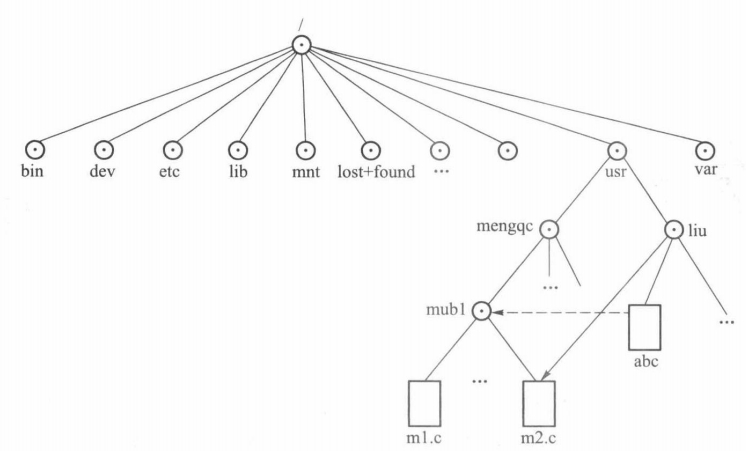

# 文件管理

## 文件系统

Linux文件系统中的文件是数据的集合，文件系统不仅包含着文件中的数据而且包含文件系统的结构，所有Linux用户和程序看到的文件、目录及文件保护信息等都存储在文件系统中。从用户角度看，文件系统是具有层次结构的，由若干目录和子目录组成

- 文件：文件系统中存储数据的一个命名对象。它是用户眼中最小的逻辑存储单元。
- 目录：包含许多文件控制块项目的一类特殊文件。目录支持文件系统的层次结构。文件系统中的每个文件都登记在一个或多个目录中。
- 子目录：被包含在另一目录中的目录。包含子目录的目录称为父目录。除了根目录`/`外，所有目录都是子目录，有父目录存在。目录的主要作用是和文件名共同组成路径，唯一地对应于一个文件。在Linux操作系统中，所有的文件和目录都被组织成从一个根节点“/”开始的倒置的树状结构



在Linux系统中，一切都是文件，既然是文件，就必须要有文件名。同其他系统相比，Linux系统对文件或目录命名的要求相对比较宽松。在Linux系统中，文件和目录的命名规则如下：

- 除了字符`/`之外，所有的字符都可以使用，但是要注意，在目录名或文件名中，使用某些特殊字符并不是明智之举。例如，在命名时应避免使用<、>、？、*和非打印字符等。如果一个文件名中包含了特殊字符，例如空格，那么在访问这个文件时就需要使用引号将文件名括起来。
- 目录名或文件名的长度不能超过255个字符。
- 目录名或文件名是区分大小写的。如DOG、dog、Dog和DOg是互不相同的目录名或文件名，但使用字符大小写来区分不同的文件或目录，也是不明智的。
- 与Windows系统不同，文件的扩展名对Linux系统没有特殊的含义，换句话说，Linux系统并不以文件的扩展名来区分文件类型。例如，dog.exe只是一个文件，其扩展名.exe并不代表此文件就一定是可执行文件。
 
如果一个目录或文件名是以`.`开始，就表示这个目录或文件是一个隐藏目录或文件，即以默认方式查找时，不显示该目录或文件。

在Linux系统中，硬件设备也是文件，也有各自的文件名称。Linux系统内核中的udev设备管理器会自动对硬件设备的名称进行规范，目的是让用户通过设备文件的名称，就可以大致猜测出设备的属性以及相关信息。udev设备管理器会一直以进程的形式运行，并监听系统内核发出的信号来管理位于/dev目录下的设备文件。

Linux系统中常见硬件设备的文件名：

- IDE设备 `/dev/hd[a-d]`，现在的IDE设备已经很少见了，因此一般的硬盘设备会以`/dev/sd`开头
- SCSI/SATA/U盘 `/dev/sd[a-p]`，一台主机可以有多块硬盘，因此系统采用a~p代表16块不同的硬盘
- 软驱 `/dev/fd[0-1]`
- 打印机 `/dev/lp[0-15]`
- 光驱 `/dev/cdrom`
- 鼠标 `/dev/mouse`
- 磁带机 `/dev/st0`或`/dev/ht0`

### 文件结构和类型

文件是Linux系统处理信息的基本单位，所有软件都组织成文件。所有文件都由两部分组成，数据项和文件控制块。在Linux系统中文件控制块被称为索引节点。

- 索引节点（又称I节点）：在文件系统结构中索引节点负责记录相应文件的控制信息，包括文件权限、文件大小等。
- 数据：文件的实际内容，它可以为空，也可以非常大，并且有自己的结构。

根据文件数据项是否具有结构，可以将文件分成两大类：无结构文件（即字符流文件）和有结构文件（例如目录文件）。但是在通常情况下，Linux文件类型被划分为普通文件、目录文件、链接文件及设备文件。

- 普通文件：它是最常使用的一类文件，其特点是不包含文件系统的结构信息。通常用户所接触到的文件，如图形文件、数据文件、文档文件、声音文件等都属于这种文件。这种类型的文件按其内部结构又可分为文本文件和二进制文件。
- 目录文件：目录文件是用于存放文件名及其相关信息的文件。它是内核组织文件系统的基本节点。目录文件可以包含下一级文件目录或普通文件。
- 链接文件：链接文件是一种特殊文件，实际上是指向一个真实文件的链接，类似于Windows系统中的快捷方式。链接文件又可细分为硬链接（HardLink）文件和符号链接（SymbolicLink）文件
- 设备文件：设备文件是Linux系统中最特殊的文件。正是它的存在使得Linux系统可以十分方便地访问外部设备。Linux系统为外部设备提供一种标准接口，将外部设备视为一种特殊文件。用户可以像访问普通文件一样访问任何外部设备，使Linux系统可以很方便地适应不断发展的外部设备。通常Linux系统将设备文件放在/dev目录下，设备文件使用设备的主设备号和次设备号来指定某外部设备。根据访问数据方式的不同，设备文件又可分为块设备和字符设备。

## 文件与目录操作

### 文件操作命令

#### cat命令

cat命令可以用来显示文本文件的内容，也可以把几个文件内容附加到另一个文件中，即连接、合并文件，cat的全称是concatenate（连接、连续）。适合查看文件内容较少的文件。

cat命令的基本格式：`$ cat [选项] 文件名` 或者 `$ cat 文件1 文件2 > 文件3`

在这两种格式中，前者用于显示文件的内容，常用选项及各自的含义如下所示；后者用于连接、合并文件。如果文件3不存在，则自动创建文件；已存在，则覆写

- `-n` 对输出的所有行进行编号。
- `-b` 与-n不同，此选项表示只对非空行进行编号。
- `-s` 当遇到连续2行以上的空白行时，就替换为1行的空白行。

``` bash
$ vim hello.txt
$ cat hello.txt
hello
world
linux
$ cat -n hello.txt
     1  hello
     2  world
     3  linux
```

当cat后面带多个参数时，cat就会依次将参数所表示的文件显示在显示屏上，从而将多个文件连接在一起，如果需要将连接后的文件生成一个新文件，使用`>`输出重定向符，就可以将连接后的文件保存在一个新文件中

``` bash
$ vim lang.txt
$ cat lang.txt
html
css
javascript
$ cat hello.txt lang.txt
hello
world
linux
html
css
javascript
$ cat hello.txt lang.txt > text.txt
$ cat text.txt
hello
world
linux
html
css
javascript
```

#### more 命令

分页显示文本文件内容，适合查看内容较多的文件。

语法 `$ more [选项] 文件名`

选项：

- `-c`或`-p` 不滚屏，先清屏后再显示内容。
- `-s` 当遇到连续两行以上的空白行时，就替换为一行的空白行。
- `+n` 从第n行开始显示文件内容，n代表数字。
- `-n` 一次显示的行数，n代表数字。

``` bash
$ more /etc/passwd
root:x:0:0:root:/root:/bin/bash
daemon:x:1:1:daemon:/usr/sbin:/usr/sbin/nologin
bin:x:2:2:bin:/bin:/usr/sbin/nologin
sys:x:3:3:sys:/dev:/usr/sbin/nologin
sync:x:4:65534:sync:/bin:/bin/sync
games:x:5:60:games:/usr/games:/usr/sbin/nologin
man:x:6:12:man:/var/cache/man:/usr/sbin/nologin
lp:x:7:7:lp:/var/spool/lpd:/usr/sbin/nologin
mail:x:8:8:mail:/var/mail:/usr/sbin/nologin
news:x:9:9:news:/var/spool/news:/usr/sbin/nologin
uucp:x:10:10:uucp:/var/spool/uucp:/usr/sbin/nologin
proxy:x:13:13:proxy:/bin:/usr/sbin/nologin
www-data:x:33:33:www-data:/var/www:/usr/sbin/nologin
backup:x:34:34:backup:/var/backups:/usr/sbin/nologin
list:x:38:38:Mailing List Manager:/var/list:/usr/sbin/nolo
gin
irc:x:39:39:ircd:/run/ircd:/usr/sbin/nologin
_apt:x:42:65534::/nonexistent:/usr/sbin/nologin
nobody:x:65534:65534:nobody:/nonexistent:/usr/sbin/nologin
systemd-network:x:998:998:systemd Network Management:/:/us
r/sbin/nologin
systemd-timesync:x:996:996:systemd Time Synchronization:/:
/usr/sbin/nologin
dhcpcd:x:100:65534:DHCP Client Daemon,,,:/usr/lib/dhcpcd:/
bin/false
messagebus:x:101:101::/nonexistent:/usr/sbin/nologin
syslog:x:102:102::/nonexistent:/usr/sbin/nologin
systemd-resolve:x:991:991:systemd Resolver:/:/usr/sbin/nol
ogin
--More--(80%)
```

使用空格键翻页。

#### less 命令

用法和more相似，兼容more的所有功能。

语法 `$ less [选项] 文件名`

q键退出

#### head命令

head命令可以显示指定的文件前若干行的内容，其基本格式如下：`$ head [选项] 文件名`

选项：

- `-n k` 这里的k表示行数，该选项用来显示文件前k行的内容。
- `-c k` 这里的k表示字节数，该选项用来显示文件前k个字节的内容。
- `-v` 显示文件名。

如不设置显示的具体行数，则默认显示10行的文本数据。

``` bash
~$ head /etc/passwd
root:x:0:0:root:/root:/bin/bash
daemon:x:1:1:daemon:/usr/sbin:/usr/sbin/nologin
bin:x:2:2:bin:/bin:/usr/sbin/nologin
sys:x:3:3:sys:/dev:/usr/sbin/nologin
sync:x:4:65534:sync:/bin:/bin/sync
games:x:5:60:games:/usr/games:/usr/sbin/nologin
man:x:6:12:man:/var/cache/man:/usr/sbin/nologin
lp:x:7:7:lp:/var/spool/lpd:/usr/sbin/nologin
mail:x:8:8:mail:/var/mail:/usr/sbin/nologin
news:x:9:9:news:/var/spool/news:/usr/sbin/nologin
```

head命令默认显示文件的开头10行内容。如果想显示指定的行数，则只需使用`-n`选项即可：

``` bash
$ head -n 3 /etc/passwd
root:x:0:0:root:/root:/bin/bash
daemon:x:1:1:daemon:/usr/sbin:/usr/sbin/nologin
bin:x:2:2:bin:/bin:/usr/sbin/nologin
```

这是显示文件的开头3行内容，也可以直接写`-行数`

``` bash
$ head -3 /etc/passwd
root:x:0:0:root:/root:/bin/bash
daemon:x:1:1:daemon:/usr/sbin:/usr/sbin/nologin
bin:x:2:2:bin:/bin:/usr/sbin/nologin
```

#### tail命令

tail命令和head命令正好相反，它用来查看文件末尾的数据，其基本格式如下：`$ tail [选项] 文件名`

tail命令可以使用“-f”选项来监听文件的新增内容，例如执行命令`$ tail -f file`，光标不会退出文件，而会一直监听在文件的结尾处。如果向文件中追加一些数据，那么，在原始的正在监听的终端中，会看到追加的信息。如果想终止输出，按Ctrl+C键中断tail命令即可。

#### touch命令

touch命令可以用来创建文件（当指定操作文件不存在时，该命令会在当前位置建立一个空文件），此命令更重要的功能是修改文件的时间参数（当文件存在时，会修改此文件的时间
参数）。

在Linux系统中，每个文件主要拥有3个时间参数（通过stat命令进行查看），分别是文件的
访问时间、数据修改时间以及状态修改时间。

``` bash
$ stat /etc/passwd
  File: /etc/passwd
  Size: 1521            Blocks: 8          IO Block: 4096   regular file
Device: 8,32    Inode: 44737       Links: 1
Access: (0644/-rw-r--r--)  Uid: (    0/    root)   Gid: (    0/    root)
Access: 2025-08-07 14:50:57.790158641 +0800
Modify: 2025-08-07 14:50:57.770158646 +0800
Change: 2025-08-07 14:50:57.770158646 +0800
 Birth: 2025-08-07 14:50:57.770158646 +0800
```

- 访问时间（access time，简称atime）：只要文件的内容被读取，访问时间就会更新。例如，使用cat命令可以查看文件的内容，此时文件的访问时间就会发生改变。
- 数据修改时间（modify time，简称mtime）：当文件的内容数据发生改变，此文件的数据修改时间就会相应改变。
- 状态修改时间（change time，简称ctime）：当文件的状态发生变化，就会相应改变这个时间。比如说，如果文件的权限或者属性发生改变，此时间就会相应改变。


touch命令的基本格式：`$ touch [选项] 文件名`

选项：

- -a：只修改文件的访问时间。
- -c：修改文件的时间参数（3个时间参数都改变），如果文件不存在，则不建立新文件。
- -m：只修改文件的数据修改时间。
- -t：该选项后面可以跟欲修订的时间，而不用目前的时间，时间格式为YYYYMMDDhhmm

可以看到，touch命令可以只修改文件的访问时间，也可以只修改文件的数据修改时间，但是不能只修改文件的状态修改时间。因为，不论是修改访问时间，还是修改文件的数据修改时间，对文件来讲，状态都会发生改变，即状态修改时间会随之改变（更新为操作当前文件的真正时间）。

#### grep 命令


grep，即global regular expressions print，在一个或多个文件中搜索某一特定的字符模式（即正则表达式），此模式可以是单一的字符、字符串、单词或句子。正则表达式是描述一组字符串的一个模式，可以是一些纯文本文字，也可以是用来产生模式的一些特殊字符。正则表达式中包含一些特殊字符，与通配符含义不同。

- c* 将匹配 0 个或多个字符 c（c 为任一字符）
- .： 将匹配任何一个字符，且只能是一个字符。
- [xyz]：匹配方括号中任意一个字符。
- [^xyz]：匹配出方括号中字符外的所有字符。
- ^：行首定位符。
- $：行尾定位符。

grep命令用来在每一个文件中（或特定输出上)搜索特定的模式。当使用grep 时，包含指定字符模式的每一行内容，都会被打印（显示）到显示器上，但是使用grep命令并不改变文件中的内容。

grep命令的基本格式如下：`$ grep [选项] 模式 文件名`

这里的模式，要么是字符（串），要么是正则表达式。此命令常用的选项如下：

- -F：将查找模式解释成单纯的字符串。
- -E：将查找模式解释成正则表达式。
- -C：仅列出文件中包含模式的行数。
- -i：忽略模式中的字母大小写。
- -n:在每一行的最前面列出行号。
- -v:列出没有匹配模式的行。

注意：如果是搜索多个文件，grep命令的搜索结果只显示文件中发现匹配模式的文件名。

``` bash
$ grep root /etc/passwd
root:x:0:0:root:/root:/bin/bash
```

#### sed 命令

主要用来自动编辑一个或多个文件，简化对文件的反复操作，编写转换程序等。

语法 `$ sed [选项] 编辑命令 文件名`

选项：

- -n：只显示匹配处理的行
- -e：执行多个编辑命令时使用（一般用“；”代替）
- -i：直接在文件中进行修改，而不是输出到显示器。
- -f：从脚本文件中读取内容并执行（文件中的编辑命令每行一个，不用“；”隔开）

编辑命令：

- p：打印匹配行 print
- d：删除指定行 delete
- a：在匹配行后面追加 append
- i：在匹配行前面插入 insert
- c：整行替换
- r：读取文件的内容
- w：将文本写入文件
- s：字符串替换（匹配正则表达式）substitution

将/etc/passwd文件的第二行和第三行输出到控制台：

``` bash
$ sed -n "2,3p" /etc/passwd
daemon:x:1:1:daemon:/usr/sbin:/usr/sbin/nologin
bin:x:2:2:bin:/bin:/usr/sbin/nologin
```

#### awk 命令

#### cp 命令

#### rm 命令

永久性删除文件或目录

`$ rm [选项] 文件或目录`

- -f：强制删除 force
- -i：删除前询问
- -r：递归删除，主要用于删除目录，可删除指定目录及包含的所有内容。

#### mv 命令

可在不同目录间移动文件或目录，也可对文件和目录进行重命名。

语法 `$ mv [选项] 源文件 目标文件`

- -f：强制覆盖
- -i：交互移动，若目标文件已经存在，询问用户是否覆盖（默认选项）
- -n：若目标文件已经存在，则不会覆盖移动，而且不询问用户。
- -v：显示文件或目录的移动过程。
- -u：若目标文件已经存在，两者相比，源文件更新，则会对目标文件进行升级。

如果源文件和目标文件在同一个目录中，此时mv就是重命名

#### sort 命令

排序命令。ASCII 码值进行比较，升序输出。

- -r 反向排序。

#### wc 命令

### 目录操作命令

#### mkdir 创建目录

#### rmdir 删除空目录

#### cd 切换工作目录

#### pwd 打印当前工作目录

print working directory 显示当前所在的目录。

#### ls 显示当前目录下的内容

不使用任何选项时，默认只会显示非隐藏文件的名称，并以文件名进行排序。
-a 显示全部的文件，包括隐藏文件。（开头为”.”的文件）

#### ln 链接

## 访问权限管理

可以使用 ls 命令查看文件和目录的权限信息，ls -al

### 权限位

### 修改权限位的命令

#### chmod 命令

权限与数字对应关系： r -4，w -2，x -1
使用数字修改文件权限的命令格式：
chmod 权限值 文件名
若加选项 -R 表示连同子目录中的所有文件，也都修改为设定的权限。
文件的基本权限就是 3 种用户身份，所有者 u，所属组 g 和其他人 o 。a 代表全部的身份。
chmod go+/-/=rwx

#### umask 命令
使用 umask 默认权限来给所有新建的文件和目录赋予初始权限。
直接通过 umask 命令得知默认权限的值！
默认是 0022，第 1 个数代表的是文件所具有的特殊权限，后 3 位才是要用到的 umask 值，
转变为字母形式是----w--w-。
文件和目录的真正初始权限可通过以下计算得到：
文件（或目录）的初始权限=文件（或目录）的最大默认权限-umask 权限
Linux 系统中，文件的最大默认权限为 666，即 rw-rw-rw-。
目录的最大默认权限是 777，即 rwxrwxrwx。
注：用字母形式做减法！最大默认权限中 和 umask 权限公共的部分，通过减法运算被遮盖
掉，剩下的最大默认权限，才是最终赋予文件目录的初始权限。如 666-033=644
#### chown 命令
用于修改文件（或目录）的所有者。基本格式：
chown 所有者 文件或目录
-R 表示连同子目录中的所有文件都更改。
若要同时更改所有者和所属组
chown 所有者：所属组 文件或目录
#### chgrp 命令
用于修改文件（或目录）的所属组。
chgrp 所属组 文件名（目录名）