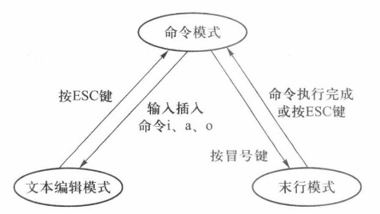

# VI编辑器

Linux系统支持多种行编辑器和全屏编辑器，用户可以方便地创建、修改、删除文件。每种操作系统至少支持一种编辑器，编辑器一般有两种类型

- 行编辑器每次所做的修改只能在一行或一组（多行）之间进行。编辑时，需要先给出文本中的行号，然后再进行修改。由于看不到编辑任务的范围和上下文，所以行编辑器一般不易使用，一般比较适合于全局操作，如搜索、替换或在文件中复制大段文本。
- 全屏编辑器每次显示一屏用户正在编辑的文本，用户可以在屏中移动光标进行修改，并且所做修改可以在屏幕上显示出来，用户也可以逐屏浏览文本的其余部分。全屏编辑器的界面比行编辑器的界面更友好，比较适合日常的编辑工作。

VI编辑器（Visual Interface）是目前Linux和UNIX操作系统都支持的全屏文本编辑器，它是一款功能强大的文本编辑器，具有字处理程序的灵活性和易用性。

## 工作模式

VI有3种工作模式

- 命令模式 VI默认进入命令模式，其他模式通过点击ESC键，也会进入命令模式。此模式下输入的一切字符，都被当作是命令
- 文本编辑模式 命令模式输入 `i` `a` 或 `o` 进入此模式编辑文本。`i` 在当前位置插入，`a`在当前位置后一行插入，`o` 在下一行插入
- 末行模式 命令模式输入`:` 进入末行模式

## 进入和退出 VI

### 进入 VI

- `vi` 进入 VI
- `vi 文件名` 文件不存在则创建文件，存在则打开文件
- `vi + 文件名`  进入 VI，光标停在文件的最后一行开始处
- `vi +n 文件名` 进入 VI，光标停在文件的第 n 行开始处
- `vi +/字符串 文件名`  进入 VI，光标停在文件中指定字符串第一次出现的行首。

### 保存文件或退出 VI

- 命令模式下按两次 `Z` 键，将保存文件并退出 VI。必须是大写的`Z`
- 末行模式
    - `w` 即write，保存当前正在编辑的文件，但不退出 VI
    - `w 文件名` 保存到指定文件中，如果文件已存在报错
    - `w! 文件名` 保存到指定文件中，如果文件已存在，直接覆写
    - `q` 即quit，不进行文件保存，直接退出 VI，若文件有改动过而没有保存，将产生错误
    - `q!` 强行退出 VI，若文件内容有改动则恢复到文件的原始内容
    - `wq` 保存并退出 VI

### VI帮助文档

- 末行模式输入 `help` 可以查看帮助文档。例如查看 `wq` 的帮助文档，在模式下输入 `help wq`，输入 `q` 退出帮助文档并返回文件。
- 即命令模式 `:help` 进入帮助文档，`:help wq` 查看 `wq` 帮助文档，`:q` 退出帮助文档

## 文本编辑

### 文本的插入

插入文本可以在命令模式下输入 `i`、`a` 或 `o` 命令。文本框底部的“INSERT”表示编辑器正处于文本编辑模式。

### 光标的移动

文本编辑模式 方向键移动光标

命令模式下移动光标

- `o`  在下一行插入一个空行，光标移动到行首，并进入文本编辑模式
- `$`  光标移动到当前行的行尾
- `nw`  光标右移 n 个单词
- `w`  光标右移 1 个字单词
- `nb`  左移 n 个单词
- `b`  左移 1 个单词
- `(`  光标移动本句的句首，若已经处于本句句首，则移动到前一句的句首
- `)`  光标移到下一句句首
- `{`  光标移到本段段首，若已经处于本段段首，则移动到前一段段首
- `}`  光标移到下一段段首
- `1G`  光标移到文件首行的行首
- `G`  光标移到文件末行的行首
- `nG`  光标移到文件第 n 行行首，n 为整数
- 组合键`Ctrl+G` 实时显示光标所处位置，位置信息显示在 VI 最后一行

### 删除

文本编辑模式下，Delete 键可以删除光标坐在位置的后一个字符，Backspace 键可以删除光标所在位置的前一个字符。

命令模式下删除文本相关命令：

- `x`  删除光标所在位置的后一个字符，类似于delete键
- `nx`  删除从光标开始的 n 个字符
- `dw`  删除从光标前一个字符，类似于backspace
- `ndw`  删除从光标开始的向右 n 个字符，类似于 `nx`
- `db`  删除光标左边的一个单词
- `ndb`  删除从光标开始的向左 n 个字符
- `d0`  删除从光标前一个字符到行首所有字符
- `d$`  删除光标所在字符到行尾的所有字符
- `dd`  删除光标所在的行
- `ndd`  删除从当前行开始的 n 行
- `d(`  删除从当前字符开始到句首的所有字符
- `d)`  删除从当前字符开始到句尾的所有字符
- `d{`  删除从当前字符开始到段首的所有字符
- `d}`  删除从当前字符开始到段尾的所有字符
- `u` 可以撤销前一次的操作undo

### 查找

命令模式下，查找文本相关命令：

- `?字符串`  按回车，在文本内容中逆向查找与字符串对应的内容 （区分大小写）
- `n`  查找下一个匹配
- `N`  查找上一个匹配

### 替换

在命令模式下：

- `:s/查找的字符串/新字符串`  在当前行用新字符串替换查找的字符串，只替换第一个查找到的字符串
- `:s/查找的字符串/新字符串/g`  在当前行用新字符串替换所有的查找的字符串
- `:1,m s/查找的字符串/新字符串/g`  在第 1 行到 m 行用新字符串替换所有查找的字符串
- `:1,$ s/查找的字符串/新字符串/g`  在整个文件中用新字符串替换所有查找的字符串

### 复制与粘贴

- `yw`  将光标所在位置到字尾的字符串复制到缓冲区中
- `nyw`  将光标所在位置开始的 n 个字复制到缓冲区中
- `yb`  从光标开始向左复制一个字符
- `nyb`  从光标开始向左复制 n 个字符
- `y0`  复制从光标前一个字符到行首的所有字符
- `y$`  复制从光标开始到行末的所有字符
- `yy`  复制当前行
- `nyy`  复制从当前行开始的 n 行
- `p`  在光标所在位置的后面插入复制的文本
- `P` 大写，在光标所在位置的前面插入复制的文本
- `np`  在光标所在位置的后面插入复制的文本，复制 n 次
- `nP`  在光标所在位置的前面插入复制的文本，复制 n 次

## 存储缓冲区

VI编辑器为用户所要创建和修改的文件建立一个临时的工作区，如果创建的是一个新文件，则VI为新文件打开一个临时的工作区；如果文件已经存在，则VI将原文件复制到临时工作区，用户对文件所做的修改只作用于工作区中文件的副本，而不是原文件。这种临时的工作区称为存储缓冲区。

这种存储缓冲区设置的目的是提高读/写效率，避免频繁地写人原文件。

在文件编辑过程中，VI编辑器使用不同的缓冲区来管理文件。对原文件的修改不会自动保存，用户必须发出写命令才能保存文件。如果用户希望保存所做的修改，必须用保存的已修改文件（缓冲区中的文件）替换原文件。

有两种类型的缓冲区：数字编号缓冲区和命名缓冲区，这两种缓冲区都可以用来保存修改和以后再找回变更。

### 数字编号缓冲区

VI 编辑器使用 9 个临时缓冲区，编号从 1 到 9

每次新删除或复制的文本替换缓冲区以前的内容，“dd”命令后，VI 将被删除的行存到缓冲区 1，当再次 dd 删除另一行，VI 将以前的内容放到下一个缓冲区 2，新内容存到缓冲区 1。缓冲区总是保留最新被修改的内容。

使用 p 命令并在它前面加上缓冲区号就可以找回数字编号缓冲区的内容。如，9p，表示要将缓冲区 9 的内容复制到光标位置。指定缓冲区的格式可以表示为 np

### 命名缓冲区

26 个命名缓冲区，用小写字母 a 到 z 命名。

用户可将删除或复制的文本存到指定缓冲区，然后使用 p 命令将指定缓冲区的文本复制到文件的其他地方。命名缓冲区内容保持不变，知道用户在删除或复制操作中指定了该缓冲区。

缓冲区命名格式 `缓冲区名+命令`

如，wdd 表示删除当前行，将它的副本保存到缓冲区 w。z3yy，表示复制 3 行到缓冲区 z。

## 编辑多个文件

启动 VI 时，可以给出多个文件名，当结束一个文件的编辑时，就可以继续编辑下一个文件。

输入 `:n` 命令启动下一个编辑文件，若当前文件已被修改，就会显示 `No write since last change(add ! to override)` ，表示自从上次修改后不能写入，可使用 `:n!` 命令忽略这个提示信息，此时文件所作的修改不会保存。

`:ar` 命令查看文件名列表

## VI 编辑器的设置

### set 命令选项

用来设置选项，选项分为 3 类布尔触发器、数字式、串。

- 布尔触发器，用户可以打开或关闭他们，像开关。通过名字来设置，在名字前面加上no 来禁止。如，对于某个选项C，`:set C` 表示打开C，输入 `:set noC` 表示关闭C，`no` 和 C之间没有空格
- 数字式选项 接受数字值，选项不同，数值范围也不同。如，某项可以使用 `:set C=1`，表示将 1 赋给 C
- 串选项 同数字式选项类似，但是它接受串值。如，输入 `:set C=yes`，表示将 yes 赋给 C

set 命令:

- `:set all` 表示在屏幕上显示所有的选项
- `:set` 表示只显示修改过的选项
- `:set C?` 表示显示选项 C 的值

### 设置 VI 环境

使用 `:set` 命令进行的设置只对当前vi窗口有效，退出之后失效

常用 VI 参数选项（设置时可以使用缩写或全名）：

- `autoindent` `ai` 将新行与前一行的行首对齐，相当于 tab缩进对齐，ctrl+d取消一级缩进
- `ignorecase` `ic` 在搜索选项中忽略大小写
- `magic` 允许在搜索时使用特殊字符
- `number` `nu` ，显示行号
- `report` 通知用户上一个命令影响的行号
- `scroll` 设定使用 Ctrl+D 键命令翻动的行数
- `shiftwidth` `sw` ，设置缩进的空格数，与 `autoindent` 选项一起使用。
- `showmode` `smd` ，屏幕的右下角显示 VI 编辑器的模式
- `terse` 显示简短的错误信息
- `wrapmargin` `wm` 设置右边界为指定行数

