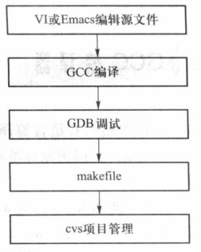

# Linux 应用程序开发技术

## centos配置C语言环境

安装 wget

``` bash
$ yum -y install wget
```

检查wget是否安装成功：

``` bash
$ wget --version
```

检查gcc是否已安装：

``` bash
$ gcc --version
```

安装gcc：

``` bash
$ yum install gcc
```

检查是否安装 gdb：

``` bash
$ gdb --version
```

安装gdb：

``` bash
$ yum install gdb
```

检查是否安装make：

``` bash
$ make --version
```

安装make：

``` bash
$ yum install make
```

安装完这些之后，C语言环境配置完成。一般Centos默认安装了这些。

## C语言程序开发的一般过程

Linux系统下C语言程序开发的过程:



在C语言程序开发中，首先要编辑源文件，一般使用VI或Emacs文本编辑器来编写程序，编写完成后检查程序中是否有错误，如果有错误，则进行修改，如果没有错误，则可以使用GCC编译器对程序进行编译。当程序编译过程出现错误时，可以使用GDB调试器对程序进行调试，输出调试信息。

如果开发的是一个大型程序，可以编写akefile文件自动编译程序，并使用cvs对项目进行管理。

下面通过一个例子对C语言程序的编写和运行进行演示。

### 第一步 使用VI编写C语言代码

``` bash
$ vim hello.c
$ cat hello.c
#include <studio.h>
int main() {
printf("hello world\n");
return 0;
}
```

### 第二步 使用GCC编译代码

``` bash
$ gcc -o hello hello.c
```

这条命令表明将 hello.c 这个文件编译为可执行文件 hello

### 第三步 运行代码

运行gcc编译后的可执行文件hello

``` bash
$ ./hello 
hello world
```

## GCC 编辑器

### C 语言程序的编译过程

当C语言程序源文件写好后，需要对其进行编译，生成可以在目标平台上执行的程序。一个C语言程序的编译过程可以包括预处理、编译、汇编、链接。

在预处理阶段主要处理源文件中以“#”开头的预处理命令，输人是C语言的源文件，通常为
扩展名为“.c”的文件，在源文件的头部一般包含头文件（扩展名为“.h”），以#include开头；或者包含常量的定义，以#define开头；或者包含条件编译命令，以#ifdef开头。

预处理阶段会生成一个中间文件（扩展名为“.i”），在实际工作中一般不用专门生成这种文
件，这只是编译器在编译的过程中生成的一种中间代码形式。若要生成这种文件，可以使用下面的命令：

``` bash
$ gcc -E hello.c -o hello.i
```

它通过对源文件“hello.c”使用-E选项生成中间文件“hello.i”

在编译阶段，输入是中间文件（扩展名为“i”），编译后生成汇编文件（扩展名为“.s”），可以使用下面的GCC命令：

``` bash
$ gcc -S hello.i -o hello.s
```

在汇编阶段，将汇编文件（扩展名为“.s”）转换成二进制机器代码（扩展名为“.o”），可以使用下面的GCC命令：

``` bash
$ gcc -c hello.s -o hello.o
```

在链接阶段，将输人的二进制机器代码文件（扩展名为“.o”）与库文件等汇集到一起形成一个可执行的二进制代码文件，可以使用下面的GCC命令：

``` bash
$ gcc hello.o -o hello
```

最终生成可执行文件hello。

上述分步编译的过程只是演示了C语言程序在编译过程中经历的阶段，实际操作时可以直接使用简化的CCC命令：

``` bash
$ gcc-c hello.c -o hello.o
$ gcc hello.o -o hello
```

或者采用更简化的形式：

``` bash
$ gcc hello.c -o hello
```

即可生成可执行文件hello。

### GCC 基本用法

语法 `$ gcc [选项] [文件名]`

默认情况下，GCC 会在系统默认的路径中（如 usr/lib）寻找所需的库文件，当使用 -L 选
项，会首先到-L 指定的目录下去寻找相关库文件。

## GDB 调试器

### GDB 的启动和退出

要启动GDB，需要在Linux的应用程序终端中输人命令“gdb程序名”或者先输人“gdb”，然后输人“file 程序名”。

例如，启动GDB对hello进行调试，可以输入命令：

``` bash
$ gdb hello
```

或者输人命令：

``` bash
$ gdb
(gdb) file hello
```

启动GDB后显示的是CDB的版权信息，如果想在GDB启动时不输出版权信息，可以在启动时加人“-q”选项，例如“gdb-q hello”。启动后显示的是GDB提示符：（gdb），可以在提示符（gdb）的后面输入GDB的相关命令。

退出GDB的方法是使用“quit"或者“q"，再按回车。

### 调试前的准备

通过gcc编译代码时，使用了 `-g` 选项生成的可执行文件才可以通过gdb调试

### 显示和查找源代码
调试时查看源代码可使用“list”命令：
list ： 每次调用该命令显示 10 行代码，若再次运行该命令，则显示接下来的 10 行
list m,n 显示从第 m 行到 n 行的代码
list 源文件:m,n 显示源文件中第 m 行到 n 行的代码
list 函数名 显示函数周围的代码
list 源文件:函数名 显示源文件中函数名指定的周围代码
可以在源文件中从当前行向后查找第一个匹配的字符串，命令格式：“search 字符
串””forward 字符串”。也可反向查找字符串，“reverse-search 字符串”。
### 执行程序
要使程序开始运行，在（gdb）的提示符下输入“run”或“r” 15.6.5 设置断点
1. break 行号 ： 将断点设置在某行
如，（gdb）break 4
Breakpoint 1 at 0*400525：file hello.c line 4. 1 表示第一个断点，0*400525 是断点所在的内存地址
设置好断点后，可以输入“run”命令运行程序
1. break 函数名 ： 断点设置在函数名上
2. break 行号或函数名 if 条件 ： 通过条件设置断点
3. info breakpoints 命令 查看当前所有的断点
Num 表示断点的编号；
Type 表示断点的类型；
Disp 表示断点在生效一次后是否失去作用，如果是则为 dis，否则为 keep；
Enb 表示当前断点是否有效，如果是，y，否则为 n；
Address 表示终端所处的内存地址；
What 表示发生在哪个函数的第几行，“stop only if i==4”标明是一个条件断点。
1. disable 断点编号 ： 使断点失效
还可通过“enable”继续使其生效
1. 删除断点
clear 删除程序中的所有断点
clear 行号 删除此行的断点
clear 函数名 删除该函数的断点
clear 断点编号 删除指定编号的断点
### 查看和设置变量的值
执行到断点的时候，往往需要通过查看变量的值来了解当前程序的执行情况
1. 查看变量的值
print 变量名或表达式
1. 查看变量的类型
whatis 变量名或表达式，用于显示某个变量或表达式结果的数据类型
1. 设置变量的值
set variable 变量=值
print 变量=值
### 调试的控制
查看变量的值后，可以让程序继续运行。是要一步一步运行，还是让程序一直运行下去
1. kill 命令
用于结束当前程序的调试，输入该命令后，会询问是否退出当前程序的调试，输入 y 结束，
输入 n 继续调试。
1. continue 命令
让程序继续运行到下一个断点或运行完整个程序
如，使用 run 让程序运行到第 1 个断点处，查看变量 n 的值，接下来使用 continue 让程序
继续运行至第 2 个断点处，再查看 n 的值。
=
1. next 和 step 命令
单步调试功能，每次执行一条语句
next 命令会把该函数当作一条语句执行，不会进入函数的内部；
step 命令则会进入函数内部，继续单步调试程序。
使用 next 命令每次执行一条语句，执行一条语句后可以使用 print 命令查看变量的值。
1. nexti 和 stepi 命令
用于单步执行一条指令，而不是一条语句，对一条语句而言，往往对应多条指令。
如，对一条循环语句“for（i=0；i<6；i++）”而言，使用“nexti”或“stepi”命令，需要输入多
次才能执行完毕。
GDB 命令
list 缩写 l 显示多行源代码
break 缩写 b 设置断点
info 缩写 i 描述程序的状态
run 缩写 r 开始运行程序
display 缩写 disp 跟踪查看某个变量
step 缩写 s 执行下一条语句，若该语句为函数调用，则进入函数，执行其中的
第一条语句
next 缩写 n 执行下一条语句，若该语句为函数调用，则不会进入函数内部执行
print 缩写 p 打印内部变量值
continue 缩写 c 继续程序的运行，直到遇到下一个断点
set variable name=v 设置变量的值
start 缩写 st 开始执行程序，在 main 函数的第一条语句前面停下来
file 装入需要调试的程序
kill 缩写 k 终止正在调试的程序
watch 监视变量值的变化
backtrace 缩写 bt 查看函数调用信息
frame 缩写 f 查看栈帧
quit 缩写 q 退出 GDB 环境

## make

make命令是GNU的工程化编译工具，它用于编译大量互相关联的源代码，使用它可以实现项目的工程化管理，提高开发效率。

make工具可以用来维护程序模块关系和生成可执行程序。在执行该命令时，通常将make工具的编译指令放入一个名为makefile（或Makefile）的文件中，该文件定义了整个项目的编译规则、模块之间的依赖关系和文件的编译顺序。make命令可以使整个项目的源文件进行自动编译，用户只需要运行一条命令，这种方式极大地提高了软件的开发效率。

make命令从makefile文件中获取模块之间的依赖关系，根据这些信息确定哪些文件需要编译。已经编译过的文件被修改后，再执行make命令会重新编译。makefile文件对于make工具
的编译具有重要作用。

### makefile文件的构成

一个makefile文件的基本单元是规则，一条规则指定一个或多个目标文件，目标文件后面跟的是编译生成目标文件所依赖的文件或模块，最后是生成目标文件的命令。

规则的格式如下：

```
目标文件列表 分隔符 依赖文件列表
    [命令]
    [命令]
```

其中，“[]”代表该项可选。

下面的代码演示了Makefile的构成，目标文件依赖于冒号之后的所有文件，可以看出proc程序的生成依赖于main.o和fac.o两个文件。定义了依赖关系以后，后续的一行定义了如何生成目标文件的命令，可以看到大部分使用的是gcc命令进行编译。proc程序是通过gcc-oproc
main.o fac.o”命令生成的，其中main.o依赖于main.c和defs.h文件；使用命令“gcc-cmain.c”可以生成main.o，fac.o依赖于fac.c和defs.h文件；使用命令“gcc-cfac.c”可以生成fac.o。最后两
行的clean代表运行“makeclean”命令后执行的内容，该命令可以删除“make”命令生成的相关
文件。

```
proc : main.o fac.o
    gcc -o proc main.o fac.o
main.o : main.c defs.h
    gcc-cmain.c
fac.o : fac.c defs.h
    gcc -c fac.c
clean:
    rm proc main.o fac.o
```

### 执行makefile

当用户输人make命令后，首先在当前目录下寻找名为makefile或Makefile的文件。找到后，在当前目录下寻找第1行中的目标文件main，如果没有，则去寻找生成main文件所依赖的文件，如main.o、modulel.o或module2.o等，如果也没有，则跳过第2行的编译命令，定位到下一行。

在命令行输人一个make命令后，它的工作过程如下：

- make工具首先会在当前目录下查找名称为makefile或者Makefile的文件
- 找到makefile或者Makefile文件之后，它会继续找文件中注明的第一个目标文件（即proc），并把这个文件作为最终需要生产的目标文件
- 如果目标文件（proc）不存在，或者目标文件后的依赖文件（.o文件）的修改时间要比目标文件（proc）新，那么，它继续寻找后面定义的命令
- 如果proc依赖的.o文件存在，那么make会在当前文件中寻找目标为.o文件的依赖性。若找到，则根据规则继续生成一个头文件
- make会根据文件夹内的.c或者.h生成.o文件，然后再用.o文件生成proc可执行程序。

可以看到，make根据依赖性一步步地完成最终文件的生成。若在此过程中遇到错误，如果是依赖文件未找到或者编写规则错误，则make直接报错并终止。如果是定义的命令不对，make并不会报错，即make只会检查文件依赖，不会对命令进行检查。

clean命令没有依赖关系，只有相关的执行命令，在执行make时它不会自动执行。如果需要执行clean，则需要指定它的执行命令“make clean”。

如果该工程已经编译过一次了，对其中某个源文件修改后，只会根据依赖性进行相关文件的重新编译，而不会重新编译整个工程。