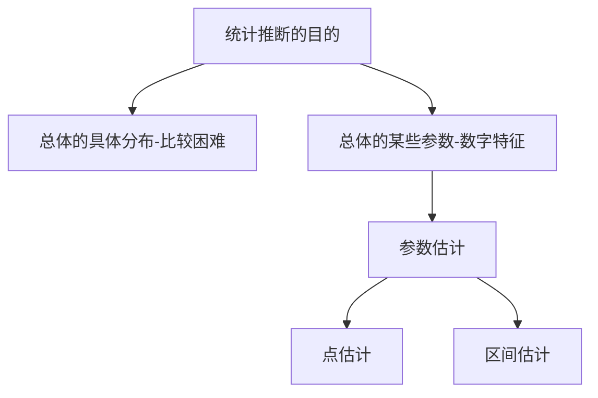

:material-pen-plus: `本文创建于2025-6-8`

## 第六章 样本及抽样分布 

???+ abstract
    - **数理统计** 研究如何合理的获得随机现象的数据资料,  建立有效的数学方法,  对所考察的问题作出推断或预测．
    - **研究方法** 部分 $\rightarrow$ 总体
    - **主要内容**

        ```mermaid
        flowchart TD
            A[统计推断] -->  B[估计理论]
            A --> C[假设检验]
            B --> D[参数估计]
            B --> E[非参数估计]
        ```

### 6.1 随机样本 

#### 6.1.1 总体与个体

- **总体** 研究对象(数量指标)的全体．
- **个体** 总体中的每个元素．

???+ example
    - 某工厂生产的灯泡的寿命 $X$ 是一个总体,  每个灯泡的寿命是一个个体；
    - 全校所有同学的身高和体重 $(X ,  Y )$ 是一个二维总体,  每个同学的身高和体重是一个个体． 

#### 6.1.2 样本与统计量

- **样本** 从某一总体 $X$ 中随机地、独立地抽取的 $n$ 个个体 $X _1,  X_2 ,  ...,  X_n$ 称为$X$ 的一个样本容量为 $n$ 的样本,  其对应的观测值 $X _1 ,  X_2 ,  ...,  X_n$ 称为样本值．
- **统计量** 不含任何未知参数的样本的函数 $\varphi (X_1 ,  X_2 ,  ...,  X _n)$ 称为统计量．

???+ example
    设总体 $X \sim N(\mu,  \sigma ^2)$,  其中 $\mu$ 已知,  $\sigma ^2$ 未知,  则 $X_1 + X_2 + \mu$ 是统计量,  $\sum _{i=1} ^3 \frac{X_i ^2}{\sigma ^2}$ 不是统计量．

#### 6.1.3 样本的联合分布

设总体 $X$ 的分布函数为$F (x),  X_1 ,  X_2 ,  ...,  X_n$ 是来自总体的一个样本(独立同分布),  则 $X_1 ,  X_2 ,  ...,  X_n$ 的联合分布函数为

$$
F ^* (x_1 ,  x_2 ,  ...,  x_n) = \prod _{i=1} ^n F (x_i )
$$

若 $X$ 的密度函数为 $f (x)$,  则样本的联合概率密度函数为

$$
f ^* (x_1 ,  x_2 ,  ...,  x_n) = \prod _{i=1} ^n f (x_i )
$$

若 $X$ 的分布律为 $p(x)$,  则样本的联合分布律为

$$
p ^* (x_1 ,  x_2 ,  ...,  x_n) = \prod _{i=1} ^n p (x_i )
$$

???+ example "样本的联合分布"
    设总体 $X \sim N(12,  4)$ ,  从中抽取容量为5的样本 $(X_1,  X_2,  X_3,  X_4,  X_5)$,  求 $P\{max(X_1,  X_2,  X_3,  X_4,  X_5) >15\}$ ．

    **解** $P\{max(X_1,  X_2,  X_3,  X_4,  X_5) > 15\} = 1- P\{max(X_1,  X_2,  X_3,  X_4,  X_5) \leq 15\} = 1- P\{X_1 \leq 15,  X_2 \leq 15,  ...,  X_5 \leq 15\} = 1- P \set{X_1 \leq 15} P \set{X_2 \leq 15} \cdots P \set{X_5 \leq 15} = 1- \varPhi ^5 (\frac{15-12}{2}) = 1- \varPhi ^5 (1.5) \approx 0.2923$

    > 需要查表

### 6.2 样本的数字特征 

#### 6.2.1 总体矩

- 称 $m_k = E(X ^k )$ (假设存在)为总体 $X$ 的 $k$ 阶原点矩
- 称 $\mu _k = E[X - E(X )] ^k$ 为 $X$ 的 $k$ 阶中心矩
- 特别地,  $m_1 = E(X ),  \mu _2 = D(X )$．

> 总体矩是一个常数． 

#### 6.2.2 样本矩

设 $X_1 ,  X_2 ,  ...,  X_n$ 是总体 $X$ 的一样本,  

- 称 $\bar{X} = \frac{1}{n} \sum _{i=1} ^n X_i$ 为样本均值,  
- $S ^2 = \frac{1}{n-1} \sum _{i=1} ^n (X_i - \bar{X} ) ^2$ 为样本方差．
- 而称 $A_k = \frac{1}{n} \sum _{i=1} ^n X_i ^k$ 为样本 $k$ 阶原点矩,  
- 称 $B_k = \frac{1}{n} \sum _{i=1} ^n (X_i - \bar{X} ) ^k$ 为样本 $k$ 阶中心矩．
- 特别地,  $A_1 = \bar{X},  B_2 = \frac{n-1}{n} S ^2$ 
- $B_2$ 由于和 $S ^2$ 很接近,  经常记为  $\tilde{S} ^2$

???+ example "样本矩"
    从某班数学期末考试成绩中,  随机抽取10名同学的成绩分别为100,  85,  70,  65,  90,  95,  63,  50,  77,  86．试写出总体,  样本,  样本容量,  样本值；写出样本的经验分布函数；
    求样本均值,  样本方差及样本二阶中心矩的观测值．

    **解** 

    - 总体：该班数学期末考试成绩 X
    - 样本：$X_1 ,  X_2 ,  ...,  X_{10} $
    - 样本容量：n = 10
    - 样本值：100,  85,  70,  65,  90,  95,  63,  50,  77,  86． 

    ---

    将样本观测值 $x_1 ,  x_2 ,  ...,  x_{10}$ 按照从小到大的顺序排列为 50,  63,  65,  70,  77,  85,  86,  90,  95,  100 则样本的经验分布函数为

    $$
    F_{10} (x) = 
    \begin{cases} 
    0 , \space x < 50 \\
    \frac{1}{10} , \space 50 \le x < 63 \\
    \frac{2}{10} , \space 63 \le x < 65 \\
    \vdots \\
    0 , \space 其他
    \end{cases}
    $$

    > 经验分布函数类似于直方图, 落在每一段的样本要均分

    ---

    - 样本均值 $\bar{x} = \frac{1}{n} \sum x_i = \frac{1}{10} (50 + 63 +...+100) = 78.1$
    - 样本方差 $S^2 = \frac{1}{n-1} \sum (x_i - \bar{x})^2 = \frac{1}{9} [(-28.1)^2 + \cdots + 21.9^2 ] = 252.54$
    - 样本二阶中心矩 $b_2 = \frac{1}{n} \sum(x_i - \bar(x))^2 = \frac{1}{10} [(-28.1)^2 + \cdots + 21.9^2 ] = 227.29．$

### 6.3 抽样分布 

#### 6.3.1 正态分布 $U \sim N(0, 1)$

???+ success inline end
    

$$
f (x) = \frac{1}{\sqrt{2\pi}\sigma}e^{-\frac{(x-\mu)^2}{2\sigma^2}} \space ,  \space x \in \R
$$

- 设 $X_1 ,  X _2,  ...,  X_n$ 是来自总体 $N(\mu,  \sigma ^2)$ 的一个样本,  $\bar{X} = \frac{1}{n} \sum _{i=1} ^n X_i$ 为样本均值,  则 $\bar{X} \sim N(\mu,  \frac{\sigma ^2}{n})$ ,  从而可得统计量 $U = \frac{\bar{X} - \mu}{\sigma} \sqrt{n} \sim N(0, 1)$

- 设 $X_1 ,  X _2,  ...,  X_m$  和 $Y_1 ,  Y _2,  ...,  Y_n$  分别为来自正态总体 $N(\mu _1,  \sigma _1 ^2)$ 和 $N(\mu _2,  \sigma _2 ^2)$ 的两个样本,  且总体 $X,  Y$ 相互独立,  则

    $$
    U = \frac{(\bar{X} - \bar{Y}) - (\mu _1 - \mu _2)}{\sqrt{\frac{\sigma _1 ^2}{m} + \frac{\sigma _2 ^2}{n}}} \sim N(0, 1)
    $$

    其中 $\bar{X} = \frac{1}{m} \sum _{i=1} ^m X_i \space,  \bar{Y} = \frac{1}{n} \sum _{i=1} ^n Y_i$

#### 6.3.2 $\chi ^2$ 分布 $\chi ^2 \sim \chi ^2 (n)$

???+ success inline end 
    

**定义** 设 $X _1,  X _2,  ...,  X_n$ 相互独立且均服从 $N(0,  1)$,  则称统计量 $\chi ^2 = X _1 ^2 +...+ X_n ^2$ 服从自由度为 $n$ 的 $\chi ^2$ 分布,  记作 $\chi ^2 \sim \chi ^2 (n)$

???+ note "$\chi ^2$ 分布的性质"
    - 若 $\chi ^2 \sim \chi ^2 (n)$,  则 $E( \chi ^2) = n$,   $D( \chi ^2) = 2n$
    - 设 $\chi _1 ^2 \sim \chi ^2(n_1 ),   \chi _2 ^2 \sim \chi ^2 (n_2)$,  且 $\chi _1 ^2,  \chi _2 ^2$ 相互独立,  则有 $\chi _1 ^2 + \chi _2 ^2 \sim \chi ^2(n_1 + n_2 )$． (可加性)

- 设 $X_1 ,  X _2,  ...,  X_n$ 是来自总体 $N(\mu,  \sigma ^2)$的一个样本,  则统计量

    $$
    \chi ^2 = \frac{1}{\sigma ^2} \sum _{i=1} ^n (X_i - \mu) ^2 \sim \chi ^2 (n)
    $$

- 设 $X_1 ,  X _2,  ...,  X_n$ 是来自总体 $N(\mu,  \sigma ^2)$的一个样本,  则样本均值$\bar{X}$与样本方差 $S^2$ 相互独立,  且统计量

    $$
    \frac{(n-1) S^2}{\sigma ^2} = \frac{1}{\sigma ^2} \sum _{i=1} ^n (X_i - \mu) ^2 \sim \chi ^2 (n-1)
    $$

#### 6.3.3 $t$ 分布 (学生 $t$ 分布) $T \sim t(n)$

???+ success inline end
    

**定义** 设 $X \sim N(0,  1),  Y \sim \chi ^2 (n)$,  且 $X$ 与 $Y$ 相互独立,  则称统计量 

$$
T = \frac{X}{\sqrt{\frac{Y}{n}}} = \frac{X}{\sqrt{Y}} \sqrt{n}
$$ 

服从自由度为 $n$ 的 $t$ 分布,  记作 $T \sim t(n)$．

???+ note "$t$ 分布的性质"
    - $f_t (x)$ 关于 $y$ 轴对称
    - 当 $n \to \infty$ 时,  $t$ 分布 $\to N(0,  1)$

- 设 $X_1 ,  X _2,  ...,  X_n$ 是来自总体 $N(\mu,  \sigma ^2)$的一个样本,  则统计量

    - $T = \frac{\bar{X} - \mu}{S} \sqrt{n} \sim t(n-1)$ 学生 $t$ 分布 

        > 其中 $S ^2 = \frac{1}{n-1} \sum _{i=1} ^n (X_i - \bar{X} ) ^2$

    - $U = \frac{\bar{X} - \mu}{\sigma} \sqrt{n} \sim N(0, 1)$  正态分布

- 设 $X_1 ,  X _2,  ...,  X_n$  和 $Y_1 ,  Y _2,  ...,  Y_n$  分别为来自正态总体 $N(\mu _1,  \sigma ^2)$ 和 $N(\mu _2,  \sigma ^2)$ 的两个样本,  且总体 $X,  Y$ 相互独立,  则

    $$
    T = \frac{(\bar{X} - \bar{Y}) - (\mu _1 - \mu _2)}{\sqrt{\frac{S_w ^2}{m} + \frac{S_w ^2}{n}}} \sim t(m+n-2) \space \text{学生t分布} \\
    \space \\
    U = \frac{(\bar{X} - \bar{Y}) - (\mu _1 - \mu _2)}{\sqrt{\frac{\sigma _1 ^2}{m} + \frac{\sigma _2 ^2}{n}}} \sim N(0, 1) \space \text{正态分布}
    $$

    其中

    $$
    S_1 ^2 = \frac{1}{m-1} \sum _{i=1} ^m (X_i - \bar{X} ) ^2 \\
    \space \\
    S_2 ^2 = \frac{1}{n-1} \sum _{j=1} ^n (Y_j - \bar{Y} ) ^2 \\
    \space \\
    S_w ^2 = \frac{(m-1) S_1 ^2 + (n-1) S_2 ^2}{m+n-2} \space \text{复合样本方差}
    $$

#### 6.3.4 $F$ 分布 $F \sim F(m,  n)$

???+ success inline end
    

**定义** 设 $X \sim \chi ^2 (m)$,  $Y \sim \chi ^2 (n)$,  且 $X$ 与 $Y$ 相互独立,  则称统计量

$$
F = \frac{X/m}{Y/n}
$$

服从第一自由度为 $m$,  第二自由度为 $n$ 的 $F$ 分布,  记作 $F \sim F(m,  n)$

???+ note "$F$ 分布的性质"
    - 若 $F \sim F(m,  n)$,  则$\frac{1}{F} \sim F(n,  m)$
    - 若 $T \sim t(n)$,  则 $T ^2 \sim F(1,  n)$ 

- 设 $X_1 ,  X _2,  ...,  X_n$  和 $Y_1 ,  Y _2,  ...,  Y_n$  分别为来自正态总体 $N(\mu _1,  \sigma _1^2)$ 和 $N(\mu _2,  \sigma _2^2)$ 的两个样本,  且总体 $X,  Y$ 相互独立,  则

    $$
    F = \frac{S_1 ^2 / S_2 ^2}{\sigma _1 ^2 / \sigma _2 ^2} \sim F(m-1,  n-1)
    $$

- 统计量

    $$
    F = \frac{\bar{S}_1 ^2 / \bar{S}_2 ^2}{\sigma _1 ^2 / \sigma _2 ^2} \sim F(m,  n)
    $$

    其中

    $$
    \bar{S}_1 ^2 = \frac{1}{m} \sum _{i=1} ^m (X_i - \mu _1 ) ^2 \\
    \space \\
    \bar{S}_2 ^2 = \frac{1}{n} \sum _{j=1} ^n (Y_j - \mu _2 ) ^2
    $$

#### 6.3.5 分位数

???+ success inline end "常用分布的分位数图示"
    

    

**定义** 设 $X \sim F(x),  \alpha \in(0,  1)$为一常数,  若对于某一 实数 $x _{\alpha}$ 满足 $P\{X \leq x_{\alpha} \}  = F(x_{\alpha} ) = \alpha$ ,  则称 $x_{\alpha}$ 为 $X$ 的下侧 $\alpha$ 分位数．

**常用分布的分位数**

- $N (0,  1)$的下侧 $\alpha$ 分位数 $u_{\alpha}$ 满足 

    $P \{U \leq u_{\alpha} \} = \int _{- \infty} ^{u _{\alpha}} \varphi(x)dx = \alpha$
    
    > 由对称性 $-u_{\alpha} = u_{1 - \alpha}$

- $\chi ^2(n)$的下侧 $\alpha$ 分位数 $\chi ^2_{\alpha} (n)$ 满足 
  
    $P \{ \chi ^2 \leq \chi ^2_{\alpha} (n) \} = \alpha$

- $t(n)$的下侧 $\alpha$ 分位数 $t_{\alpha} (n)$ 满足 
  
    $P \{ t \leq t_{\alpha} (n) \} = \alpha$
    
    > 由对称性 $-t_{\alpha} (n) = t_{1 - \alpha} (n)$

- $F(m,  n)$的下侧 $\alpha$ 分位数 $F_{\alpha} (m, n)$ 满足 
    - $P \{ F \leq F_{\alpha} (m, n) \} = \alpha$
    - $F_{\alpha} (m, n) = \frac{1}{F_{1 - \alpha} (n, m)}$

???+ example "分位数"
    设 $X_1 ,  X_2 ,  ...,  X_{10}$ 是来自总体 $N(0,  0.3^2)$的样本,  求 $P \set{\sum _{i=1} ^{10} X_i ^2 > 1.44}$ ．

    **解** 因为 $\sum _{i=1} ^{10} (\frac{X_i - \mu}{\sigma})^2 = \sum _{i=1} ^{10} \frac{X_i ^2}{0.3^2} \sim \chi ^2(10)$,  所以

    $$
    P \set{\sum _{i=1} ^{10} X_i ^2 > 1.44} = P \set{\sum _{i=1} ^{10} \frac{X_i ^2}{0.3^2} > \frac{1.44}{0.3^2}} \\
    = P \set{\chi ^2(10) > 16} = 1- P \set{\chi ^2(10) \leq 16} = 1- 0.9 = 0.1
    $$

    > 需要查表

## 第七章 参数估计 

### 7.1  参数估计的概念 



参数估计的分类

- 点估计：给出未知参数的估计值
- 区间估计：给出未知参数的取值范围 

### 7.2 点估计量的求法 

#### 7.3.1 点估计的概念

设总体 $X$ 中含有未知参数 $\theta,  X_1 ,  X_2 ,  ...,  X_n $为 $X$ 的一样本．点估计就是要构造适当的统计量 $\hat{\theta} (X_1 ,  X_2 ,  ...,  X_n)$,  用其观测值 $\hat{\theta} (x_1 ,  x_2 ,  ...,  x_n)$ 作为 $\theta$ 的估计值．

点估计方法:

- 矩估计
- 最大似然估计 (极大似然估计) 

#### 7.3.2 矩估计

假设 $\theta = (\theta _1 ,  \theta _2,  ...,  \theta _l) $ 为总体 $X$ 的待估参数, 令样本矩等于总体矩：

$$
\begin{cases} 
A_1 = m_1 \\
A_2 = m_2 \\
\vdots \\
A_l = m_l
\end{cases}
$$

用方程组的解 $\hat{\theta _1} ,  \hat{\theta _2} ,  ...,  \hat{\theta _l}$ 分别作为$\theta _1 ,  \theta _2,  ...,  \theta _l$ 的估计量,  则称该估计量为矩估计量,  相应的观察值称为矩估计值．

> 具体求解中只需掌握 $l = 1,  2$ 的情形． 

???+ note
    原理 $A_k \xrightarrow{P} m_k$

    - 样本矩 $A_k = \frac{1}{n} \sum _{i=1} ^n X_i ^k$
    - 总体矩 $m_k = E(X^k)$

???+ example "矩估计-记住此题结论"
    设 $X_1 ,  X_2 ,  ...,  X_n$ 为总体 $X$ 的一样本,  而 $X$ 的期望 $\mu$ 和方差 $\sigma ^2$ 都存在但未知,  试求 $\mu$ 和 $\sigma ^2$ 的矩估计量．

    **解** 令 

    $$
    \begin{cases} 
    A_1 = m_1 \\
    A_2 = m_2
    \end{cases}
    $$

    而 $A_1 = \frac{1}{n} \sum X_i = \bar{X} ,  A_2 = \frac{1}{n} \sum X_i ^2$

    $m_1 = E(X ) = \mu,   m_2 = E(X ^2) = D(X ) + E^2(X ) = \sigma ^2 + \mu ^2$

    所以得

    $$
    \begin{cases} 
    \hat{\mu} = \bar{X} = A_1 \\
    \hat{\sigma} ^2 = A_2 - \mu ^2 = \frac{1}{n} \sum X_i ^2 - \bar{X} ^2 = \frac{1}{n} \sum (X_i - \bar{X}) ^2 = \tilde{S} ^2
    \end{cases}
    $$

    > 上述结果表明,  总体期望的矩估计量为样本的均值,  总体方差的矩估计量为样本的二阶中心矩． 

???+ example "矩估计"
    设总体 $X \sim P(\lambda)$,  $\lambda$ 未知,  $X_1 ,  X_2 ,  ...,  X_n$ 是 X$ 的一个样本,  求 $\lambda$ 的矩估计量．
    解 因为 $E(X ) = \lambda ,  D(X ) = \lambda$ ,  由上一题的结论：

    - 总体期望的矩估计量为样本的均值,  从而可得 $\hat{\lambda} = \bar{X}$ ,  
    - 总体方差的矩估计量为样本的二阶中心矩,  从而可得 $\hat{\lambda} = \frac{1}{n} \sum (X_i - \bar{X}) ^2 = \tilde{S} ^2 $

    即该待估参数有两个不同的矩估计量． 

???+ example "矩估计"
    设总体 $X \sim U[a,  b]$,  其中$a,  b$ 为未知参数,  试求 $a,  b$ 的矩估计量．

    **解** 由结论得

    $$
    \begin{cases} 
    \frac{\hat{a} + \hat{b}}{2} = \bar{X} \\
    \\
    \frac{(\hat{b} - \hat{a})^2}{12}  = \tilde{S} ^2
    \end{cases}
    \implies
    \begin{cases} 
    \hat{a} = \bar{X} - \sqrt{3} \tilde{S} \\
    \hat{b} = \bar{X} + \sqrt{3} \tilde{S}
    \end{cases}
    $$

#### 7.3.3 最大似然估计

原理：大概率事件易发生

设总体X 的密度函数为 $f (x；\theta )$ (或分布律为 $p(x；\hat{\theta} )$),  $\theta = ( \theta _1, \theta _2, \cdots, \theta _l)$ 为待估参数,  称样本 $X_1 ,  X_2 ,  ...,  X_n$ 的联合密度函数(或联合分布律)为似然函数,  记为 $L(\theta )$,   即

$$
L(\theta) = f(x_1, x_2, \cdots, x_n ; \theta) = \prod _{i=1} ^n f (x_i；\theta ) , \space \theta \in \Theta \\
L(\theta) = p(x_1, x_2, \cdots, x_n ; \theta) = \prod _{i=1} ^n p (x_i；\theta ) , \space \theta \in \Theta
$$

求出 $L(\theta)$ 的最大值点 $\hat{\theta}$,  则称 $\hat{\theta}$ 为 $\theta$ 的最大似然估计值． 

???+ example "最大似然估计"
    设总体 $X \sim B(1,  p),  p$未知,  求 $p$ 的最大似然估计量．

    **解** 因 $X \sim P \set{X = x} = p^x (1- p)^{1-x},  x = 0,  1,  $ 则似然函数

    $$
    L(p) = \prod _{i=1} ^n p (x_i；p) = \prod _{i=1} ^n p^{x_i} (1- p)^{1-x_i} = p^{\sum x_i} (1- p)^{n - \sum x_i}
    $$

    取对数 $ln L( p) = (\sum x_i) ln p + (n - \sum x_i) ln(1- p)$

    令 $\frac{d ln L( p)}{dp} = 0 \implies p = \frac{1}{n} \sum x_i$ 

    所以 $p$ 的最大似然估计量为 $\hat{p} = \frac{1}{n} \sum x_i = \bar{X}$

<!-- 例5 设总体X \sim P(\lambda),  \lambda未知,  求 \lambda 的最大似然估计量．
\lambdax
解 因 X \sim P{X = x} = e-\lambda,  x = 0,  1,  2,  ...,   则似然函数
x!
n
\sum
x
i
n n \lambdaxi \lambdai=1
L(\lambda) =  p(x ；\lambda) =  e-\lambda= e-n\lambda,  
i
x ! x !\cdot  x !...x !
i=1 i=1 i 1 2 n
 n  n
取对数 ln L(\lambda) = \sum x ln \lambda - n\lambda - \sumln(x !),  
 
i i
 
i=1 i=1
dln L(\lambda) 1 n 1 n
令 = \sum x - n = 0  \lambda = \sum x ,  
d\lambda \lambda i n i
i=1 i=1
1 n

所以 \lambda 的最大似然估计量为 \lambda = \sum X = X ．
i
n
i=1  -->

离散型随机变量的最大似然估计的难点主要是似然函数的构造,  假如样本值已知,  似然函数有一个非常简单的构造法．设总体 $X$ 的分布律为:

$$
\begin{array}{c|cccc}
X & x_1 & x_2 & \cdots & x_n \\
\hline
P & p_1 (\theta) & p_2 (\theta) & \cdots & p_n (\theta)
\end{array}
$$

$X_1 ,  X_2 ,  ...,  X_n$ 是 $X$ 的一个样本,  且样本值已知,  已知样本值中 $x_1 ,  x_2 ,  ...,  x_k$ 分别出现了$n_1 ,  n_2 ,  ...,  n_k $ 次,  则似然函数为：

$L(\theta) = [p_1(\theta)] ^{n_1} [p_2(\theta)] ^{n_2} \cdots [p_k(\theta)] ^{n_k}$

???+ example "最大似然估计-离散型"
    设总体 $X$ 的分布律为

    $$
    \begin{array}{c|cccc}
    X & 1 & 2 & 3 \\
    \hline
    P & \theta ^2 & 2 \theta (1 - \theta) & (1 - \theta)^2
    \end{array}
    $$

    (1,  2,  1) 为来自总体的一个样本,  求 $\theta$ 的最大似然估计．

    **解** 样本中出现了2个1,  1个2,  0个3,  即 $n_1 = 2,  n_2 = 1,  n_3 = 0$

    $L(\theta) = [\theta ^2] ^2 \cdot [2 \theta (1 - \theta)] ^1 \cdot [(1 - \theta)^2] ^0 = 2 \theta ^5 - 2 \theta ^6$

    $L'(\theta) = 10 \theta ^4 - 12 \theta ^5 = 0$

    解得 $\hat{\theta} = 0$ (舍去), $\hat{\theta} = \frac{5}{6}$

<!-- 
例7 设总体 X 的分布律为 0 < p <
 
P p2 2p(1- p) p2 1- 2p  2 
(1,  3,  0,  2,  3,  3,  1,  3) 为来自总体的一个样本,  求 p 的最大似然估计．
解 n = 1,  n = 2,  n = 1,  n = 4
0 1 2 3
L( p) =  p2 1 \cdot 2 p(1- p)2 \cdot   p2 1 \cdot 1- 2 p4= 4 p6(1- p)2(1- 2 p)4
   
ln L( p) = ln 4 + 6ln p + 2ln(1- p) + 4ln(1- 2 p)
dln L( p) 6 2 8 7 - 13
= - - = 0,  得 12 p2 -14 p + 3 = 0,  p =  0.2829
dp p 1- p 1- 2 p 12 
例8 设总体X \sim E(\lambda),  \lambda未知,  求 \lambda 的最大似然估计量．
\lambdae-\lambdax,   x \ge 0,  
解 因 X \sim f (x；\lambda) =  则似然函数
0,   x < 0,  

  n 
n \lambdan exp -\lambda\sum x ,   x ,  ...,  x \ge 0,  
  
L(\lambda) =  f (x ；\lambda) = i 1 n
  
i i=1
i=1 
0,   其它,  

dln L(\lambda) n 1
两边取对数并令 = 0  \lambda = n \sum x = ,  
i
d\lambda x
i=1
n 1

所以\lambda 的最大似然估计量为 \lambda = n \sum X = ．
i
X
i=1 
例9 设总体X \sim N(\mu,  \sigma 2),  \mu,  \sigma 2 未知,  求 \mu,  \sigma 2的最大似然估计量．
2
1 (x-\mu)
-
解 因 X \sim f (x; \mu,  \sigma 2) = e 2 ,   x \in \R,  
2\sigma 
2\pi\sigma 
n  1 n 
则似然函数 L(\mu,  \sigma 2) =  f (x ; \mu,  \sigma 2) = (2\pi\sigma 2)-n exp - \sum(x - \mu)2 ,  
2  
i 2\sigma 2 i
 
i=1 i=1
n 1 n
取对数 ln L(\mu,  \sigma 2) = - (ln 2\pi + ln \sigma 2) - \sum(x - \mu)2,  
2 2\sigma 2 i
i=1 

例9 设总体X \sim N(\mu,  \sigma 2),  \mu,  \sigma 2 未知,  求 \mu,  \sigma 2的最大似然估计量．
  1 n
[ln L(\mu,  \sigma 2)] = \sum(x - \mu) = 0,   (1)

2 i
\mu \sigma 

i=1
令 
 n 1 n

[ln L(\mu,  \sigma 2)] = - + \sum(x - \mu)2 = 0,  
(2)
 \sigma 2 2\sigma 2 2\sigma 4 i

i=1
1 n 1 n
由(1)式得 \mu = \sum x = x,  代入(2)得 \sigma 2 = \sum(x - x)2,  
i
n i
n
i=1
i=1
1 n 1 n

\mu = \sum X = X ,   \sigma 2 = \sum(X - X )2 = S2 ．
所以
i i
n n
i=1 i=1 

e-(x-\hat{\theta} ),   x \ge\hat{\theta} ,  
例10 设总体 X \sim f (x;\hat{\theta} ) = \theta 未知,  求 \theta 的最大似然

0,   x <\hat{\theta} ,  

估计量．
 n
\sum
n  n\hat{\theta} - xi
解 似然函数 L(\theta) =  f (x ;\theta) = e i=1 ,   x ,  ...,  x \ge\hat{\theta} ,  

1 n
i

i=1 0,   其它,  

 n
\sum
n\hat{\theta} - x
n i

e ,   \hat{\theta} \leq min{x },  
L(\theta) =  f (x ;\theta) = i=1
 i
i 1\leqi\leqn

i=1
0,   其它,  

要使 L(\hat{\theta} ) 达到最大,  只需取\hat{\theta} = min{x ,  x ,  ...,  x },  所以 \theta 的最大似然
1 2 n

估计量为\hat{\theta} = min{X ,  X ,  ...,  X }．
1 2 n 

例11 设 X \sim U[a,  b],  a,  b 未知,  求 a,  b 的最大似然估计量．
1 (b - a),   a \leq x \leq b,  
解 因 X \sim f (x；a,  b) = 则似然函数

0,   其它,  

 1
n ,   a \leq x ,  ...,  x \leq b,  

L(a,  b) =  f (x ；a,  b) = (b - a)n 1 n

i
i=1 
0,   其它,  
 

例11 设 X \sim U[a,  b],  a,  b 未知,  求 a,  b 的最大似然估计量．
1 (b - a),   a \leq x \leq b,  
解 因 X \sim f (x；a,  b) = 则似然函数

0,   其它,  

 1
n ,   a \leq min{x },  b \ge max{x },  

L(a,  b) =  f (x ；a,  b) = (b - a)n 1\leqi\leqn i 1\leqi\leqn i
i
i=1 
0,   其它,  

记 x = min{x },  x = max{x },  则对满足 a \leq x ,  x \leq b 的任意 a,  b 有
i (n) i (n)
1\leqi\leqn 1\leqi\leqn
1 1
L(a,  b) = \leq ,  
(b - a)n (x - x )n
(n) (1)

a,  b 的最大似然估计为 a = min{X },  b = max{X }．
i i
1\leqi\leqn 1\leqi\leqn  -->

### 7.3  估计量的评选标准 

- **无偏性** 设 $\hat{\theta}$ 是参数 $\theta$ 的估计量,  若 $E(\hat{\theta} ) = \theta$ ,  则称 $\hat{\theta}$  是 $\theta$的无偏估计量．
- **有效性** 设$\hat{\theta _1}$  与$\hat{\theta _2}$  都是 $\theta$ 的无偏估计量,  若 $D(\hat{\theta _1}  ) < D(\hat{\theta _2}  )$,   则称$\hat{\theta _1}$  比$\hat{\theta _2}$  更有效．
- **相合性** 设$\hat{\theta}$ 是 $\theta$ 的估计量,  若$\hat{\theta} \xrightarrow{p} \theta \space  (n \to \infty)$,   则称 $\hat{\theta}$  是 $\theta$ 的相合估计量． 

???+ example "无偏性"
    证明：样本均值 $\bar{X}$ 是总体期望 $\mu$ 的无偏估计量,  样本方差 $S^2$ 是总体方差 $\sigma ^2$ 的无偏估计量．

    **证** 因为 $E( \bar{X} ) = E( \frac{1}{n} \sum X_i) = \frac{1}{n} \cdot  n \mu = \mu$,  所以 $\bar{X}$ 是 $\mu$ 的无偏估计量．

    又 $E(S^2) = E \large[ \frac{1}{n - 1} \sum (X_i - \bar{X} ) ^2  \large] = \frac{1}{n - 1} E( \sum X_i ^2 - n \bar{X} ^2)$

    而 $E(X_i ^2) = D(X_i ) + E^2(X_i ) = \sigma ^2 + \mu ^2, \space  E(\bar{X} ^2) = D(\bar{X} ) + E^2(\bar{x} ) = \frac{ \sigma ^2}{ n} + \mu ^2$

    则 $E(S^2) = \frac{1}{n -1 } \large[n(\sigma ^2 + \mu ^2) - n(\frac{ \sigma ^2}{ n} + \mu ^2) \large] = \sigma ^2$

    所以 $S^2$ 是 $\sigma ^2$ 的无偏估计量． 

    ---

    由于 $S^2$ 是 $\sigma ^2$ 的无偏估计量,   且 $\tilde{S}^2 = \frac{n - 1}{n} S^2$ ,  

    因此 $E( \tilde{S}^2 ) = \frac{n-1}{n} E(S^2) = \frac{n-1}{n} \sigma ^2$ ,   所以  $\tilde{S}^2$  不是 $\sigma ^2$ 的无偏估计量．

    > 虽然 $S^2$ 是 $\sigma ^2$ 的无偏估计量,   但是 $S$ 并不是 $\sigma$  的无偏估计量．事实上,  由于 $D(S) = E(S^2) - E^2(S)$ ,  得 $E(S) = \sqrt{ E(S^2) - D(S) } = \sqrt{ \sigma ^2 - D(S) } \not = \sigma  $

???+ example "有效性"
    设 $(X_1 ,  X_2 ,  X_3 )$ 为来自总体 $N(\mu,  1)$ 的一个样本,   $\mu$ 未知,  则下列 $\mu$ 的无偏估计量中最有效的是 (A)．

    - [x] (A) $\frac{1}{2} X_1 + \frac{1}{3} X_2 + \frac{1}{6} X_3$
    - [ ] (B) $\frac{1}{2} X_1 + \frac{1}{4} X_2 + \frac{1}{4} X_3$
    - [ ] (C) $\frac{1}{3} X_1 + \frac{1}{3} X_2 + \frac{1}{3} X_3$
    - [ ] (D) $ X_1 +  X_2 - X_3$

    **解析** 

    - $D(\frac{1}{2} X_1 + \frac{1}{3} X_2 + \frac{1}{6} X_3) = \frac{1}{4} + \frac{1}{9} + \frac{1}{36} = \frac{7}{18}$
    - $D(\frac{1}{2} X_1 + \frac{1}{4} X_2 + \frac{1}{4} X_3) = \frac{1}{4} + \frac{1}{16} + \frac{1}{16} = \frac{3}{8}$
    - $D(\frac{1}{3} X_1 + \frac{1}{3} X_2 + \frac{1}{3} X_3) = \frac{1}{9} + \frac{1}{9} + \frac{1}{9} = \frac{1}{3}$
    - $D(X_1 +  X_2 - X_3) = 1 + 1 + 1 = 3$

### 7.4  区间估计 

???+ abstract
    - **点估计的缺陷** 未能反映出估计值$\hat{\theta}$ 与真实值 $\theta$ 之间的误差及可靠性．
    - **区间估计的思想** 对未知参数$\theta$,  构造两统计量$\theta _1$ 与$\theta _2$  ,   使得 $\theta$ 能以较大的概率落在随机区间 $[\theta _1 ,  \\theta _2  ]$ 内,  由相应的观测值来估计$\theta$ 的取值范围．

    $P \set{\theta _1  \leq \theta \leq \theta _2}$ —可信程度 

    $E(\theta _2  - \theta _1)$ —精确程度

    最优区间估计：可信度给定情况下区间尽量短． 

#### 7.4.1 置信区间的概念及其求法

定义 设总体 $X$ 含未知参数$\theta$,  对于给定的 $\alpha \in (0,  1)$,  若存在两个统计量 $\theta _1 (X_1 ,  X_2 ,  ...,  X_n)$ 和 $\theta _2 (X_1 ,  X_2 ,  ...,  X_n)$,   使得 $P \set{\theta _1  \leq \theta \leq \theta _2} = 1- \alpha$, 则称 $[\theta _1 ,  \theta _2]$ 为 $\theta$ 的置信度为 $1- \alpha$ 的置信区间．

???+ example "置信区间"
    设总体 $X \sim N(\mu,  \sigma ^2)$,  其中 $\sigma  = \sigma _0$  已知,   $\mu$ 未知, $X_1 ,  X_2 ,  ...,  X_n$ 是 $X$ 的样本,  求 $\mu$ 的置信度为 $1- \alpha$ 的置信区间． 

    ???+ success inline end
        

    解 因 $\sigma  = \sigma _0$  已知,  则由抽样分布知 $U = \frac{\bar{X} -\mu}{\sigma} \sqrt{n} $ 只包含未知参数 $\mu$ 且服从 $N(0,  1)$ ,  现需找一尽量短的区间,  使得 $U$ 落在该区间内的概率为 $1- \alpha$．由分位数的定义知 $P{-u_{1 - \alpha /2} \leq U \leq u_{1 - \alpha /2} } = 1- \alpha$

    即 $P \set{-u_{1 - \alpha /2} \leq \frac{\bar{X} -\mu}{\sigma} \sqrt{n} \leq u_{1 - \alpha /2} } = 1 - \alpha$

    因此 $\mu$ 的置信度为 $1- \alpha$ 的置信区间为 $\large[ \bar{X} - \frac{\sigma}{\sqrt{n}} u_{1 - \alpha /2},\bar{X} + \frac{\sigma}{\sqrt{n}} u_{1 - \alpha /2} \large]$

???+ tip "求解步骤"
    1. 构造一个只包含待估参数 $\theta$ 的样本的函数 $U$ ,  要求它的分布已知(一般由抽样分布可得)
    2. 寻求一尽量短的区间 $[a,  b]$,  使得 $U$ 落在该区间内的概率为 $1- \alpha$ (一般由分位数可得)
    3. 从 $a \leq U \leq b$ 中得到等价不等式 $\theta _1 \leq \theta \leq \theta _2$ ,  则$[\theta _1 ,  \theta _2 ] $ 就是 $\theta$ 的置信度为 $1- \alpha$ 的置信区间． 

#### 7.4.2 单个正态总体的情形

设总体 $X \sim N(\mu,  \sigma ^2),  X_1 ,  X_2 ,  ...,  X_n$ 是 $X$ 的一个样本,  对给定置信度 $1- \alpha$ ,  求 $\mu$ 和 $\sigma ^2$ 的置信区间．

{==问题一: 求 $\mu$ 的置信区间==}

=== "当 $\sigma ^2$ 已知时"

    上一题可知,   $\mu$ 的置信度为 $1- \alpha$ 的置信区间为

    $$
    \large[ \bar{X} - \frac{\sigma}{\sqrt{n}} u_{1 - \alpha /2}, \bar{X} + \frac{\sigma}{\sqrt{n}} u_{1 - \alpha /2} \large]
    $$

=== "当 $\sigma ^2$ 未知时"

    ???+ success inline end
        

    因为 $S^2$ 是 $\sigma  ^2 $ 的无偏估计,  所以可以用$S $代替 $\sigma$ ,  则由抽样分布知 $T = \frac{\bar{X} -\mu}{S} \sqrt{n} \sim t(n-1) $

    由分位数 $P \set{-t_{1 - \alpha /2} (n -1) \leq T \leq t_{1 - \alpha /2} (n -1)} = 1- \alpha$

    即 $P \set{-t_{1 - \alpha /2} (n -1) \leq \frac{\bar{X} -\mu}{S} \sqrt{n} \leq t_{1 - \alpha /2} (n -1)} = 1- \alpha$

    所以 $\mu$ 的置信度为 $1- \alpha$ 的置信区间为 

    $$
    [\bar{X} - \frac{S}{\sqrt{n}}t_{1 - \alpha /2}, \bar{X} + \frac{S}{\sqrt{n}}t_{1 - \alpha /2}]
    $$

---

???+ example "方差已知"
    某厂生产的节能灯寿命 $X \sim N(\mu,  8)$,  从生产的一批灯中抽取10只作寿命测试,  数据如下(小时)：1050,  1100,  1080,  1120,  1200,  1250,  1040,  1130,  1300,  1200 试估计这批节能灯平均寿命的范围 ( $\alpha   =   0.05 $ )．

    **解** 这是在方差已知的情况下对期望进行区间估计．因为 $\bar{X} = 1147,  u_{1 - \alpha /2} = u_{0.975} =1.96$,  从而可得

    - $\bar{X} - \frac{\sigma}{\sqrt{n}} u_{1 - \alpha /2} = 1145.25$
    - $\bar{X} + \frac{\sigma}{\sqrt{n}} u_{1 - \alpha /2} = 1148.75$

    所以这批节能灯平均寿命 $\mu$ 在0.95的置信水平下的置信区间为$[1145.25,  1148.75]$．(区间长度为3.5)

???+ example "方差未知"
    若上一题中的方差未知,  求这批节能灯平均寿命 $\mu$ 的置信水平为0.95的置信区间． 

    > $1 - \alpha = 0.95 \implies \alpha = 0.05$

    **解** 这是在方差未知的情况下对期望进行区间估计．由上一题的数据计算标准差 $S = \sqrt{S^2} \approx 87.06$,  类似得置信水平为0.95的置信区间为 $[1084.72,  1209.28]$(长度为124.56)

    > 此题表明,  由于对总体的了解少了(方差未知),  因而在相同的置信水平下估计的效果也就差很多． 

{==问题二: 求 $\sigma ^2$ 的置信区间==}

=== "当 $\mu$ 已知时"

    ???+ success inline end
        

    因 $\mu = \mu _0$ 已知,  则由抽样分布知 $\chi ^2 = \frac{1}{\sigma ^2} \sum (X_i - \mu) ^2$ 只包含未知参数 $\sigma ^2$ 且服从 $\chi ^2(n)$,  现需找一尽量短的区间,  使得 $\chi ^2$ 落在该区间内的概率为 $1- \alpha$

    由分位数定义 $P \set{\chi _{\alpha /2} ^2 (n) \leq \chi ^2 \leq \chi _{1 - \alpha /2} ^2 (n)} = 1- \alpha$

    所以 $\sigma ^2$ 的置信度为 $1- \alpha$ 的置信区间为： 

    $$
    \big[\frac{\sum _{i=1} ^n (X_i - \mu)^2}{\chi _{1 - \alpha /2} ^2 (n)}, \space \frac{\sum _{i=1} ^n (X_i - \mu)^2}{\chi _{\alpha /2} ^2 (n)}  \big]
    $$

=== "当 $\mu$ 未知时"

    因为 $\bar{X}$ 是 $\mu$ 的无偏估计,  所以可以用 $\bar{X}$ 代替 $\mu$ ,  则由抽样分布知

    $\frac{(n -1)S^2}{\sigma ^2} = \sigma ^2 \sum (X_i - \bar{X} )^2 \sim \chi ^2 (n -1)$

    类似可得 $\sigma ^2$ 的置信度为 $1- \alpha$ 的置信区间为：

    $$
    \big[\frac{\sum _{i=1} ^n (X_i - \mu)^2}{\chi _{1 - \alpha /2} ^2 (n-1)}, \space \frac{\sum _{i=1} ^n (X_i - \mu)^2}{\chi _{\alpha /2} ^2 (n-1)}  \big]
    $$

---

???+ example "期望已知"
    从总体 $X \sim N(0 ,  \sigma ^2)$ 中抽取一个容量为4的样本：1.3 , −2.78 , 0.06 , 1.98, 试求 $\sigma ^2$ 的置信水平为0.95的置信区间．

    **解** 这是在期望已知的情况下对方差进行区间估计．

    因为 $\sum (x_i - 0) ^2 =13.34 ,   \chi _{\alpha / 2} ^2 (n) = 0.484, \chi _{1 - \alpha / 2} ^2 (n) = 11.143$  

    所以可得 $\sigma ^2$ 置信水平为0.95的置信区间为 $[\frac{13.34}{11.143}, \frac{13.34}{0.484}]$

    > 需要查表

## 第八章 假设检验 

### 8.1  假设检验的基本思想 

#### 8.1.1 假设检验的基本思想 (概率性质的反证法)

为了推断总体,  首先对总体的分布或未知参数作出某种假设 $H_0$ ,  然后在 $H_0$ 成立的条件下,  若通过抽样分析发现“小概率事件”(矛盾)竟然在一次试验中发生了,  则表明 $H_0$ 很可能不成立,  从而拒绝 $H_0$ ；相反,  若没有导致上述“不合理”现象的发生,  则没有理由拒绝 $H_0$ ,  从而接受 $H_0$

#### 8.1.2 两类错误

- 第一类错误(弃真) $H_0$ 实际正确,  但据抽样分析拒绝了 $H_0$ ；P {拒绝 $H_0$ | $H_0$ 为真} = $\alpha$ —— 显著性水平
- 第二类错误(纳伪) $H_0$ 实际错误,  但据抽样分析接受了 $H_0$ ．P {接受 $H_0$ | $H_0$ 不真} = $\beta$

#### 8.1.3 假设检验的步骤

???+ example "假设检验"
    某厂正常情况下生产灯泡寿命$X \sim N(1600,  80^2)$,  现从一批灯泡中抽取10个,  测得它们的平均寿命 $\bar{x} = 1548$,   若灯泡使用寿命的标准差不变,  在显著性水平 $\alpha = 0.05$ 的条件下,  能否认为该厂的生产正常? 

    ???+ success inline end
        

    **解** 由题意,  要检验假设 $H_0 ：\mu = \mu _0 = 1600,  H ：\mu \not = 1600$,  因 $\bar{X}$ 是 $\mu$ 的无偏估计,  所以用 $\bar{X}$ 来检验 $H_0$ 是合理的．

    在 $H_0$ 成立的条件下,  统计量 $U = \frac{\bar{X} - \mu _0}{\sigma} \sqrt{n} \sim N(0,  1)$,  若 $H_0$ 不真,  则 $|U|$ 一般会很大,  于是由 $P \{|U| > u_{1 - \alpha / 2} \}  = \alpha$,  得拒绝域 $W = U > u_{1 - \alpha / 2} 或 U < -u_{1 - \alpha / 2}$

    因 $u = \frac{1548 - 1600}{80} \sqrt{10} \approx -2.06 < - u_{0.975} = -1.96$

    观测值落入拒绝域,  即“小概率事件”竟发生了,  从而拒绝原假设 $H_0$ ,  认为生产过程不正常． 

???+ tip "假设检验求解过程"
    1. 由实际问题的要求提出原假设 $H_0$ 和对立假设 $H_1$
    2. 选择适当的统计量,  在 $H_0$ 成立的条件下确定其分布
    3. 对给定的 $\alpha$,  构造“小概率事件”,  得到拒绝域
    4. 据统计量的观测值对是否接受 $H_0$ 做出判断

### 8.2  单个正态总体参数的假设检验

#### 8.2.1 期望的假设检验

=== "当 $\sigma  ^2$ 已知时"

    ???+ success inline end
        

    $U$ 检验 $U = \frac{\bar{X} - \mu _0}{\sigma} \sim N(0,  1)$

    - $H_0 ：\mu = \mu _0 ,  H_1 ：\mu \not = \mu _0$ (双侧) 

        $W = \set{U > u_{1 - \alpha / 2} 或 U < -u_{1 - \alpha / 2} }$

    - $H_0 ：\mu \le \mu _0 ,  H_1 ：\mu > \mu _0$ (单侧) 

        $W = \set{U > u_{1 - \alpha}}$

    - $H_0 ：\mu \ge \mu _0 ,  H_1 ：\mu < \mu _0$ (单侧) 

        $W = \set{U < u_{1 - \alpha}}$

=== "当 $\sigma ^2$ 未知时"

    ???+ success inline end
        

    $T$ 检验 $T = \frac{\bar{X} - \mu _0}{S} \sqrt{n} \sim t(n -1)$

    - $H_0 ：\mu = \mu _0 ,  H_1 ：\mu \not = \mu _0$ 

        $W = \set{T > t_{1 - \alpha / 2} (n - 1) 或 T < -t_{1 - \alpha / 2} (n - 1)}$

    - $H_0 ：\mu \le \mu _0 ,  H_1 ：\mu > \mu _0$ 

        $W = \set{T > t_{1 - \alpha} (n - 1)}$

    - $H_0 ：\mu \ge \mu _0 ,  H_1 ：\mu < \mu _0$ 

        $W = \set{T < - t_{1 - \alpha} (n - 1)}$

    > 拒绝域中的不等号与 $H_0$ 的相反．

---

???+ example "U检验"
    厂商称他们的装潢材料抗断强度 $X \sim N(3.25,  1.21)$,  现从中抽取9件进行检验,  测得平均抗断强度为3.15,  问能否接受该厂商的说法? $(\alpha = 0.05)$

    **解** 由题意,  要检验假设 $H_0 ：\mu = \mu _0 = 3.25,  H_1 ：\mu \not = 3.25$ , 因为是在方差已知的情况下对期望进行假设检验,   所以使用 U 检验,  即 $U = \frac{\bar{X} - \mu _0}{\sigma} \sim N(0,  1)$,  从而可得拒绝域

    $W = \set{U > u_{1 - \alpha / 2} 或 U < -u_{1 - \alpha / 2} }$

    因 $1.96 = u_{0.975} > u = \frac{3.15 - 3.25}{1.1} \sqrt{9} \approx -0.273 > -u_{0.975} = -1.96$

    所以接受 $H_0$ ,  即认为该厂商的说法是正确的．

???+ example "T检验"
    电视台广告部称企业在该台播放广告后的平均利润收益量至少为15万元,  已知这类企业广告播出后的收益量服从正态分布． 现抽取容量为20的样本,  得平均收益量为13.2万元,  标准差为3.4,  试在显著性水平 $\alpha = 0.05$ 下,  判断该广告部的说法是否正确?

    **解** 由题意,  要检验假设 $H_0 ：\mu \ge \mu =15,  H_1 ：\mu <15$ , 因为是在方差未知的情况下对期望进行假设检验,   所以使用 T 检验,  即 $T = \frac{\bar{X} - \mu _0}{S} \sqrt{n} \sim t(n -1)$,   拒绝域 $W = \set{T < - t_{1 - \alpha} (n - 1)}$  

    由于 $t = \frac{13.2 - 15}{3.4} \sqrt{20} \approx -2.37  < -t_{0.95} (19) = -1.729$

    所以拒绝 $H_0$ ,  即认为该广告部的说法不正确．

#### 8.2.2 方差的假设检验

=== "当 $\mu$ 已知时"

    ???+ success inline end
        

    $\chi ^2(n)$ 检验 

    $$
    \chi ^2 = \frac{1}{\sigma _0 ^2} \sum _{i=1} ^n (X_i - \mu)^2 \sim \chi ^2(n)
    $$

    - $H_0 ：\sigma ^2 = \sigma _0 ^2,  H_1 ：\sigma ^2 \not = \sigma ^2$

        $W = \set{\chi ^2 > \chi _{1 - \alpha / 2} ^2 (n) 或 \chi ^2 < \chi _{\alpha / 2} ^2 (n)}$

    - $H_0 ：\sigma ^2 \le \sigma _0 ^2,  H_1 ：\sigma ^2 > \sigma ^2$

        $W = \set{\chi ^2 > \chi _{1 - \alpha} ^2 (n)}$

    - $H_0 ：\sigma ^2 \ge \sigma _0 ^2,  H_1 ：\sigma ^2 < \sigma ^2$

        $W = \set{\chi ^2 < \chi _{\alpha} ^2 (n)}$


=== "当 $\mu$ 未知时"

    ???+ success inline end
        

    $\chi ^2 (n-1)$ 检验 

    $$
    \chi ^2 = \frac{1}{\sigma _0 ^2} \sum _{i=1} ^n (X_i - \bar{X})^2 \sim \chi ^2(n-1)
    $$

    - $H_0 ：\sigma ^2 = \sigma _0 ^2,  H_1 ：\sigma ^2 \not = \sigma ^2$

        $W = \set{\chi ^2 > \chi _{1 - \alpha / 2} ^2 (n-1) 或 \chi ^2 < \chi _{\alpha / 2} ^2 (n-1)}$

    - $H_0 ：\sigma ^2 \le \sigma _0 ^2,  H_1 ：\sigma ^2 > \sigma ^2$

        $W = \set{\chi ^2 > \chi _{1 - \alpha} ^2 (n-1)}$

    - $H_0 ：\sigma ^2 \ge \sigma _0 ^2,  H_1 ：\sigma ^2 < \sigma ^2$

        $W = \set{\chi ^2 < \chi _{\alpha} ^2 (n-1)}$

    > 双侧检验的接受域即为置信区间．

---

???+ example "$\chi ^2 (n-1)$ 检验"
    某车间生产的金属丝的折断力 $X \sim N(\mu,  64)$,  现从一批产品中抽出10根作折断力试验,  结果如下：578,  572,  570,  568,  572,  570,  572,  596,  584,  570 问能否认为这批金属丝的折断力方差仍为64? $(\alpha = 0.05)$

    **解** 由题意,  要检验假设 $H_0 ：\sigma ^2 = \sigma _0 ^2 = 64；H_1 ：\sigma ^2 \not = 64$,  因为是在期望未知的情况下对方差进行假设检验,  所以使用 $\chi ^2(n -1)$ 检验,  即 $ \chi ^2 = \frac{1}{\sigma _0 ^2} \sum (X_i - \bar{X})^2 \sim \chi ^2(n-1)$,  从而可得

    拒绝域 $W = \set{\chi ^2 > \chi _{1 - \alpha / 2} ^2 (n-1) 或 \chi ^2 < \chi _{\alpha / 2} ^2 (n-1)}$

    由于 $2.7 = \chi _{0.025} ^2 (9) < \chi ^2 \approx 10.65 < \chi _{0.975} ^2 (9) =19.02$

    所以接受 $H_0$ ,  即认为折断力的方差与 64 无显著差异．

???+ example "$\chi ^2 (n-1)$ 检验"
    某车间生产一种保险丝,  规定保险丝熔化时间的方差不得超过400．今从一批产品中抽出25个,   测得其熔化时间的方差为388.58．已知保险丝熔化时间服从正态分布,  试根据所给数据,  检验这批产品是否符合
    要求? $(\alpha = 0.05)$

    **解** 由题意,  要检验假设 $H_0 ：\sigma ^2 \leq \sigma _0 ^2 = 400；H_1 ：\sigma ^2 > 400$ 因为在期望未知的情况下对方差进行假设检验,  所以使用 $\chi ^2 (n-1)$ 检验,  即 $ \chi ^2 = \frac{1}{\sigma _0 ^2} \sum (X_i - \bar{X})^2 \sim \chi ^2(n-1)$ ,  从而可得拒绝域  $W = \set{\chi ^2 > \chi _{1 - \alpha} ^2 (n-1)}$

    由于 $\chi ^2 \approx 23.31 < \chi _{0.95} ^2 (24) = 36.42$

    所以应该接受 $H_0$ ,  即这批保险丝符合要求．
