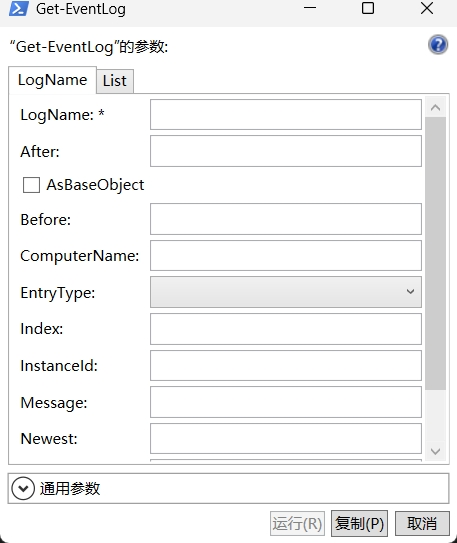

# DAY 4 运行命令

## 剖析一个命令

``` powershell
> Get-EventLog -LogName Security -ComputerName WIN8,Server1 -Verbose
```

> [!NOTE]
> 这个命令在新版powershell中的写法已经发生了改变，与这种写法有较大差异

分析这个命令：

- `Get-EventLog` 是cmdlet，powershell cmdlet总是以 **动词+名词** 形式命令
- `-LogName Security` 是参数1，参数名是 `-LogName`，赋值为 `Security`，如果赋值的字符串中有空格需要使用引号包裹
- `-ComputerName WIN8,Server1` 是参数2，参数名是 `ComputerName`，以分隔列表的方式给它赋了2个值，`WIN8` 和 `Server1`
- `-Verbose` 是开关参数，无需赋值，只需要指定参数即可

> [!IMPORTANT]
> - cmdlet与参数1之间必须要有空格分隔
> - 参数名总是以 `-` 开头
> - 参数名之间需要使用空格分隔，多个参数值之间也必须有空格
> - `-` 与参数名之间没有空格
> - powershell不区分大小写

## 相关术语

- cmdlet，即command-let，是一个原生的powershell命令行工具，这是powershell专用术语，表示powershell中的命令
- 函数，和cmdlet类似，但不以 `.NET` 语言编写，而是以powershell脚本编写而成
- 工作流，是指嵌入powershell的工作流执行系统的一类特殊函数
- 应用程序，是任意类型的外部可执行程序，包括 `PING` `Ipconfig` 等命令行工具
- 命令，是一个通用术语，上面介绍的cmdlet，函数，工作流，应用程序都可以称为命令

## 命名规范

以 `动词-名词单数` 的格式命名，使用的动词需要在 `Get-Verb` 返回的列表中，以保证命名的规范性，名词随意

## 命令的别名（命令的昵称）

别名一般是命令的缩写形式，有些命令实在是太长了，因此别名可以解决命令太长容易输入错误的问题。别名仅仅是命令的一个昵称，无法包含任何预定义的参数

通过 `Get-Alias -Definition 命令名` 可以查看命令的别名

``` powershell
> Get-Alias -Definition Get-Service

CommandType     Name
-----------     ----
Alias           gsv -> Get-Service
```

## 参数的别名

- 参数名称可以只输入前几个字母，这时可以使用tab补全
- 参数名别名，例如：查看 `Get-EventLog` 命令 `Computer`参数的别名 `Cn`

    ``` powershell
    > (Get-Command Get-EventLog | Select -ExpandProperty parameters).computername.aliases
    Cn
    ```

- 位置参数 通过 `Help` 返回的帮助文档，我们可以看到某个参数的位置，`位置?                        0` 这种情况表示是第一个位置参数，位置参数传参时可以省略参数名，位置参数只适合简单的命令，如果命令过于复杂，请不要使用位置参数

## 快捷传参

``` powershell
> Show-Command Get-EventLog
```

运行这个命令之后会弹出一个对话框，可以在这个对话框中填写参数运行命令。使用这种方法输入的命令格式一定是正确的


