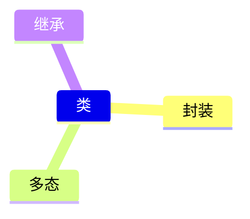

# 预备节：面向对象

:material-pen-plus: `本文创建于2025-3-16`

要使用tkinter进行GUI设计，就不得不用到**面向对象**的编程思想。Tkinter提供的小部件非常有限，而且大多数小部件的功能往往不足以完成相应的任务。在这种情况之下，就不得不使用继承来加强小部件的功能，或者创建新的小部件。

面向对象编程（object-oriented programming，OOP）是最有效的软件编写方法之一，在面向对象编程中，我们可以：编写表示现实世界中事物或情景的类（class），并基于这些类来创建对象（object）。通过类的实例化来根据类创建对象，并在代码中使用类的实例（instance）对象。

==class关键字，类名以大写字母开头（大驼峰命名法）。== 类名后面不需要加括号，但是子类后面需要加括号

## 一、属性

使用 `dir()` 函数可以查看一个对象所有的方法和属性

### 1.1 类属性

通俗来说，类属性就是定义在类中的变量。不需要创建实例就能直接使用，当然实例也可以使用类属性。通过类名就可以调用，可以更改属性值，还可以创建新属性。

我们来创建一个 *Banana* 类：

```py title='banana.py' hl_lines="3 4" linenums="1"
class Banana:
    """一种美味的热带水果"""
    food_group = 'fruit'
    colors = ['green', 'green-yellow', 'yellow', 'brown spotted', 'black']
```

上面代码中的 *food_group* 和 *colors* 就是类属性。它们不需要创建实例就可以使用，对二者调用 `print()` 函数：

    print(Banana.food_group)
    print(Banana.colors)

输出：

    fruit
    ['green', 'green-yellow', 'yellow', 'brown spotted', 'black']

### 1.2 实例属性

使用初始化方法 `__init__()` 创建实例属性。`self` 形参：它是一个指向实例本身的引用，实例的每次调用都会自动传入自身，这样使得实例能够访问类中的属性和方法，self 形参必不可少，而且必须位于其他形参的前面。

所有的实例属性定义时都有 `self.` 的前缀，有些属性无须通过形参来定义，可以在 `__init__()` 方法中为其指定默认值。

实例属性就是定义在构造方法（又称初始化方法，属于魔术方法的一种） `__init__()` 中的带有 *self.* 前缀的变量，必须创建实例之后才能使用。不创建实例通过类名调用会报错。需要先创建实例，才能调用，创建实例后，可以对属性重新赋值，还可以创建新属性。

```py title='banana.py' linenums="1" hl_lines="3 4"
class Banana:
    # --snip--(1)
    def __init__(self, color='green'):
        self.color = color
```

1. 我使用 *# --snip--* 来省略前面已经写过的一些代码

此处的 *self.color* 就是实例属性，它是定义在 `__init__()` 方法中的一个变量。

???+ warning

    - `__init__(self)` 方法的第一个参数必须是 *self*，用来表示实例本身
    - *self.color* 和 *color* 并不是同一个变量，而是两个不同的变量，但常常定义在 `__init__()` 中定义的属性会命名为 `__init__()` 方法传入参数的名字，*self.color* 是一个不可分割的整体

为了使用 *self.color* 属性，我们需要创建实例：

    my_banana = Banana()
    print(my_banana.color)

输出：

    green

## 二、方法

### 2.1 实例方法

定义在类中的函数，和 `__init__()` 方法一样，第一个参数必须是 *self*。需要先创建实例，才能调用。创建实例后，可以新建方法（先定义一个函数，再使用self.的方式将创建的函数名赋值给self）。

```py title='banana.py' linenums="1" hl_lines="3 4"
class Banana:
    # --snip--
    def print_color(self):
        print(self.color)
```

需要创建实例才可以使用：

    my_banana.print_color()

输出：

    my_banana.print_color()

### 2.2 类方法

使用装饰器 `@classmethod` 修饰的方法，类方法的第一个参数必须是 *cls*，表示这个类本身。不能使用实例属性和实例方法，但是可以通过 *cls.* 来访问类属性，类似与实例属性的访问。

不需要创建实例就可以调用类方法，在类中也可以通过 `self.` 来调用类方法，类似于实例方法在类中的调用。当然实例也可以调用类方法。

`cls()` 函数，在类方法中使用可以创建实例对象。

```py title='banana.py' linenums="1" hl_lines="3 4 5"
class Banana:
    # --snip--
    @classmethod
    def check_color(cls, color):
        return color in cls.colors
```

这个方法通过类名就可以直接调用：

    print(Banana.check_color('blue'))

输出结果：

    False

### 2.3 静态方法

使用装饰器@staticmethod修饰的方法，定义静态方法时，不需要传入参数 *self*或 *cls* 。静态方法类似于普通的函数。不能在静态方法中使用实例属性和实例方法。

直接通过类名，就可以调用。当然也可以通过实例调用静态方法。

```py title='banana.py' linenums="1" hl_lines="3 4 5"
class Banana:
    # --snip--
    @staticmethod
    def estimate_calories(num_bananas):
        return num_bananas * 105
```

这个方法通过类名就可以直接调用：

    print(Banana.estimate_calories(10))

输出结果：

    1050

## 三、类的三个特性



### 3.1 继承

代码复用。

在编写类时，并非总是要从头开始，如果要编写的类是一个已有类的特殊版本，那么我们就可以使用继承（inheritance）。被继承的类称为父类（parent class）或超类，而继承的类称为子类（child class）。子类可以继承父类的所有属性和方法，也可以定义自己的属性和方法。

父类代码必须放在在子类代码的前面。需要在子类名称后添加括号，并在其中指定父类的名称，括号中指定了当前类继承的父类名称。在子类的初始化方法中， 我们使用了 super() 函数。这是一个特殊的函数，让你能够调用父类的方法，继承父类的实例属性。当父类中定义的一些方法不能满足子类的要求时，可以在子类中随时重写父类的方法：定义一个同名的方法。当调用子类生成的实例时，Python 首先会查找子类中的方法，从而忽略父类中被重写的同名方法。也可以把实例当作属性

单继承 使用 `super().__init__()` 继承父类属性和方法

多继承 使用 `父类类名.__init__ ()` 继承父类方法和属性

在子类中重写方法 可以使用 `super()` 从父类继承原方法


```py title='banana.py' linenums="1" 
class RedBanana(Banana):
    def __init__(self, color='green'):
        super().__init__(color)
```

通过继承 *RedBanana* 类获得了 *Banana* 类的所有属性和方法。

### 3.2 多态

提高程序的可扩展性。

多个不同的类有同名的方法，通过创建一个参数是类的函数，这个函数中调用这些类同名的方法，可以实现多态（同一个方法，适用于不同的对象产生不同的行为）。

### 3.3 封装

保护程序的安全。

#### 3.3.1 受保护成员（单下划线）

使用单下划线开头的属性和方法表示受保护的成员，只能在类的内部使用，子类可以通过继承获得受保护成员，实际上在外部也可以使用。

#### 3.3.2 私有成员（双下划线）

使用双下划线开头的变量或方法表示私有成员，只能在类的内部使用，子类无法通过继承获得私有成员

#### 3.3.3 魔术方法和魔术属性（首尾双下划线）

魔术方法
:   

    - 构造方法 `__init__`
    - `__str__`	对实例调用 `print()` 函数时，返回的内容

魔术属性
:   

    - obj.__dict__属性 存储对象的属性字典
    - obj.__class__属性 存储对象所属于的类，相当于调用了type()函数。在此基础上还可以再使用__name__属性，返类名
    - obj.__bases__属性 存储对象父类的元组
    - obj.__base__属性 存储对象继承的第一个父类
    - obj.__mro__属性 存储直接或间接继承的父类的元组

## 四、类型注解

???+ tip "类的编写风格"

    - 类名中的每个单词的首字母都应大写，并且不使用下划线。这种命名规则叫做大驼峰式命名法（也称为 Pascal 命名法）。实例名和模块名都应该使用全小写，并在单词之间加上下划线（_）。 这种命名规则叫做下划线命名法（也称为 蛇形命名法）   
    - 每个类定义后的第一行和模块文件的首行，都应该包含一个文档字符串，简要地描述类的功能，以帮助其他人理解我们的代码
    - 使用两个空行来分隔不同类，使用一个空行分隔类内的不同方法
    - 当使用 import 语句时，使用一个空行分隔标准库和自己的库
    

适用类型注解可以让 `PyCharm` 为自定义的方法、变量等添加代码提示。

???+ note

    类型注解在代码简单时，几乎不使用，但是当代码十分复杂时，可以使用类型注解帮助自己更好的记住自己的思路，从而提高自己的工作效率。

### 4.1 对类中的变量添加类型注解

例如：

=== "方法1"
    ```py
    my_list: list = [1， 2, 3]
    my_tuple: tuple = (1,2，3)
    ```

=== "方法2"
    ```py
    my_list = [1， 2, 3] # type: list
    my_tuple = (1,2，3) # type: tuple
    ```

分别对my_list和my_tuple两个变量进行了类型注解。

### 4.2 对类中的方法添加类型注解

例如：

```py
@staticmethod
def estimate_calories(num_bananas: int) -> int:
   return num_bananas * 105
```

为传入的参数 *num_bananas* 和 方法的返回值添加了类型注解。

### 4.3 Union联合类型注解

如果一个变量中存储了不同类型的数据，那就需要使用联合类型注解，常用于字典、列表等。

使用前先导入模块 `from typing import Union`

例如：

    my_list: list[union(int， str)] = [l，2，"hello"，"world"]

因为 *my_list* 变量存储的数据同时有 *int* 和 *str*，所以需要使用联合类型注解。

## 五、举例

```py linenums="1" title='banana.py'
class Banana:
    """一个用于表示香蕉的类"""
    
    food_group = 'fruit'
    colors = ['green', 'green-yellow', 'yellow', 'brown-spotted', 'black']
    __ripe_colors = ['yellow', 'brown-spotted'] #(1)

    def __init__(self, color='green'): #(2)
        if not self.check_color(color):
            raise ValueError(f'{self.__class__.__name__} cannot be {color}!!!')
        self.color = color
        self.peeled = False
    
    def __str__(self):#(3)
        return f'A {self.color} {self.__class__.__name__}'

    def peel(self):
        # 香蕉去皮
        self.peeled = True
    
    def set_color(self, color):
        # 香蕉颜色
        if color in self.colors:
            self.color = color
        else:
            raise ValueError(f'{self.__class__.__name__} cannot be {color}!!!')
    
    def can_eat(self):
        # 香蕉是否可以吃
        return self._is_ripe()
    
    def _is_ripe(self): #(4)
        """香蕉是否成熟"""
        return self.color in self.__ripe_colors
    
    @classmethod #(5)
    def check_color(cls, color):
        # 检查传入的颜色是否可能是香蕉的颜色，返回布尔值
        return color in cls.colors

    @classmethod
    def make_greenie(cls):
        # 创建一个绿色香蕉对象
        banana = cls() #(6)
        banana.set_color('green')
        return banana
    
    @staticmethod #(7)
    def estimate_calories(num_bananas):
        # 计算卡路里
        return num_bananas * 105


class RedBanana(Banana): #(8)
    """表示红色香蕉的类"""

    colors = ['green', 'arange', 'red', 'brown', 'black']
    botanical_name = 'red dacca'

    def __init__(self, color='green'):
        super().__init__(color) #(9)

    def peel(self): #(10)
        super().peel()
        print('It just like normal Banana')
```

1. 这是一个私有成员，子类不能通过继承获得
2. 构造方法 `__init__()`
3. 魔术方法 `__str__()` 控制对类或实例调用 `print()` 函数打印的内容
4. 这是一个受保护的成员，在类中被调用的方法不一定要放在调用的语句之前，而是可以放在任意位置
5. 这是一个类方法
6. 使用 `cls()` 函数可直接创建实例
7. 这是一个静态方法
8. 这是继承自 `Banana` 的一个子类 `RedBanana`
9. 继承父类的属性和方法
10. 重写父类的方法